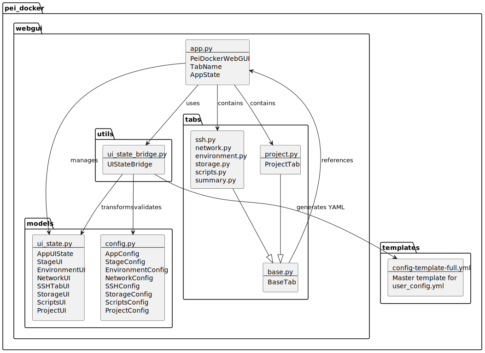
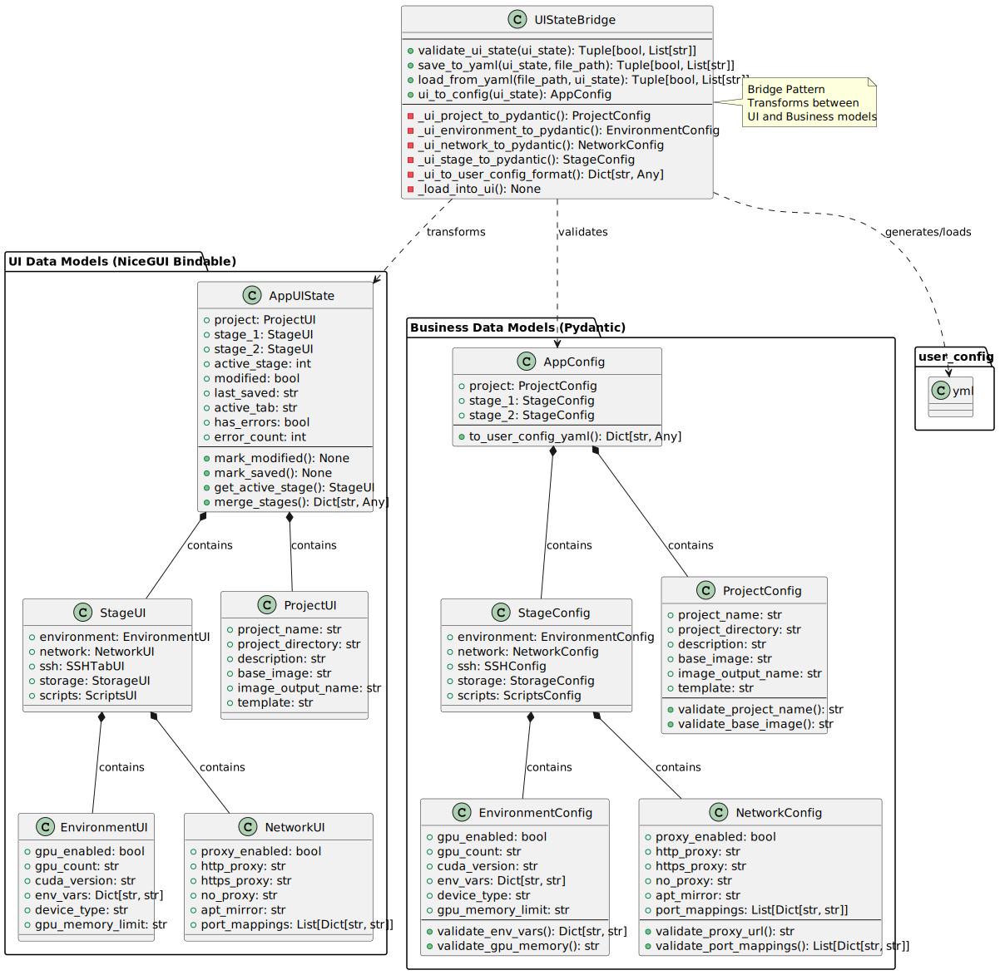
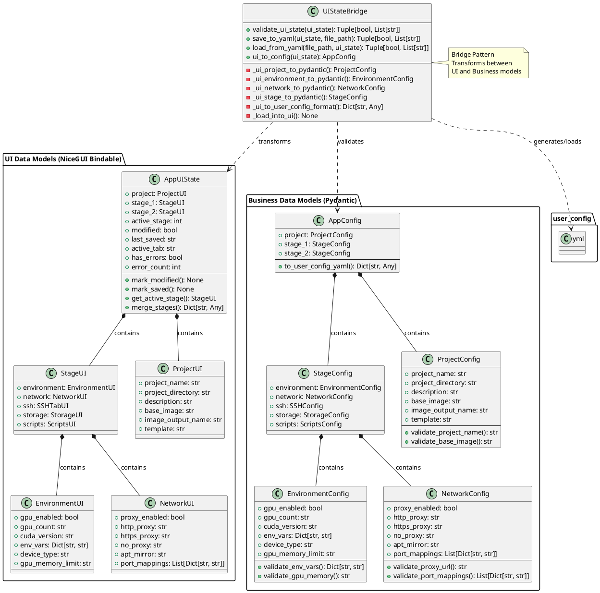
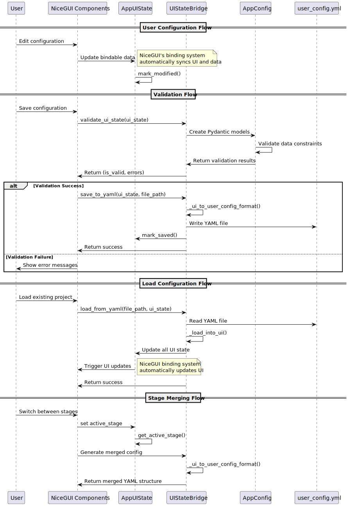
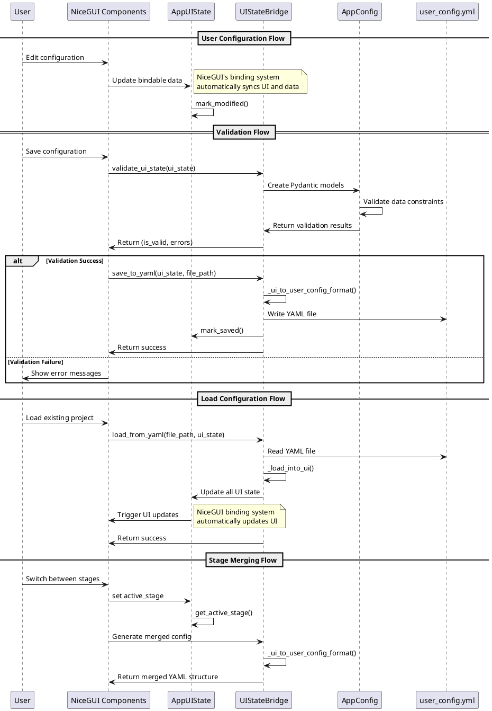

# Architecture Documentation: PeiDocker WebGUI Data Models

## Architecture Pattern

The PeiDocker WebGUI follows a **Model-View-ViewModel (MVVM)** pattern enhanced with a **Bridge Pattern** for data transformation. This architecture provides clear separation of concerns between the user interface, business logic, and data persistence layers.

### Key Architectural Components

1. **UI-Data-Model** (View Model) - NiceGUI bindable dataclasses for reactive UI state
2. **Business-Data-Model** (Model) - Pydantic models for validation and business logic
3. **UI-to-Business-Bridge** (Bridge) - Transformation layer between UI and business models
4. **User Config YAML** (Persistence) - File-based configuration storage
5. **Web UI Components** (View) - NiceGUI-based user interface components

## Package Structure Diagram



```plantuml
@startuml package_structure
!define RECTANGLE class

package "pei_docker.webgui" {
    package "models" {
        RECTANGLE ui_state [
            ui_state.py
            --
            AppUIState
            StageUI
            EnvironmentUI
            NetworkUI
            SSHTabUI
            StorageUI
            ScriptsUI
            ProjectUI
        ]
        
        RECTANGLE config [
            config.py
            --
            AppConfig
            StageConfig
            EnvironmentConfig
            NetworkConfig
            SSHConfig
            StorageConfig
            ScriptsConfig
            ProjectConfig
        ]
    }
    
    package "utils" {
        RECTANGLE ui_state_bridge [
            ui_state_bridge.py
            --
            UIStateBridge
        ]
    }
    
    package "tabs" {
        RECTANGLE base [
            base.py
            --
            BaseTab
        ]
        
        RECTANGLE project_tab [
            project.py
            --
            ProjectTab
        ]
        
        RECTANGLE other_tabs [
            ssh.py
            network.py
            environment.py
            storage.py
            scripts.py
            summary.py
        ]
    }
    
    RECTANGLE app [
        app.py
        --
        PeiDockerWebGUI
        TabName
        AppState
    ]
}

package "pei_docker.templates" {
    RECTANGLE config_template [
        config-template-full.yml
        --
        Master template for
        user_config.yml
    ]
}

ui_state_bridge --> ui_state : transforms
ui_state_bridge --> config : validates
ui_state_bridge --> config_template : generates YAML

app --> ui_state : manages
app --> ui_state_bridge : uses
app --> project_tab : contains
app --> other_tabs : contains

project_tab --|> base
other_tabs --|> base

base --> app : references
@enduml
```

## Data Model Class Diagram





## Data Flow Sequence Diagram





## Integration with PeiDocker Core

### Connection to user_config.yml

The `user_config.yml` file serves as the **primary interface** between the WebGUI and the PeiDocker CLI system. This YAML file follows a specific schema that the PeiDocker CLI understands:

#### YAML Structure Mapping

```yaml
# Generated by WebGUI -> Used by PeiDocker CLI
stage-1:
  image:
    base: ubuntu:22.04          # From ProjectUI.base_image
    output: pei-image:stage-1   # From ProjectUI.image_output_name
  
  environment:                  # From EnvironmentUI.env_vars
    - "VAR1=value1"
    - "VAR2=value2"
  
  device:                       # From EnvironmentUI.device_type
    type: gpu
    gpu:
      all: true                 # From EnvironmentUI.gpu_count
      memory: "4GB"             # From EnvironmentUI.gpu_memory_limit
  
  proxy:                        # From NetworkUI proxy settings
    http: "http://proxy:8080"
    https: "https://proxy:8080"
  
  ssh:                          # From SSHTabUI
    enable: true
    port: 22
    host_port: 2222
    users: [...]

stage-2:
  storage:                      # From StorageUI
    app: "auto-volume"
    data: "host:/data"
    workspace: "volume:ws-vol"
    mounts:
      - "/host/path:/container/path"
  
  scripts:                      # From ScriptsUI
    pre-build: [...]
    post-build: [...]
    first-run: [...]
```

### Bridge Pattern Implementation

The `UIStateBridge` class implements the **Bridge Pattern** to decouple the UI representation from the business logic:

1. **UI-to-Business Transformation**:
   - Converts NiceGUI bindable dataclasses to Pydantic models
   - Applies business validation rules
   - Ensures data integrity before persistence

2. **Business-to-YAML Transformation**:
   - Converts validated business models to `user_config.yml` format
   - Handles complex data structure transformations
   - Manages inline script embedding and metadata

3. **YAML-to-UI Transformation**:
   - Loads existing configurations back into UI state
   - Reconstructs UI-specific metadata from YAML
   - Maintains UI state consistency

### Integration Points with PeiDocker CLI

The WebGUI integrates with PeiDocker's core functionality through several key points:

1. **Configuration Generation**: 
   - WebGUI generates `user_config.yml` files that PeiDocker CLI commands consume
   - The `pei-docker-cli configure` command processes these YAML files

2. **Template System**:
   - WebGUI uses the master template from `src/pei_docker/templates/config-template-full.yml`
   - Ensures compatibility with PeiDocker's expected configuration format

3. **Docker Compose Generation**:
   - The generated `user_config.yml` drives Docker Compose file generation
   - Stage-1 and Stage-2 configurations map to Docker build stages

4. **Project Directory Structure**:
   - WebGUI respects PeiDocker's project directory conventions
   - Manages paths relative to installation directories

## Key Architectural Benefits

### 1. Separation of Concerns
- **UI State**: Handles reactive UI updates and user interactions
- **Business Logic**: Validates data and enforces business rules
- **Data Persistence**: Manages file I/O and format conversion

### 2. Data Binding with NiceGUI
- **Automatic Synchronization**: UI elements automatically update when data changes
- **Type Safety**: Bindable dataclasses provide compile-time type checking
- **Reactive Updates**: Changes propagate immediately to the UI

### 3. Validation Pipeline
- **Client-Side Validation**: Immediate feedback through Pydantic validators
- **Business Rule Enforcement**: Consistent validation across UI and CLI
- **Error Handling**: Structured error reporting with field-level precision

### 4. Bidirectional Data Flow
- **UI → Business**: User inputs validated and transformed to business models
- **Business → YAML**: Business models serialized to PeiDocker-compatible format
- **YAML → UI**: Existing configurations loaded back into UI state

### 5. Extensibility
- **Plugin Architecture**: New configuration sections can be added easily
- **Validation Rules**: Business rules centralized in Pydantic models
- **UI Components**: Modular tab system for feature organization

## Technology Stack

- **Frontend Framework**: NiceGUI (Python-based web UI framework)
- **Data Binding**: NiceGUI's bindable dataclass system
- **Validation**: Pydantic models with custom validators
- **Serialization**: PyYAML for configuration file handling
- **Architecture Pattern**: MVVM with Bridge Pattern
- **Backend**: FastAPI (underlying NiceGUI framework)

This architecture ensures that the WebGUI remains maintainable, extensible, and fully compatible with PeiDocker's existing CLI-based workflow while providing a modern, reactive user interface for configuration management.
