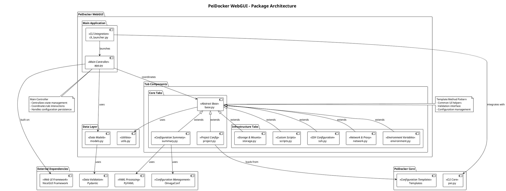

# PeiDocker WebGUI Architecture Documentation

## Overview

The PeiDocker WebGUI is a sophisticated web-based configuration interface built on the NiceGUI framework. It provides a user-friendly interface for managing PeiDocker projects, allowing users to configure Docker environments through a tabbed interface that abstracts the complexity of YAML configuration files.

## Architecture Pattern

The WebGUI follows a **Hybrid MVC Architecture** with **Tab-based Component Pattern**, incorporating several design patterns:

- **Model-View-Controller (MVC)**: Clear separation between data models, UI views, and business logic controllers
- **Template Method Pattern**: BaseTab class defines common interface and behavior for all tab implementations
- **Strategy Pattern**: Different storage types, mount configurations, and script handling strategies
- **Observer Pattern**: Event-driven updates through NiceGUI's reactive system
- **Component Pattern**: Modular tab system with isolated responsibilities

## System Architecture

### High-Level Structure

The architecture consists of five main layers:

1. **Main Application Layer** (`app.py`): Central coordinator and state manager
2. **Data Models Layer** (`models.py`): Pydantic-based data validation and structure
3. **Tab Component Layer** (`tabs/`): Feature-specific configuration modules
4. **Utilities Layer** (`utils.py`): Shared helper functions and utilities
5. **CLI Integration Layer** (`cli_launcher.py`): Command-line interface integration

### Core Components

#### PeiDockerWebGUI (Main Controller)
- **Location**: `src/pei_docker/webgui/app.py`
- **Responsibilities**:
  - Centralized state management through `AppData`
  - Tab lifecycle coordination and navigation
  - Project loading and persistence
  - Configuration validation orchestration
  - NiceGUI UI framework integration

#### BaseTab (Abstract Template)
- **Location**: `src/pei_docker/webgui/tabs/base.py`
- **Pattern**: Template Method Pattern
- **Responsibilities**:
  - Defines common interface for all tabs (`render()`, `validate()`, `get_config_data()`, `set_config_data()`)
  - Provides shared UI helper methods
  - Implements configuration change tracking
  - Enforces consistent validation contract

#### Tab Implementations
Each tab handles a specific configuration domain with full isolation:

1. **ProjectTab** (`project.py`): Basic project settings and Docker image configuration
2. **SSHTab** (`ssh.py`): SSH access configuration with user management and key handling
3. **NetworkTab** (`network.py`): Proxy settings, APT mirrors, and port mappings
4. **EnvironmentTab** (`environment.py`): Environment variables and GPU device configuration
5. **StorageTab** (`storage.py`): Storage system configuration and volume mounts
6. **ScriptsTab** (`scripts.py`): Custom entry points and lifecycle hook scripts
7. **SummaryTab** (`summary.py`): Configuration aggregation and export functionality

### Data Flow Architecture

#### Two-Stage Configuration Model
The WebGUI reflects PeiDocker's core two-stage architecture:
- **Stage-1**: System-level configuration (base image, SSH, system packages)
- **Stage-2**: Application-level configuration (storage, custom applications, GUI tools)

#### Configuration Merging Strategy
The GUI implements intelligent configuration merging:
```python
# Stage-2 configurations override Stage-1 for shared settings
merged_config = merge_dict(stage_1_config, stage_2_config)
```

#### State Management
- **Centralized State**: All configuration data stored in `app.data.config`
- **Real-time Validation**: Per-tab validation with immediate feedback
- **Change Tracking**: Modified state tracking for unsaved changes
- **Atomic Updates**: Configuration changes applied atomically per tab

### Event-Driven Architecture

#### User Interaction Flow
1. User modifies UI element → Tab event handler triggered
2. Tab validates input and updates local state
3. Tab calls `mark_modified()` to signal changes
4. Configuration data updated in centralized state
5. Real-time validation provides immediate feedback

#### Configuration Persistence Flow
1. User navigates to Summary tab
2. Summary tab aggregates configuration from all tabs via `get_config_data()`
3. Configuration merged and validated across all tabs
4. Final YAML configuration generated using OmegaConf
5. Configuration saved to `user_config.yml`

## Design Patterns Implementation

### Template Method Pattern (BaseTab)
```python
# Abstract interface enforced across all tabs
class BaseTab:
    def render(self) -> ui.element:        # Template method
        pass
    def validate(self) -> tuple[bool, list[str]]:  # Hook method
        pass
    def get_config_data(self) -> dict:     # Hook method
        pass
    def set_config_data(self, data: dict): # Hook method
        pass
```

### Strategy Pattern (Storage Configuration)
```python
# Different storage strategies: auto-volume, manual-volume, host, image
storage_strategies = {
    'auto-volume': AutoVolumeStrategy(),
    'manual-volume': ManualVolumeStrategy(),
    'host': HostMountStrategy(),
    'image': ImageStorageStrategy()
}
```

### Observer Pattern (Configuration Changes)
```python
# NiceGUI event system provides reactive updates
input_field.on('input', lambda e: self._on_value_change(e))
```

## Key Architectural Features

### 1. Configuration Simplification
The GUI simplifies complex YAML configurations:
- **Unified Environment Variables**: Combines stage-1 and stage-2 environment settings
- **Smart Port Mapping**: Applies port configurations to both stages automatically
- **Proxy Propagation**: Global proxy settings applied consistently across stages

### 2. Real-time Validation
- **Per-tab Validation**: Each tab validates its own configuration domain
- **Cross-tab Dependencies**: Summary tab performs comprehensive validation
- **User-friendly Error Messages**: Clear, actionable error descriptions

### 3. Flexible Storage Management
- **Stage-2 Dynamic Storage**: Fixed storage entries (app, data, workspace) with configurable types
- **General Volume Mounts**: User-defined mounts for both stages
- **Storage Type Strategies**: Auto-volume, manual-volume, host, and image storage options

### 4. Script Management System
- **Lifecycle Hooks**: Scripts for build, first run, every run, and user login events
- **Entry Point Customization**: Custom container entry points with parameter support
- **Path Access Rules**: Stage-specific path access validation (stage-1 vs stage-2)

### 5. SSH Configuration Management
- **Multiple Authentication Methods**: Password, public key, private key authentication
- **Key Discovery**: Automatic SSH key discovery using `~` syntax
- **User Management**: Full user lifecycle with UID management and root user handling

## Framework and Technology Stack

### Core Technologies
- **NiceGUI Framework**: Python-based web UI framework with FastAPI backend
- **Pydantic**: Data validation and serialization
- **OmegaConf**: Configuration management and YAML processing
- **asyncio**: Asynchronous operation support

### UI Components
- **Reactive Elements**: Real-time UI updates through NiceGUI's reactive system
- **Form Validation**: Client-side and server-side validation
- **Dynamic Content**: Add/remove configuration entries dynamically
- **File Handling**: Secure server-side file processing

### Integration Points
- **CLI Integration**: Seamless integration with `pei-docker-cli` commands
- **Template System**: Integration with PeiDocker configuration templates
- **Project Management**: Direct manipulation of PeiDocker project structures

## Security Considerations

### File System Security
- **Server-side Processing**: All file operations performed server-side
- **Path Validation**: Comprehensive path validation to prevent directory traversal
- **Access Control**: Restricted access to project directories only

### SSH Key Management
- **Secure Key Handling**: SSH keys processed securely without client-side exposure
- **Key Validation**: Comprehensive SSH key format validation
- **Encrypted Key Support**: Support for encrypted private keys with proper handling

### Input Validation
- **Comprehensive Validation**: All user inputs validated both client-side and server-side
- **Type Safety**: Pydantic models ensure type safety across the application
- **Sanitization**: Input sanitization to prevent injection attacks

## Performance Characteristics

### Memory Management
- **Lazy Loading**: Tab content loaded on-demand
- **State Optimization**: Minimal memory footprint for configuration state
- **Component Cleanup**: Proper cleanup of UI components on tab switches

### Network Efficiency
- **Single Page Application**: No page reloads, all interactions via WebSocket
- **Efficient Updates**: Only changed components re-rendered
- **Optimized File Transfer**: Efficient project export and download mechanisms

### Scalability
- **Stateless Design**: Each session independent for multiple concurrent users
- **Resource Management**: Proper resource cleanup and memory management
- **Concurrent Access**: Thread-safe configuration management

## Extensibility and Maintenance

### Adding New Tabs
1. Create new tab class extending `BaseTab`
2. Implement required abstract methods
3. Add tab to `TabName` enum and tab registry
4. Define configuration schema and validation rules

### Configuration Extensions
- **New Configuration Domains**: Easy addition through tab system
- **Validation Rules**: Extensible validation framework
- **UI Components**: Reusable UI components through BaseTab helpers

### Framework Updates
- **NiceGUI Compatibility**: Architecture designed for framework evolution
- **Dependency Management**: Clear separation of framework-specific code
- **Migration Support**: Configuration migration support for schema changes

## Quality Attributes

### Maintainability
- **Clear Separation of Concerns**: Each tab handles specific configuration domain
- **Consistent Patterns**: Template Method pattern ensures consistency
- **Comprehensive Documentation**: Inline documentation and type hints

### Testability
- **Unit Test Support**: Each tab can be tested independently
- **Mock-friendly Design**: Clean interfaces enable easy mocking
- **Validation Testing**: Comprehensive validation logic testing

### Usability
- **Intuitive Interface**: Tab-based organization matches user mental models
- **Real-time Feedback**: Immediate validation and error reporting
- **Progressive Disclosure**: Complex configurations revealed incrementally

### Reliability
- **Error Handling**: Comprehensive error handling throughout the application
- **Data Integrity**: Atomic configuration updates prevent partial states
- **Recovery Support**: Graceful handling of configuration errors

## Conclusion

The PeiDocker WebGUI architecture successfully balances complexity and usability, providing a sophisticated yet intuitive interface for Docker environment configuration. The modular tab-based design, combined with robust validation and state management, creates a maintainable and extensible system that effectively abstracts the underlying YAML configuration complexity while preserving full functionality.

The architecture's strength lies in its clear separation of concerns, consistent design patterns, and comprehensive validation framework, making it both developer-friendly for maintenance and user-friendly for configuration management.

---

## Architecture Diagrams

### Package Diagram


<details>
<summary>Package Diagram Source Code (PlantUML)</summary>


</details>

### Class Diagram  

```plantuml
@startuml PeiDocker-WebGUI-Class-Diagram
!theme plain
title PeiDocker WebGUI - Class Diagram

' Main Application Classes
class PeiDockerWebGUI {
    +data: AppData
    +tabs: Dict[TabName, BaseTab]
    +current_tab: TabName
    +project_loaded: bool
    +modified: bool
    +lock: asyncio.Lock
    --
    +__init__(project_dir: Optional[Path])
    +run(port: int, jump_to_page: Optional[str])
    +switch_to_tab(tab_name: TabName)
    +save_project()
    +load_project(project_dir: Path)
    +_initialize_tabs()
    +_create_main_ui()
    +_handle_tab_switch()
}

' Data Models
class AppData {
    +project: ProjectConfig
    +config: ConfigData
    +validation_results: Dict[TabName, ValidationResult]
}

class ProjectConfig {
    +directory: Path
    +name: str
    +user_config_file: Path
    +is_loaded: bool
}

class ConfigData {
    +stage_1: Dict[str, Any]
    +stage_2: Dict[str, Any]
    --
    +merge_stage_configs()
    +validate_consistency()
}

class ValidationResult {
    +is_valid: bool
    +errors: List[str]
    +warnings: List[str]
}

' Abstract Base Tab
abstract class BaseTab {
    #app: PeiDockerWebGUI
    #container: Optional[ui.element]
    --
    +__init__(app: PeiDockerWebGUI)
    +{abstract} render(): ui.element
    +{abstract} validate(): Tuple[bool, List[str]]
    +{abstract} get_config_data(): Dict[str, Any]
    +{abstract} set_config_data(data: Dict[str, Any])
    +mark_modified()
    +create_card(title: str): ui.card
    +create_form_group(title: str, description: str): ui.column
    +create_section_header(title: str, description: str)
}

' Concrete Tab Implementations
class ProjectTab {
    +project_name_input: ui.input
    +project_dir_input: ui.input
    +description_textarea: ui.textarea
    +base_image_select: ui.select
    --
    +render(): ui.element
    +validate(): Tuple[bool, List[str]]
    +get_config_data(): Dict[str, Any]
    +set_config_data(data: Dict[str, Any])
    +_on_project_name_change()
    +_generate_temp_directory()
}

class SSHTab {
    +ssh_enabled_switch: ui.switch
    +ssh_port_input: ui.input
    +host_port_input: ui.input
    +users_container: ui.column
    +users_data: List[Dict[str, Any]]
    --
    +render(): ui.element
    +validate(): Tuple[bool, List[str]]
    +_add_user(username: str, password: str)
    +_remove_user(user_id: str)
    +_handle_ssh_key_upload()
}

class NetworkTab {
    +proxy_enabled_switch: ui.switch
    +proxy_url_input: ui.input
    +apt_mirror_select: ui.select
    +port_mappings_data: List[Dict[str, Any]]
    --
    +render(): ui.element
    +validate(): Tuple[bool, List[str]]
    +_add_port_mapping()
    +_validate_port_input()
    +_update_port_mappings_config()
}

class EnvironmentTab {
    +device_type_select: ui.select
    +gpu_config_container: ui.column
    +env_variables_data: List[Dict[str, Any]]
    --
    +render(): ui.element
    +validate(): Tuple[bool, List[str]]
    +_add_env_variable()
    +_on_device_type_change()
}

class StorageTab {
    +storage_configs: Dict[str, Any]
    +stage1_mounts_data: List[Dict[str, Any]]
    +stage2_mounts_data: List[Dict[str, Any]]
    --
    +render(): ui.element
    +validate(): Tuple[bool, List[str]]
    +_create_storage_entry()
    +_add_mount(stage: str)
    +_on_storage_type_change()
}

class ScriptsTab {
    +stage1_entry_mode_radio: ui.radio
    +stage2_entry_mode_radio: ui.radio
    +stage1_lifecycle_scripts: Dict[str, List[Dict]]
    +stage2_lifecycle_scripts: Dict[str, List[Dict]]
    --
    +render(): ui.element
    +validate(): Tuple[bool, List[str]]
    +_add_lifecycle_script()
    +_validate_script_path()
    +_generate_uuid(): str
}

class SummaryTab {
    +save_button: ui.button
    +configure_button: ui.button
    +download_button: ui.button
    --
    +render(): ui.element
    +validate(): Tuple[bool, List[str]]
    +refresh_summary()
    +_generate_full_config(): Dict[str, Any]
    +_save_configuration()
    +_configure_project()
}

' Enums
enum TabName {
    PROJECT
    SSH
    NETWORK
    ENVIRONMENT
    STORAGE
    SCRIPTS
    SUMMARY
}

' CLI Launcher
class CLILauncher {
    --
    +{static} main()
    +{static} start_webgui(port: int, project_dir: Optional[Path], jump_to_page: Optional[str])
    +{static} validate_port(port: int): bool
    +{static} validate_project_dir(path: Path): bool
}

' Relationships
PeiDockerWebGUI *-- AppData : contains
PeiDockerWebGUI o-- BaseTab : manages
AppData *-- ProjectConfig : contains
AppData *-- ConfigData : contains
AppData *-- ValidationResult : contains

BaseTab <|-- ProjectTab : implements
BaseTab <|-- SSHTab : implements
BaseTab <|-- NetworkTab : implements
BaseTab <|-- EnvironmentTab : implements
BaseTab <|-- StorageTab : implements
BaseTab <|-- ScriptsTab : implements
BaseTab <|-- SummaryTab : implements

PeiDockerWebGUI --> TabName : uses
CLILauncher --> PeiDockerWebGUI : creates

' Notes
note right of BaseTab
  Template Method Pattern
  - Defines common interface
  - Provides shared utilities
  - Enforces validation contract
end note

note bottom of ConfigData
  Two-Stage Configuration
  - stage_1: System-level config
  - stage_2: Application-level config
  - Merging and validation logic
end note

note left of SummaryTab
  Configuration Aggregator
  - Collects data from all tabs
  - Generates final YAML config
  - Handles save/export operations
end note

@enduml
```


<details>
<summary>Class Diagram Source Code (PlantUML)</summary>


</details>

### Sequence Diagram

```plantuml
@startuml PeiDocker-WebGUI-Sequence-Diagram
!theme plain
title PeiDocker WebGUI - User Configuration Flow

actor User
participant "CLI Launcher" as CLI
participant "PeiDockerWebGUI" as App
participant "ProjectTab" as ProjectTab
participant "SSHTab" as SSHTab
participant "NetworkTab" as NetworkTab
participant "SummaryTab" as SummaryTab
participant "AppData" as Data
participant "ConfigData" as Config
database "File System" as FS

== Application Startup ==
User -> CLI: pei-docker-gui start --project-dir /path/to/project
activate CLI

CLI -> CLI: validate_port(8080)
CLI -> CLI: validate_project_dir(path)
CLI -> App: __init__(project_dir)
activate App

App -> Data: create AppData instance
activate Data

App -> App: _initialize_tabs()
App -> ProjectTab: __init__(app)
activate ProjectTab
App -> SSHTab: __init__(app)
activate SSHTab
App -> NetworkTab: __init__(app) 
activate NetworkTab
App -> SummaryTab: __init__(app)
activate SummaryTab

App -> App: _create_main_ui()
App -> FS: check if user_config.yml exists
FS --> App: file exists/not exists

alt Project exists
    App -> App: load_project(project_dir)
    App -> FS: read user_config.yml
    FS --> App: config data
    App -> Config: parse and validate config
    activate Config
    Config --> App: structured config data
    
    App -> ProjectTab: set_config_data(data)
    ProjectTab -> ProjectTab: populate UI fields
    App -> SSHTab: set_config_data(data)
    SSHTab -> SSHTab: populate UI fields
    App -> NetworkTab: set_config_data(data)
    NetworkTab -> NetworkTab: populate UI fields
else New Project
    App -> ProjectTab: render() with defaults
    ProjectTab -> ProjectTab: create default project settings
end

CLI -> App: run(port=8080)
App --> User: WebGUI Interface displayed

== User Configuration Workflow ==

User -> ProjectTab: modify project name
ProjectTab -> ProjectTab: _on_project_name_change()
ProjectTab -> Data: update config.stage_1['image']['output']
ProjectTab -> App: mark_modified()
App -> Data: set modified = True

User -> App: click SSH tab
App -> App: switch_to_tab(TabName.SSH)
App -> SSHTab: render()
SSHTab --> User: SSH configuration interface

User -> SSHTab: enable SSH toggle
SSHTab -> SSHTab: _on_ssh_toggle(enabled=True)
SSHTab -> Data: update config.stage_1['ssh']['enable']
SSHTab -> App: mark_modified()

User -> SSHTab: add new user
SSHTab -> SSHTab: _add_user('developer', 'password123')
SSHTab -> SSHTab: create user UI elements
SSHTab -> Data: update config.stage_1['ssh']['users']
SSHTab -> App: mark_modified()

User -> App: click Network tab
App -> App: switch_to_tab(TabName.NETWORK)
App -> NetworkTab: render()
NetworkTab --> User: Network configuration interface

User -> NetworkTab: enable proxy
NetworkTab -> NetworkTab: _on_proxy_toggle(enabled=True)
NetworkTab -> Data: update config.stage_1['proxy']
NetworkTab -> Data: update config.stage_2['proxy']
NetworkTab -> App: mark_modified()

User -> NetworkTab: add port mapping
NetworkTab -> NetworkTab: _add_port_mapping()
NetworkTab -> NetworkTab: create port mapping UI
NetworkTab -> NetworkTab: _validate_port_input()
NetworkTab -> Data: update config.stage_1['ports']
NetworkTab -> App: mark_modified()

== Configuration Validation & Save ==

User -> App: click Summary tab
App -> App: switch_to_tab(TabName.SUMMARY)
App -> SummaryTab: render()
activate SummaryTab

SummaryTab -> SummaryTab: refresh_summary()
SummaryTab -> SummaryTab: _generate_full_config()

loop for each tab
    SummaryTab -> ProjectTab: get_config_data()
    ProjectTab --> SummaryTab: tab configuration
    SummaryTab -> SSHTab: get_config_data()
    SSHTab --> SummaryTab: tab configuration
    SummaryTab -> NetworkTab: get_config_data()
    NetworkTab --> SummaryTab: tab configuration
end

SummaryTab -> SummaryTab: merge all configurations
SummaryTab -> SummaryTab: _update_config_preview()
SummaryTab --> User: Configuration summary displayed

User -> SummaryTab: click "Save Configuration"
SummaryTab -> SummaryTab: _save_configuration()

loop validate all tabs
    SummaryTab -> ProjectTab: validate()
    ProjectTab --> SummaryTab: (is_valid, errors)
    SummaryTab -> SSHTab: validate()
    SSHTab --> SummaryTab: (is_valid, errors)
    SummaryTab -> NetworkTab: validate()
    NetworkTab --> SummaryTab: (is_valid, errors)
end

alt validation successful
    SummaryTab -> Config: generate final YAML
    Config --> SummaryTab: yaml_content
    SummaryTab -> FS: write user_config.yml
    FS --> SummaryTab: file saved
    SummaryTab --> User: "Configuration saved successfully!"
else validation errors
    SummaryTab --> User: display validation errors
end

== Optional: Project Configuration ==

User -> SummaryTab: click "Configure Project"
SummaryTab -> SummaryTab: _configure_project()
SummaryTab -> SummaryTab: _run_configure()
note right: In real implementation, this would call:\npei-docker-cli configure -p /path/to/project
SummaryTab --> User: "Project configuration started..."

deactivate SummaryTab
deactivate NetworkTab
deactivate SSHTab  
deactivate ProjectTab
deactivate Config
deactivate Data
deactivate App
deactivate CLI

@enduml
```


<details>
<summary>Sequence Diagram Source Code (PlantUML)</summary>


</details>

---

**Generated**: 2025-08-04  
**Author**: NiceGUI Developer (Claude)  
**Version**: WebGUI Architecture Analysis v1.0