# How to Use UML for GUI Application Design with PlantUML

## Overview

UML (Unified Modeling Language) provides powerful diagram types for modeling user interface behavior, state changes, and user interactions in GUI applications. PlantUML offers a text-based approach to create these diagrams efficiently.

## Key UML Diagram Types for GUI Design

### 1. State Diagrams (State Charts)
**Purpose**: Model the different states of UI components and the system as a whole, including transitions triggered by user actions.

**Best for**:
- Modal dialogs and windows
- Form validation states
- Application workflow states
- Component lifecycle states

**PlantUML Example**:
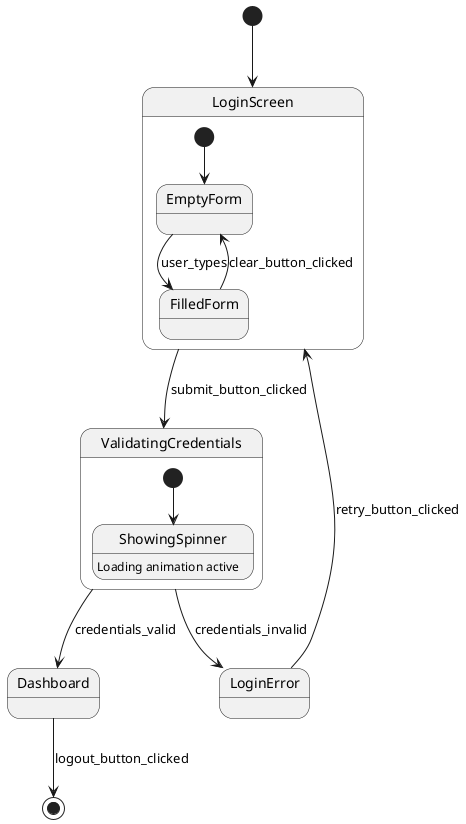

### 2. Activity Diagrams
**Purpose**: Model user workflows, business processes, and complex interaction flows through the application.

**Best for**:
- Multi-step wizards
- User onboarding flows
- Complex business processes
- Decision-based navigation

**PlantUML Example**:
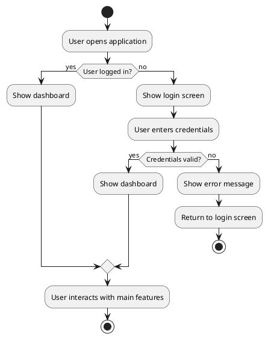

### 3. Sequence Diagrams
**Purpose**: Model interactions between UI components, backend services, and user actions over time.

**Best for**:
- API calls and responses
- Component communication
- Event handling chains
- Asynchronous operations

**PlantUML Example**:
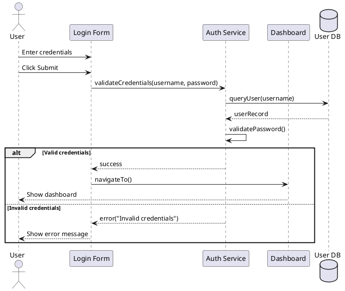

### 4. Use Case Diagrams
**Purpose**: Model user goals and system functionality from the user's perspective.

**Best for**:
- Requirements gathering
- Feature overview
- User role definition
- System boundaries

**PlantUML Example**:
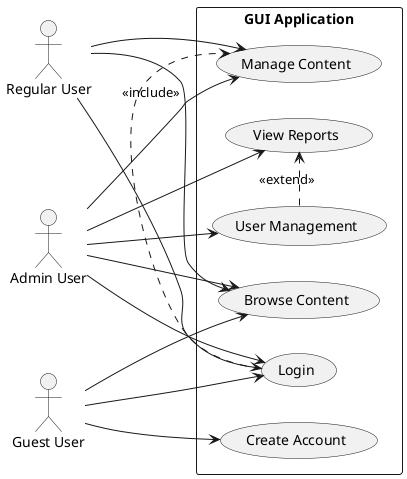

## Advanced PlantUML Features for GUI Design

### Styling and Themes
```plantuml
@startuml
!theme cerulean-outline

skinparam state {
  BackgroundColor LightBlue
  BorderColor DarkBlue
  FontColor Black
}

skinparam activity {
  BackgroundColor LightGreen
  BorderColor DarkGreen
  DiamondBackgroundColor Yellow
}
@enduml
```

### Custom Colors and Stereotypes
```plantuml
@startuml
skinparam state {
  BackgroundColor<<UI>> LightCyan
  BackgroundColor<<Error>> LightPink
  BackgroundColor<<Loading>> LightYellow
}

state "Login Screen" <<UI>>
state "Error State" <<Error>>
state "Loading" <<Loading>>
@enduml
```

### Notes and Documentation
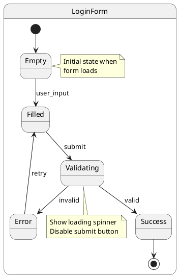

## Best Practices for UI Design Documentation

### 1. Hierarchical Organization
```plantuml
@startuml
state "Application" {
  state "Authentication Flow" {
    state Login
    state Register
    state ForgotPassword
  }
  
  state "Main Application" {
    state Dashboard
    state UserProfile
    state Settings
  }
}
@enduml
```

### 2. Clear State Naming
- Use descriptive names: `WaitingForUserInput` instead of `State1`
- Include context: `LoginForm_ValidatingCredentials` instead of `Validating`
- Use consistent naming conventions

### 3. Document Transitions
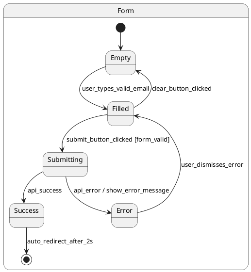

### 4. Combine Multiple Diagram Types
For comprehensive documentation, use:
- **Use Cases** for requirements and user goals
- **Activity Diagrams** for high-level user flows
- **State Diagrams** for detailed component behavior
- **Sequence Diagrams** for interaction details

### 5. Maintain Design Flexibility

#### Version Control Integration
```plantuml
@startuml
!define VERSION v2.1.0
title User Authentication Flow (VERSION)

' Rest of diagram...
@enduml
```

#### Modular Diagrams
```plantuml
@startuml
!include common-styles.puml
!include auth-components.puml

' Use included components
@enduml
```

#### Configuration Variables
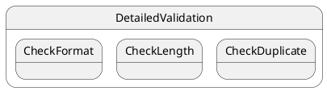

## Integration with Development Workflow

### 1. Documentation-Driven Development
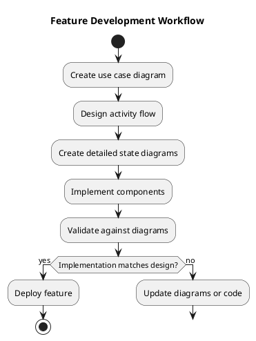

### 2. Living Documentation
- Store PlantUML files in version control
- Generate diagrams in CI/CD pipeline
- Embed in technical documentation
- Link to design decisions and requirements

### 3. Review and Collaboration
```plantuml
@startuml
!procedure $review_state($name, $reviewer, $status)
state $name {
  note right : Reviewed by: $reviewer\nStatus: $status
}
!endprocedure

$review_state("LoginFlow", "UI Team", "Approved")
$review_state("ValidationLogic", "Backend Team", "Under Review")
@enduml
```

## Tools and Extensions

### PlantUML Integration Options
- **VS Code**: PlantUML extension for live preview
- **IntelliJ IDEA**: Built-in PlantUML support
- **Web Interface**: plantuml.com for quick prototyping
- **CLI Tools**: Local PlantUML JAR for automation

### Export Formats
- PNG/SVG for documentation
- PDF for printable specs
- ASCII for text-only environments

## Common Patterns for GUI Design

### Modal Dialog State Machine
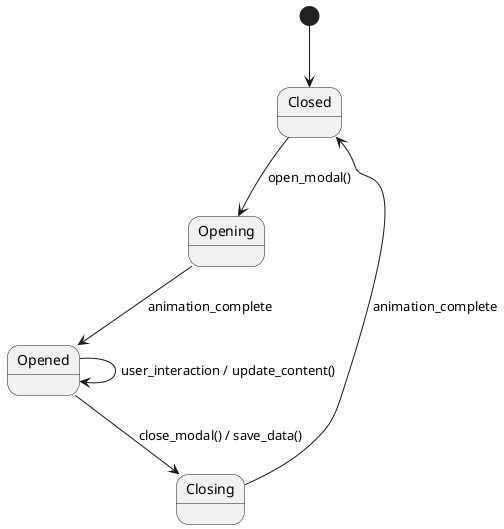

### Form Validation Pattern
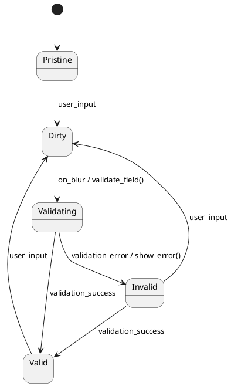

### Async Operation Pattern
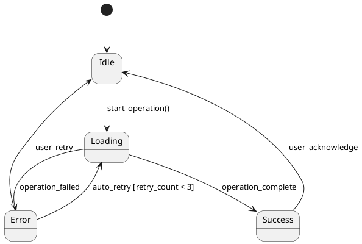

## References

- [PlantUML Official Documentation](https://plantuml.com/)
- [PlantUML State Diagrams](https://plantuml.com/state-diagram)
- [PlantUML Activity Diagrams](https://plantuml.com/activity-diagram-beta)
- [PlantUML Sequence Diagrams](https://plantuml.com/sequence-diagram)
- [UML Best Practices for UI Design](https://developer.ibm.com/articles/the-sequence-diagram/)
