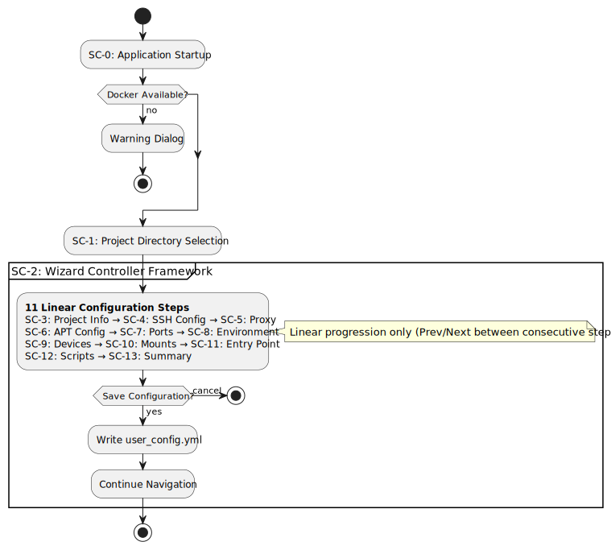
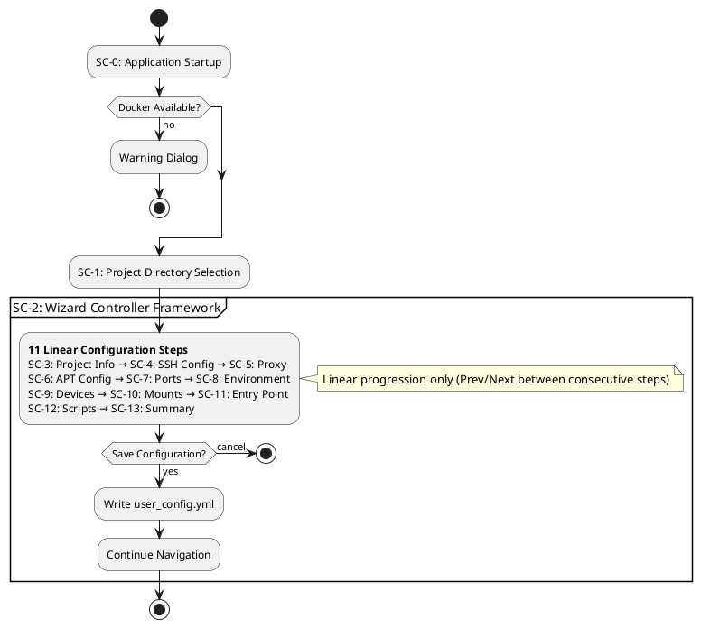

# PeiDocker GUI - Simple Mode Only Interaction Design

## Overview

The GUI provides **ONLY a simple mode** - a guided, wizard-like interface that walks users through creating a PeiDocker project using a series of sequential configuration steps. Each step has its own dedicated GUI screen. There is no advanced mode. The interface focuses on the most common configuration options with streamlined navigation and memory-based state management.

## CLI Command Structure

The GUI is launched using the `pei-docker-gui` command with the following subcommands:

### Start Subcommand
```bash
pei-docker-gui start [OPTIONS]
```

Options:
- `--project-dir PATH`: Project directory to use (skips directory selection)
- `--here`: Use current directory as the project directory

Examples:
```bash
pei-docker-gui start                           # Start with project directory selection
pei-docker-gui start --project-dir ./my-app    # Start with specific project directory
pei-docker-gui start --here                    # Use current directory as project directory
```

### Dev Subcommand
```bash
pei-docker-gui dev [OPTIONS]
```

Options:
- `--project-dir PATH`: Project directory to use (required for dev mode)
- `--here`: Use current directory as the project directory  
- `--screen TEXT`: Screen to start with (e.g., 'sc-0', 'sc-1', etc.)

Examples:
```bash
pei-docker-gui dev --project-dir ./my-app      # Start in development mode
pei-docker-gui dev --here --screen sc-1        # Start at specific screen in dev mode
```

**Important**: The `--screen` option requires either `--project-dir` or `--here` to be specified.

## Screen Numbering Convention

The GUI uses a consistent screen numbering system where:

- **Screen 0 (SC-0)**: Application Startup Screen - Entry point with system validation
- **Screen 1 (SC-1)**: Project Directory Selection Screen - Project location setup
- **Screen 2 (SC-2)**: Simple Mode Wizard Controller - **Controller framework (not user-facing)** that orchestrates the 11-step configuration wizard
- **Screens 3-13 (SC-3 to SC-13)**: Configuration wizard screens (Steps 1-11 of the wizard)

**Important**: SC-2 is not a screen users visit directly. It's the underlying controller framework that provides navigation, state management, validation, and UI infrastructure for the actual wizard steps (SC-3 to SC-13). Users navigate between the 11 configuration steps, while SC-2 manages the flow behind the scenes.

**Screen ID to Step Mapping:**
- SC-3: Step 1 - Project Information
- SC-4: Step 2 - SSH Configuration  
- SC-5: Step 3 - Proxy Configuration
- SC-6: Step 4 - APT Configuration
- SC-7: Step 5 - Port Mapping
- SC-8: Step 6 - Environment Variables
- SC-9: Step 7 - Device Configuration
- SC-10: Step 8 - Additional Mounts
- SC-11: Step 9 - Custom Entry Point
- SC-12: Step 10 - Custom Scripts
- SC-13: Step 11 - Configuration Summary

## Architecture & File Structure

```
src/pei_docker/gui/
├── __init__.py
├── app.py                    # Main GUI application entry point
├── screens/
│   ├── __init__.py
│   ├── startup.py            # SC-0: Application startup (project directory selection)
│   ├── project_selection.py  # SC-1: Project directory selection and validation
│   ├── wizard_controller.py  # SC-2: Wizard controller framework (not user-facing)
│   ├── simple/
│   │   ├── __init__.py
│   │   ├── project_info.py   # SC-3: Step 1: Project name and base image
│   │   ├── ssh_config.py     # SC-4: Step 2: SSH configuration
│   │   ├── proxy_config.py   # SC-5: Step 3: Proxy configuration
│   │   ├── apt_config.py     # SC-6: Step 4: APT mirror configuration
│   │   ├── port_mapping.py   # SC-7: Step 5: Additional port mappings
│   │   ├── env_vars.py       # SC-8: Step 6: Environment variables
│   │   ├── device_config.py  # SC-9: Step 7: GPU/device configuration
│   │   ├── mounts.py         # SC-10: Step 8: Additional mount points
│   │   ├── entry_point.py    # SC-11: Step 9: Custom entry point scripts
│   │   ├── custom_scripts.py # SC-12: Step 10: Custom hook scripts
│   │   └── summary.py        # SC-13: Step 11: Configuration summary and save
├── models/
│   ├── __init__.py
│   └── config.py            # Configuration data models
├── widgets/
│   ├── __init__.py
│   ├── inputs.py            # Custom input widgets with validation
│   ├── forms.py             # Reusable form components
│   └── dialogs.py           # Dialog widgets
└── utils/
    ├── __init__.py
    ├── docker_utils.py      # Docker command utilities
    └── file_utils.py        # File system utilities
```

## Screen Flow Diagram



<details>
<summary>PlantUML Source</summary>


</details>

**Navigation Rules:**
- **Linear Progression**: Users can only navigate between consecutive steps (SC-3 ↔ SC-4 ↔ SC-5, etc.)
- **No Step Jumping**: Cannot skip ahead to SC-7 from SC-3 or jump back multiple steps  
- Each step: `prev` | `next` buttons (consecutive steps only)
- Final step: `prev` | `save` | `cancel` buttons  
- Double ESC: Return to main menu from any step
- Single ESC: Clear current input or go to previous state
- Memory-only changes until save
- After save: remain on summary page, continue linear navigation

## Detailed Screen Designs

### Screen 0: Application Startup Screen

**Layout:**
```
╭─ PeiDocker GUI ─────────────────────────────────────────────╮
│                                                             │
│  ██████╗ ███████╗██╗██████╗  ██████╗  ██████╗██╗  ██╗███████╗██████╗ │
│  ██╔══██╗██╔════╝██║██╔══██╗██╔═══██╗██╔════╝██║ ██╔╝██╔════╝██╔══██╗│
│  ██████╔╝█████╗  ██║██║  ██║██║   ██║██║     █████╔╝ █████╗  ██████╔╝│
│  ██╔═══╝ ██╔══╝  ██║██║  ██║██║   ██║██║     ██╔═██╗ ██╔══╝  ██╔══██╗│
│  ██║     ███████╗██║██████╔╝╚██████╔╝╚██████╗██║  ██╗███████╗██║  ██║│
│  ╚═╝     ╚══════╝╚═╝╚═════╝  ╚═════╝  ╚═════╝╚═╝  ╚═╝╚══════╝╚═╝  ╚═╝│
│                                                             │
│                 Docker Container Configuration GUI           │
│                                                             │
│  System Status:                                             │
│  ┌─────────────────────────────────────────────────────────┐ │
│  │ ✓ Docker: Available (version 24.0.6)                   │ │
│  │ ✓ Python: 3.11.5                                       │ │
│  │ ✓ PeiDocker: 0.8.0                                     │ │
│  └─────────────────────────────────────────────────────────┘ │
│                                                             │
│  [Continue] [Quit]                                          │
│                                                             │
│  Press 'q' to quit, Enter to continue                      │
╰─────────────────────────────────────────────────────────────╯
```

**Behavior:**
- Check for Docker availability on startup
- Show warning dialog if Docker not found
- Display system information
- Auto-continue after 2 seconds or on Enter key

### Screen 1: Project Directory Selection Screen

**Layout:**
```
╭─ Project Directory Setup ──────────────────────────────────╮
│                                                             │
│  Select where to create your PeiDocker project:            │
│                                                             │
│  Project Directory:                                         │
│  ┌─────────────────────────────────────────────────────────┐ │
│  │ D:\code\my-project                                      │ │
│  └─────────────────────────────────────────────────────────┘ │
│                              [Browse...]                    │
│                                                             │
│  ⚠ Directory will be created if it doesn't exist           │
│                                                             │
│  Project Name (for Docker images):                         │
│  ┌─────────────────────────────────────────────────────────┐ │
│  │ my-project                                              │ │
│  └─────────────────────────────────────────────────────────┘ │
│                                                             │
│  Docker images will be named:                               │
│  • my-project:stage-1                                      │
│  • my-project:stage-2                                      │
│                                                             │
│  [Back] [Continue]                                          │
│                                                             │
│  Press 'b' for back, Enter to continue                     │
╰─────────────────────────────────────────────────────────────╯
```

**Behavior:**
- If `pei-docker-gui start --project-dir <path>` provided, skip this screen
- Auto-suggest project name from directory name
- Check for existing Docker images and warn if found
- Validate directory path and create if needed
- After completion, proceed directly to Simple Wizard (no mode selection)

### Configuration Wizard Screens (SC-3 to SC-13)

The following screens represent the actual user-facing configuration steps, orchestrated by the SC-2 wizard controller framework. Each screen follows consistent navigation patterns with progress tracking and memory-based state management.

### Screen 3: Project Information Screen (Step 1 of 11)

**Layout:**
```
╭─ Project Information ──────────────────────── Step 1 of 11 ╮
│                                                             │
│  Basic project settings:                                    │
│                                                             │
│  Project Name: *                                            │
│  ┌─────────────────────────────────────────────────────────┐ │
│  │ my-awesome-project                                      │ │
│  └─────────────────────────────────────────────────────────┘ │
│  Images: my-awesome-project:stage-1, my-awesome-project:stage-2 │
│                                                             │
│  Base Docker Image:                                         │
│  ┌─────────────────────────────────────────────────────────┐ │
│  │ ubuntu:24.04                                            │ │
│  └─────────────────────────────────────────────────────────┘ │
│                                                             │
│  Common base images:                                        │
│  • ubuntu:24.04 (recommended)                              │
│  • ubuntu:22.04                                            │
│  • nvidia/cuda:12.6.3-cudnn-devel-ubuntu24.04             │
│                                                             │
│  ✓ Image exists on Docker Hub                              │
│                                                             │
│  [Prev] [Next]                                              │
│                                                             │
│  * Required field                                           │
╰─────────────────────────────────────────────────────────────╯
```

**Behavior:**
- Auto-populate project name from directory
- Validate Docker image name format
- Check Docker Hub for image existence (optional, non-blocking)
- Prevent empty project names

### Screen 4: SSH Configuration Screen (Step 2 of 11)

**Layout:**
```
╭─ SSH Configuration ───────────────────────── Step 2 of 11 ╮
│                                                             │
│  Configure SSH access to your container:                   │
│                                                             │
│  Enable SSH: ● Yes  ○ No                                   │
│                                                             │
│  ⚠ Selecting 'No' means you'll need to use docker exec    │
│    commands to access the container                        │
│                                                             │
│  SSH Container Port:                                        │
│  ┌─────────────────────────────────────────────────────────┐ │
│  │ 22                                                      │ │
│  └─────────────────────────────────────────────────────────┘ │
│                                                             │
│  SSH Host Port:                                             │
│  ┌─────────────────────────────────────────────────────────┐ │
│  │ 2222                                                    │ │
│  └─────────────────────────────────────────────────────────┘ │
│                                                             │
│  SSH User:                                                  │
│  ┌─────────────────────────────────────────────────────────┐ │
│  │ me                                                      │ │
│  └─────────────────────────────────────────────────────────┘ │
│                                                             │
│  SSH Password (no spaces or commas):                       │
│  ┌─────────────────────────────────────────────────────────┐ │
│  │ ••••••                                                  │ │
│  └─────────────────────────────────────────────────────────┘ │
│                                                             │
│  SSH User UID:                                              │
│  ┌─────────────────────────────────────────────────────────┐ │
│  │ 1100                                                    │ │
│  └─────────────────────────────────────────────────────────┘ │
│                                                             │
│  [Prev] [Next]                                              │
╰─────────────────────────────────────────────────────────────╯
```

**Extended SSH Configuration (if enabled):**
```
╭─ SSH Keys Configuration ──────────────────────────────────╮
│                                                             │
│  SSH Public Key Authentication: ○ Yes  ● No                │
│                                                             │
│  ┌─ Public Key (when enabled) ───────────────────────────┐  │
│  │ ○ Enter key text  ○ Use system key (~)               │  │
│  │                                                       │  │
│  │ Key Text:                                             │  │
│  │ ┌───────────────────────────────────────────────────┐ │  │
│  │ │ ssh-rsa AAAAB3NzaC1yc2EAAAADAQABAAABAQ...        │ │  │
│  │ └───────────────────────────────────────────────────┘ │  │
│  └───────────────────────────────────────────────────────┘  │
│                                                             │
│  SSH Private Key: ○ Yes  ● No                               │
│                                                             │
│  Root SSH Access: ○ Yes  ● No                               │
│                                                             │
│  ┌─ Root Password (when enabled) ────────────────────────┐  │
│  │ ┌───────────────────────────────────────────────────┐ │  │
│  │ │ ••••                                              │ │  │
│  │ └───────────────────────────────────────────────────┘ │  │
│  └───────────────────────────────────────────────────────┘  │
│                                                             │
│  [Prev] [Next]                                              │
╰─────────────────────────────────────────────────────────────╯
```

**Behavior:**
- Show/hide sections based on selections
- Validate port numbers (1-65535)
- Check for port conflicts
- Password validation (no spaces/commas)
- Toggle password visibility

### Screen 5: Proxy Configuration Screen (Step 3 of 11)

**Layout:**
```
╭─ Proxy Configuration ─────────────────────── Step 3 of 11 ╮
│                                                             │
│  Configure HTTP proxy for container networking:            │
│                                                             │
│  Use Proxy: ○ Yes  ● No                                    │
│                                                             │
│  ┌─ Proxy Settings (when enabled) ───────────────────────┐  │
│  │                                                       │  │
│  │ This will set http_proxy and https_proxy environment │  │
│  │ variables in the container.                           │  │
│  │                                                       │  │
│  │ Proxy Port:                                           │  │
│  │ ┌───────────────────────────────────────────────────┐ │  │
│  │ │ 8080                                              │ │  │
│  │ └───────────────────────────────────────────────────┘ │  │
│  │                                                       │  │
│  │ Proxy Usage:                                          │  │
│  │ ● Build-time only (remove after build)               │  │
│  │ ○ Build and runtime (persistent)                     │  │
│  │                                                       │  │
│  │ Proxy URL will be: http://host.docker.internal:8080  │  │
│  └───────────────────────────────────────────────────────┘  │
│                                                             │
│  [Prev] [Next]                                              │
╰─────────────────────────────────────────────────────────────╯
```

**Behavior:**
- Show/hide proxy settings based on selection
- Validate port number
- Preview proxy URL format
- Explain build vs runtime proxy usage

### Screen 6: APT Configuration Screen (Step 4 of 11)

**Layout:**
```
╭─ APT Repository Configuration ────────────── Step 4 of 11 ╮
│                                                             │
│  Choose APT repository mirror for faster package downloads:│
│                                                             │
│  Use Custom Mirror: ○ Yes  ● No                            │
│                                                             │
│  ┌─ Mirror Selection (when enabled) ─────────────────────┐  │
│  │                                                       │  │
│  │ Available mirrors:                                    │  │
│  │                                                       │  │
│  │ ○ tuna    - Tsinghua University (China)              │  │
│  │ ○ aliyun  - Alibaba Cloud (China)                    │  │
│  │ ○ 163     - NetEase (China)                          │  │
│  │ ○ ustc    - University of Science and Technology     │  │
│  │ ○ cn      - Ubuntu Official China Mirror             │  │
│  │ ● default - Ubuntu Default (no change)               │  │
│  │                                                       │  │
│  │ Selected mirror provides faster downloads for users  │  │
│  │ in specific geographic regions.                       │  │
│  └───────────────────────────────────────────────────────┘  │
│                                                             │
│  [Prev] [Next]                                              │
╰─────────────────────────────────────────────────────────────╯
```

**Behavior:**
- Radio button selection for mirror
- Geographic information for each mirror
- Preview of mirror benefits

### Screen 7: Port Mapping Screen (Step 5 of 11)

**Layout:**
```
╭─ Additional Port Mapping ─────────────────── Step 5 of 11 ╮
│                                                             │
│  Map additional ports from host to container:               │
│  (SSH port is already configured)                          │
│                                                             │
│  Add Port Mappings: ○ Yes  ● No                            │
│                                                             │
│  ┌─ Port Mappings (when enabled) ────────────────────────┐  │
│  │                                                       │  │
│  │ Enter port mapping (host:container) or range:        │  │
│  │ Examples: 8080:80, 3000:3000, 100-200:300-400        │  │
│  │                                                       │  │
│  │ ┌───────────────────────────────────────────────────┐ │  │
│  │ │ 8080:80                                           │ │  │
│  │ └───────────────────────────────────────────────────┘ │  │
│  │                                          [Add]        │  │
│  │                                                       │  │
│  │ Current mappings:                                     │  │
│  │ ┌───────────────────────────────────────────────────┐ │  │
│  │ │ • 2222:22 (SSH)                                   │ │  │
│  │ │ • 8080:80                                         │ │  │
│  │ └───────────────────────────────────────────────────┘ │  │
│  │                                                       │  │
│  │ Press Enter with empty input to finish               │  │
│  └───────────────────────────────────────────────────────┘  │
│                                                             │
│  [Prev] [Next]                                              │
╰─────────────────────────────────────────────────────────────╯
```

**Behavior:**
- Dynamic list of port mappings
- Validate port format and ranges
- Prevent duplicate mappings
- Show SSH port as read-only

### Screen 8: Environment Variables Screen (Step 6 of 11)

**Layout:**
```
╭─ Environment Variables ───────────────────── Step 6 of 11 ╮
│                                                             │
│  Set custom environment variables for the container:       │
│                                                             │
│  Add Environment Variables: ○ Yes  ● No                    │
│                                                             │
│  ┌─ Environment Variables (when enabled) ─────────────────┐ │
│  │                                                       │  │
│  │ Enter environment variable (KEY=VALUE):               │  │
│  │                                                       │  │
│  │ ┌───────────────────────────────────────────────────┐ │  │
│  │ │ NODE_ENV=production                               │ │  │
│  │ └───────────────────────────────────────────────────┘ │  │
│  │                                          [Add]        │  │
│  │                                                       │  │
│  │ Current variables:                                    │  │
│  │ ┌───────────────────────────────────────────────────┐ │  │
│  │ │ • NODE_ENV=production                             │ │  │
│  │ │ • DEBUG=true                                      │ │  │
│  │ └───────────────────────────────────────────────────┘ │  │
│  │                                                       │  │
│  │ To delete a variable, set it to an empty value       │  │
│  │ Press Enter with empty input to finish               │  │
│  └───────────────────────────────────────────────────────┘  │
│                                                             │
│  [Prev] [Next]                                              │
╰─────────────────────────────────────────────────────────────╯
```

**Behavior:**
- Validate KEY=VALUE format
- Allow deletion by setting empty value
- Dynamic list management
- Show current variables list

### Screen 9: Device Configuration Screen (Step 7 of 11)

**Layout:**
```
╭─ Device Configuration ────────────────────── Step 7 of 11 ╮
│                                                             │
│  Configure hardware device access:                         │
│                                                             │
│  Enable GPU Support: ○ Yes  ● No                           │
│                                                             │
│  ┌─ GPU Information ──────────────────────────────────────┐ │
│  │                                                       │  │
│  │ ⚠ GPU support requires:                               │  │
│  │   • NVIDIA Docker runtime                             │  │
│  │   • Compatible GPU drivers                            │  │
│  │   • CUDA-compatible base image                        │  │
│  │                                                       │  │
│  │ We do not detect GPU availability automatically.     │  │
│  │ Enable this only if you have the required setup.     │  │
│  │                                                       │  │
│  │ Recommended base images for GPU:                      │  │
│  │ • nvidia/cuda:12.6.3-cudnn-devel-ubuntu24.04         │  │
│  │ • nvidia/cuda:12.6.3-cudnn-runtime-ubuntu24.04       │  │
│  └───────────────────────────────────────────────────────┘  │
│                                                             │
│  [Prev] [Next]                                              │
╰─────────────────────────────────────────────────────────────╯
```

**Behavior:**
- Warning about GPU requirements
- No automatic GPU detection
- Suggest compatible base images

### Screen 10: Additional Mounts Screen (Step 8 of 11)

**Layout:**
```
╭─ Additional Mounts ───────────────────────── Step 8 of 11 ╮
│                                                             │
│  Configure additional volume mounts:                       │
│                                                             │
│  Stage-1 Mounts: ○ Yes  ● No                               │
│                                                             │
│  ┌─ Stage-1 Mount Configuration (when enabled) ──────────┐  │
│  │                                                       │  │
│  │ Mount Type:                                           │  │
│  │ ○ Automatic Docker Volume                             │  │
│  │ ○ Manual Docker Volume                                │  │
│  │ ○ Host Directory                                      │  │
│  │ ○ Done (finish mounting)                              │  │
│  │                                                       │  │
│  │ Destination Path:                                     │  │
│  │ ┌───────────────────────────────────────────────────┐ │  │
│  │ │ /app/data                                         │ │  │
│  │ └───────────────────────────────────────────────────┘ │  │
│  │                                                       │  │
│  │ Source (for manual volume/host directory):           │  │
│  │ ┌───────────────────────────────────────────────────┐ │  │
│  │ │ my-data-volume                                    │ │  │
│  │ └───────────────────────────────────────────────────┘ │  │
│  │                                          [Add Mount]  │  │
│  └───────────────────────────────────────────────────────┘  │
│                                                             │
│  Stage-2 Mounts: ○ Yes  ● No                               │
│  ⚠ Stage-2 mounts will completely replace Stage-1 mounts  │
│                                                             │
│  [Prev] [Next]                                              │
╰─────────────────────────────────────────────────────────────╯
```

**Behavior:**
- Show/hide mount configuration sections
- Validate paths and volume names
- Warning about Stage-2 override behavior
- Support for different mount types

### Screen 11: Custom Entry Point Screen (Step 9 of 11)

**Layout:**
```
╭─ Custom Entry Point ──────────────────────── Step 9 of 11 ╮
│                                                             │
│  Configure custom entry point scripts:                     │
│                                                             │
│  Stage-1 Entry Point: ○ Yes  ● No                          │
│                                                             │
│  ┌─ Stage-1 Entry Point (when enabled) ──────────────────┐  │
│  │                                                       │  │
│  │ Entry Point Script (.sh):                             │  │
│  │ ┌───────────────────────────────────────────────────┐ │  │
│  │ │ /path/to/my-entrypoint.sh                         │ │  │
│  │ └───────────────────────────────────────────────────┘ │  │
│  │                                         [Browse...]   │  │
│  │                                                       │  │
│  │ Script will be copied to project directory and       │  │
│  │ executed when the container starts.                  │  │
│  └───────────────────────────────────────────────────────┘  │
│                                                             │
│  Stage-2 Entry Point: ○ Yes  ● No                          │
│  ⚠ Stage-2 entry point will override Stage-1 entry point  │
│                                                             │
│  [Prev] [Next]                                              │
╰─────────────────────────────────────────────────────────────╯
```

**Behavior:**
- File browser for script selection
- Validate script file existence
- Warning about Stage-2 override behavior
- Copy script to project directory

### Screen 12: Custom Scripts Screen (Step 10 of 11)

**Layout:**
```
╭─ Custom Scripts ──────────────────────────── Step 10 of 11 ╮
│                                                             │
│  Configure custom lifecycle scripts:                       │
│                                                             │
│  Stage-1 Custom Scripts: ○ Yes  ● No                       │
│                                                             │
│  ┌─ Stage-1 Script Configuration (when enabled) ─────────┐  │
│  │                                                       │  │
│  │ Script Type:                                          │  │
│  │ ● on_build    - Run during Docker image build        │  │
│  │ ○ on_first_run - Run on first container startup      │  │
│  │ ○ on_every_run - Run on every container startup      │  │
│  │ ○ on_user_login - Run when user logs in via SSH     │  │
│  │                                                       │  │
│  │ Script Path (with optional arguments):               │  │
│  │ ┌───────────────────────────────────────────────────┐ │  │
│  │ │ stage-1/custom/setup.sh --verbose                 │ │  │
│  │ └───────────────────────────────────────────────────┘ │  │
│  │                                          [Add Script] │  │
│  │                                                       │  │
│  │ Current on_build scripts:                            │  │
│  │ • stage-1/custom/setup.sh --verbose                  │  │
│  │                                                       │  │
│  │ Press Enter with empty path to switch script types   │  │
│  └───────────────────────────────────────────────────────┘  │
│                                                             │
│  Stage-2 Custom Scripts: ○ Yes  ● No                       │
│                                                             │
│  [Prev] [Next]                                              │
╰─────────────────────────────────────────────────────────────╯
```

**Behavior:**
- Cycle through script types
- Show current scripts for each type
- Support command-line arguments
- Validate script paths

### Screen 13: Configuration Summary Screen (Step 11 of 11)

**Layout:**
```
╭─ Configuration Summary ───────────────────── Step 11 of 11 ╮
│                                                             │
│  Review your configuration:                                 │
│                                                             │
│  ┌─ Project Settings ─────────────────────────────────────┐ │
│  │ Name: my-awesome-project                               │ │
│  │ Base Image: ubuntu:24.04                               │ │
│  │ Output Directory: D:\code\my-project                   │ │
│  └─────────────────────────────────────────────────────────┘ │
│                                                             │
│  ┌─ SSH Configuration ────────────────────────────────────┐ │
│  │ ✓ Enabled (port 2222:22)                              │ │
│  │ User: me (password auth)                               │ │
│  │ Root access: disabled                                  │ │
│  └─────────────────────────────────────────────────────────┘ │
│                                                             │
│  ┌─ Additional Configuration ─────────────────────────────┐ │
│  │ Proxy: disabled                                        │ │
│  │ APT Mirror: default                                    │ │
│  │ GPU Support: disabled                                  │ │
│  │ Port Mappings: 8080:80                                 │ │
│  │ Environment: NODE_ENV=production                       │ │
│  └─────────────────────────────────────────────────────────┘ │
│                                                             │
│  [Prev] [Save] [Cancel]                                     │
│                                                             │
│  Save creates user_config.yml in project dir & stays here  │
│  Continue navigating back/forth and save again as needed   │
╰─────────────────────────────────────────────────────────────╯
```

**Behavior:**
- Comprehensive configuration review
- Organized by logical sections
- Save: Write user_config.yml and remain on this page
- Prev: Navigate back to any previous step for changes
- Cancel: Return to main menu without saving
- After save: persistent page with continued navigation ability
- Generate user_config.yml file

## Key Features & Behaviors

### Navigation
- **Progress Indicator**: Shows current step (1-11) and total steps
- **Prev/Next Buttons**: Linear navigation between consecutive screens only
- **Double ESC**: Return to main menu from any step
- **Single ESC**: Clear current input or go to previous state
- **Final Page**: Prev | Save | Cancel buttons
- **Keyboard Shortcuts**: Tab, Enter, Escape, arrow keys
- **Linear Navigation**: Go back and forth between consecutive steps only

### Validation
- **Real-time Validation**: Input validation as user types
- **Error Messages**: Clear, actionable error messages
- **Required Fields**: Visual indicators for required inputs
- **Format Checking**: Port ranges, key formats, file paths

### State Management
- **Memory-Only Changes**: All configuration changes kept in memory until save
- **Configuration State**: Maintain user choices across screens during navigation
- **No Auto-save**: Only write user_config.yml when user explicitly saves
- **Persistent Final Page**: After save, remain on summary page for more changes
- **Iterative Workflow**: Navigate, modify, save repeatedly as needed
- **Reset Options**: Clear all and start over from main menu

### Accessibility
- **Keyboard Navigation**: Full keyboard accessibility
- **Screen Reader Support**: Proper ARIA labels
- **Color Blind Friendly**: Color-independent indicators
- **Responsive Layout**: Adapts to terminal size

### Error Handling
- **Docker Unavailable**: Graceful degradation with warnings
- **File System Errors**: Clear error messages
- **Network Issues**: Timeout and retry mechanisms
- **Invalid Inputs**: Prevent invalid configurations

## Technical Implementation Notes

### Textual Framework Usage
- **Screens**: Each wizard step is a separate Screen class
- **Widgets**: Custom validation widgets for inputs
- **Reactive Variables**: State management with reactive attributes
- **CSS Styling**: Consistent visual theme
- **Message Handling**: Screen-to-screen communication

### Configuration Model
- **Data Classes**: Type-safe configuration structures
- **YAML Generation**: Convert internal model to user_config.yml
- **Validation**: Comprehensive input validation
- **Defaults**: Sensible default values

### File Operations
- **Path Handling**: Cross-platform path management
- **File Copying**: Script files to project directory
- **Directory Creation**: Automatic directory structure setup
- **Permission Handling**: Proper file permissions

## Key Design Changes from Original

This updated design reflects the new simple-mode-only approach with these critical changes:

### Removed Features
- **Advanced Mode**: Completely removed - only simple mode wizard exists
- **Mode Selection Screen**: No longer needed, go directly to wizard
- **Auto-save**: No automatic file writing during navigation

### Enhanced Features  
- **Memory-First State**: All changes kept in memory until explicit save
- **Persistent Final Page**: After save, stay on summary page for more iterations
- **Linear Navigation**: Sequential step progression with double-ESC to main menu
- **SSH User UID**: Added UID field (default 1100) to avoid system user conflicts
- **Iterative Workflow**: Save multiple times after making changes

### Navigation Behavior
- **Each Step**: [Prev] | [Next] buttons
- **Final Step**: [Prev] | [Save] | [Cancel] buttons  
- **Double ESC**: Return to main menu from anywhere
- **Single ESC**: Clear input or go to previous state
- **Post-Save**: Continue linear navigation and save again as needed

This design provides a streamlined, single-mode wizard interface that guides users through PeiDocker project creation while maintaining maximum flexibility for configuration changes and iterations.