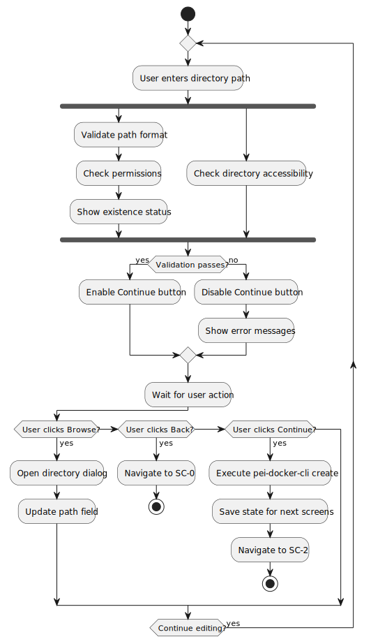

# Screen 1: Project Directory Selection Screen - Technical Specification

## Overview

**Screen ID:** `SC-1`  
**Screen Name:** Project Directory Selection Screen  
**Purpose:** Project location setup and Docker image naming configuration  
**File Location:** `src/pei_docker/gui/screens/project_setup.py`  
**Flow Position:** Second screen after Application Startup (SC-0), before Simple Wizard Controller (SC-2)  
**Figures Directory:** `figures/sc1/` (contains generated UML diagrams)

## Functional Requirements

### Primary Objectives
1. **Directory Selection**: Allow user to select or create project directory
2. **Project Naming**: Generate and validate project name for Docker images (no default value)
3. **Path Validation**: Ensure directory path is valid and accessible
4. **Docker Image Preview**: Show resulting Docker image names
5. **Project Directory Creation**: Create the project directory structure for use by subsequent screens

### Use Cases


<details>
<summary>PlantUML Source</summary>


</details>

### Navigation Options
- **Back Button**: Return to Application Startup Screen (SC-0)
- **Continue Button**: Proceed to Simple Wizard Controller (SC-2)
- **Browse Button**: Open directory selection dialog
- **Keyboard Controls**: 'b' for back, Enter to continue

## User Interface Specification

### Layout Structure
```
╭─ Project Directory Setup ──────────────────────────────────╮
│                                                             │
│  Select where to create your PeiDocker project:            │
│                                                             │
│  Project Directory:                                         │
│  ┌─────────────────────────────────────────────────────────┐ │
│  │ D:\code\my-project                                      │ │
│  └─────────────────────────────────────────────────────────┘ │
│                              [Browse...]                    │
│                                                             │
│  ⚠ Directory will be created if it doesn't exist           │
│                                                             │
│  Project Name (for Docker images):                         │
│  ┌─────────────────────────────────────────────────────────┐ │
│  │ my-project                                              │ │
│  └─────────────────────────────────────────────────────────┘ │
│                                                             │
│  Docker images will be named:                               │
│  • my-project:stage-1                                      │
│  • my-project:stage-2                                      │
│                                                             │
│  [Back] [Continue]                                          │
│                                                             │
│  Press 'b' for back, Enter to continue                     │
╰─────────────────────────────────────────────────────────────╯
```

### Status Display Examples

#### Standard Configuration
```
Project Directory:
┌─────────────────────────────────────────────────────────────┐
│ D:\code\my-project                                          │
└─────────────────────────────────────────────────────────────┘
                             [Browse...]

⚠ Directory will be created if it doesn't exist

Project Name (for Docker images):
┌─────────────────────────────────────────────────────────────┐
│ my-project                                                  │
└─────────────────────────────────────────────────────────────┘

Docker images will be named:
• my-project:stage-1
• my-project:stage-2
```

#### Directory Already Exists
```
Project Directory:
┌─────────────────────────────────────────────────────────────┐
│ D:\code\existing-project                                    │
└─────────────────────────────────────────────────────────────┘
                             [Browse...]

ℹ Directory already exists

Project Name (for Docker images):
┌─────────────────────────────────────────────────────────────┐
│ existing-project                                            │
└─────────────────────────────────────────────────────────────┘

Docker images will be named:
• existing-project:stage-1
• existing-project:stage-2
```


#### Invalid Project Name
```
Project Directory:
┌─────────────────────────────────────────────────────────────┐
│ D:\code\my project with spaces                              │
└─────────────────────────────────────────────────────────────┘
                             [Browse...]

⚠ Directory will be created if it doesn't exist

Project Name (for Docker images):
┌─────────────────────────────────────────────────────────────┐
│ my project with spaces                                      │
└─────────────────────────────────────────────────────────────┘

❌ Invalid project name: 
   • No spaces allowed
   • Use letters, numbers, hyphens, and underscores only
   • Must start with letter
```

## Behavior Specifications

### Screen Initialization Activity


<details>
<summary>PlantUML Source</summary>


</details>

### User Interaction Flow



<details>
<summary>PlantUML Source</summary>


</details>

### Input Validation Rules

**Directory Path**: Non-empty, valid filesystem path, write permissions  
**Project Name**: Alphanumeric + hyphens + underscores, no spaces, 1-50 chars, starts with letter

### Navigation State Machine


<details>
<summary>PlantUML Source</summary>


</details>

### Error Handling States


<details>
<summary>PlantUML Source</summary>


</details>

### Command Line Override Behavior

**CLI Override (--project-dir or --here)**: Screen is displayed with directory input field pre-filled and grayed out (uneditable). Browse button is disabled. Project name is extracted from path and can be modified. 

CLI commands that trigger this behavior:
- `pei-docker-gui start --project-dir <path>`
- `pei-docker-gui start --here`
- `pei-docker-gui dev --project-dir <path>`
- `pei-docker-gui dev --here`

This specification provides comprehensive guidance for implementing the Project Directory Selection Screen as the second step in the PeiDocker GUI application workflow.