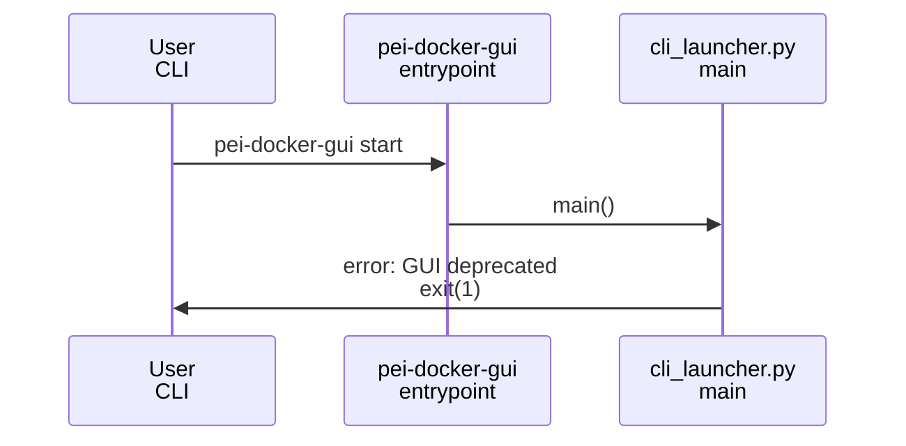

# Plan: Deprecate PeiDocker GUI Launch

## HEADER
- Purpose: Prevent users from starting the deprecated GUI in PeiDocker 2.0 by blocking the GUI entry point with a clear error message, while documenting the change.
- Status: Draft
- Date: 2026-02-06
- Dependencies:
  - **src/pei_docker/webgui/cli_launcher.py** (GUI CLI entry point and start flow)
  - **pyproject.toml** (console entry point for `pei-docker-gui`)
  - **docs/cli_reference.md** (CLI documentation)
  - **README.md** (top-level usage notes)
- Target: PeiDocker maintainers and contributors implementing 2.0 deprecations.

---

## 1. Purpose and Outcome
Success means any attempt to run `pei-docker-gui start` (or the module directly) immediately exits with a clear, user-facing error stating the GUI is deprecated and not available until a future update. The CLI should not try to initialize NiceGUI, resolve ports, or create projects. Documentation should reflect the deprecation.

## 2. Implementation Approach
### 2.1 High-level flow
1. Intercept GUI startup at the earliest practical CLI entry point.
2. Emit a concise error message and exit with non-zero status.
3. Ensure direct module invocation (`python -m pei_docker.webgui.cli_launcher`) is also blocked.
4. Update docs to mark GUI as deprecated/unavailable in 2.0.

### 2.2 Sequence diagram (steady-state usage)

## 3. Files to Modify or Add
- **src/pei_docker/webgui/cli_launcher.py**: Add early guard in `main()` (and optionally `start_command`) to raise `SystemExit` with a clear deprecation message before any GUI logic runs.
- **docs/cli_reference.md**: Update GUI section to note deprecation and unavailable status.
- **README.md**: Add a short note indicating GUI is deprecated in 2.0.

## 4. TODOs (Implementation Steps)
- [ ] **Locate GUI entrypoint guard** confirm `pei-docker-gui` resolves to `pei_docker.webgui.cli_launcher:main` and identify the earliest interception point.
- [ ] **Block GUI startup** implement a top-of-`main()` guard (and optionally `start_command`) that prints an error and exits with status 1.
- [ ] **Cover direct module runs** ensure `__main__` path is also blocked via the same guard.
- [ ] **Update CLI docs** mark `pei-docker-gui` as deprecated/unavailable in 2.0.
- [ ] **Update README** add a brief deprecation note in the usage section.
