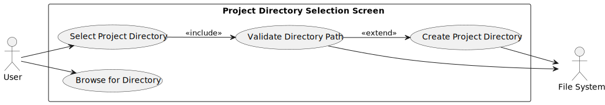
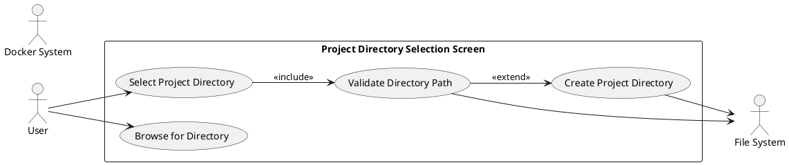
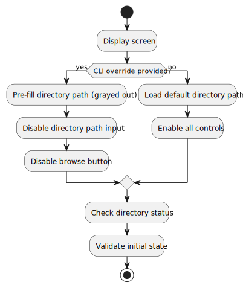
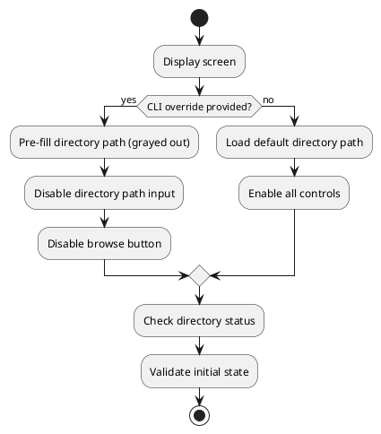
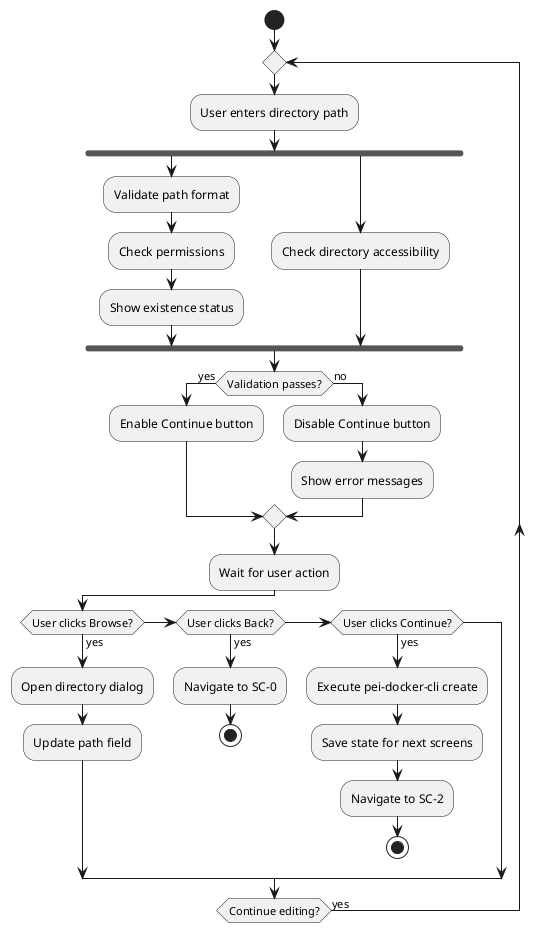
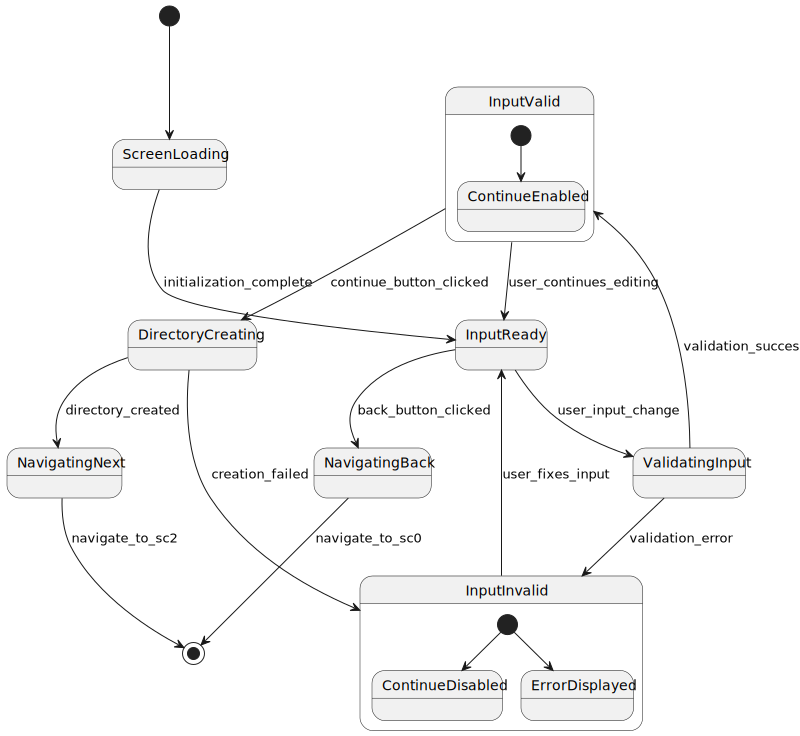
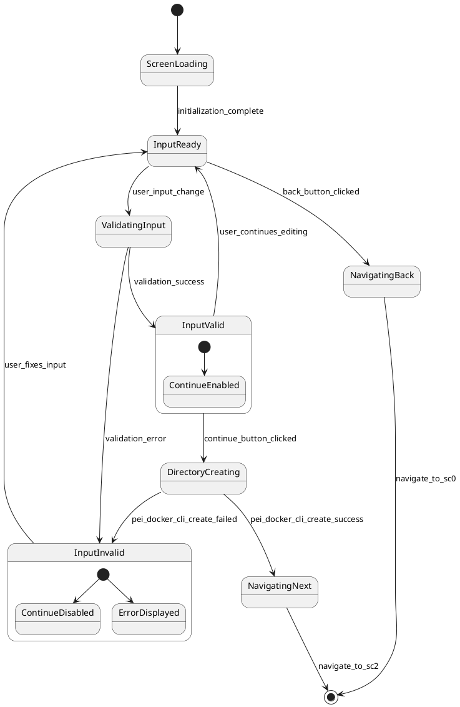
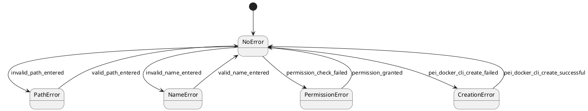

# Screen 1: Project Directory Selection Screen - Technical Specification

## Overview

**Screen ID:** `SC-1`  
**Screen Name:** Project Directory Selection Screen  
**Purpose:** Project location setup and directory validation  
**File Location:** `src/pei_docker/gui/screens/project_setup.py`  
**Flow Position:** Second screen after Application Startup (SC-0), before Simple Wizard Controller (SC-2)  
**Figures Directory:** `figures/sc1/` (contains generated UML diagrams)

### CLI Integration

This screen can be launched directly via the `pei-docker-gui dev` command with the `--project-dir <path>` argument for development and testing. This path can point to an existing or new directory. When launched in this mode, the directory input is pre-filled and disabled, the project name is derived from the path, and the screen's state must be initialized accordingly.

### Project Creation Implementation

To create new projects, this screen uses the existing `pei-docker-cli create` command instead of implementing the same functionality again. This ensures consistency with the CLI interface and avoids code duplication. The GUI screen serves as a frontend interface that collects the necessary parameters (project directory and name) and then invokes the CLI command to perform the actual project creation.


## Functional Requirements

### Primary Objectives
1. **Directory Selection**: Allow user to select or create project directory
2. **Path Validation**: Ensure directory path is valid and accessible
3. **Project Directory Creation**: Use `pei-docker-cli create` to create the project directory structure for use by subsequent screens

6. **Real-time Logging**: Display real-time logs from application backend processes in a dedicated view, occupying the right half of the screen.

### Use Cases



<details>
<summary>PlantUML Source</summary>


</details>

### User Stories

#### **Title: Real-time Log Viewer**

**As a** user running a potentially long process (like project creation),
**I want** to see real-time logs of the operations,
**So that** I can monitor the progress and diagnose any issues immediately.

##### **Acceptance Criteria:**
1. A log panel is displayed on the right side of the screen.
2. The main GUI content occupies the left half of the screen width.
3. The log panel occupies the right half of the screen width.
4. Both the main GUI and the log panel have the same height.
5. Logs from backend processes (e.g., `pei-docker-cli create`) are streamed into the log panel in real-time. This includes redirecting both `stdout` and `stderr` from the CLI command.
6. All logs generated by Python's standard `logging` module within the GUI application are also directed to this log widget.
7. The log panel is scrollable if the content exceeds the visible area.
8. Long log lines are automatically wrapped to fit within the log panel width, preventing horizontal scrolling and ensuring all content remains visible.

##### **Technical Implementation Notes:**
- The implementation of the logging widget should follow the guidelines provided in [`context/hints/howto-implement-realtime-logs-in-textual.md`](context/hints/howto-implement-realtime-logs-in-textual.md).

### Navigation Options
- **Back Button**: Return to Application Startup Screen (SC-0)
- **Continue Button**: Proceed to Simple Wizard Controller (SC-2)
- **Browse Button**: Open directory selection dialog

## User Interface Specification

### Layout Structure

The screen is divided into two main vertical panes. The main interaction area is on the left (1/2 of the screen width), and a real-time log viewer is on the right (1/2 of the screen width).

```
╭─ Project Directory Setup ────────────────────────────────────────────────────────────────╮
│╭─────────────────────────────────────────────╮╭─────────────────────────────────────────────╮│
││ Select where to create PeiDocker project:  ││ [INFO] App started...                       ││
││                                             ││ [DEBUG] Loading default path...             ││
││ Project Directory:                          ││ [INFO] Executing 'pei-docker-cli create'    ││
││ ┌─────────────────────────────────────────┐ ││ Creating project directory...               ││
││ │ D:\code\my-project                      │ ││ Project 'my-project' created.               ││
││ └─────────────────────────────────────────┘ ││                                             ││
││                              [Browse...]    ││                                             ││
││                                             ││                                             ││
││ ⚠ Directory will be created if not exist  ││                                             ││
││                                             ││                                             ││
││ [Back] [Continue]                           ││                                             ││
││                                             ││                                             ││
│╰─────────────────────────────────────────────╯╰─────────────────────────────────────────────╯│
╰──────────────────────────────────────────────────────────────────────────────────────────╯
```

### Status Display Examples

#### Standard Configuration
```
╭─────────────────────────────────────────────╮╭─────────────────────────────────────────────╮
│ Project Directory:                          ││ [INFO] Validating path...                   │
│ ┌─────────────────────────────────────────┐ ││ [SUCCESS] Path is valid.                    │
│ │ D:\code\my-project                      │ ││ [INFO] Ready to create project.             │
│ └─────────────────────────────────────────┘ ││                                             │
│                              [Browse...]    ││                                             │
│                                             ││                                             │
│ ⚠ Directory will be created if not exist  ││                                             │
╰─────────────────────────────────────────────╯╰─────────────────────────────────────────────╯
```

#### Directory Already Exists
```
╭─────────────────────────────────────────────╮╭─────────────────────────────────────────────╮
│ Project Directory:                          ││ [INFO] Validating path...                   │
│ ┌─────────────────────────────────────────┐ ││ [WARN] Directory 'D:\code\exist...' exists. │
│ │ D:\code\existing-project                │ ││ [INFO] Will use existing directory.        │
│ └─────────────────────────────────────────┘ ││                                             │
│                              [Browse...]    ││                                             │
│                                             ││                                             │
│ ℹ Directory already exists                ││                                             │
╰─────────────────────────────────────────────╯╰─────────────────────────────────────────────╯
```


#### Invalid Directory Path
```
╭─────────────────────────────────────────────╮╭─────────────────────────────────────────────╮
│ Project Directory:                          ││ [INFO] Validating path...                   │
│ ┌─────────────────────────────────────────┐ ││ [ERROR] Invalid directory path.             │
│ │ invalid/path///here                     │ ││ Path contains invalid characters.           │
│ └─────────────────────────────────────────┘ ││                                             │
│                              [Browse...]    ││                                             │
│                                             ││                                             │
│ ❌ Invalid directory path                   ││                                             │
╰─────────────────────────────────────────────╯╰─────────────────────────────────────────────╯
```

## Behavior Specifications

### Screen Initialization Activity



<details>
<summary>PlantUML Source</summary>


</details>

### User Interaction Flow


<details>
<summary>PlantUML Source</summary>


</details>

### Input Validation Rules

**Directory Path**: Non-empty, valid filesystem path, write permissions

### Navigation State Machine



<details>
<summary>PlantUML Source</summary>


</details>

### Error Handling States


<details>
<summary>PlantUML Source</summary>


</details>

### Command Line Override Behavior

**CLI Override (--project-dir or --here)**: Screen is displayed with directory input field pre-filled and grayed out (uneditable). Browse button is disabled. 

CLI commands that trigger this behavior:
- `pei-docker-gui start --project-dir <path>`
- `pei-docker-gui start --here`
- `pei-docker-gui dev --project-dir <path>`
- `pei-docker-gui dev --here`

This specification provides comprehensive guidance for implementing the Project Directory Selection Screen as the second step in the PeiDocker GUI application workflow.