# SC-2: Simple Mode Wizard Controller Framework - Technical Specification

## Overview

**Component ID:** `SC-2`  
**Component Name:** Simple Mode Wizard Controller Framework  
**Type:** Controller Infrastructure (Not User-Facing)  
**Purpose:** Provides navigation, state management, validation, and UI infrastructure for the 11-step configuration wizard  
**File Location:** `src/pei_docker/gui/screens/wizard_controller.py`  
**Role:** Controller framework that orchestrates user navigation through Steps 1-11 (SC-3 to SC-13)  
**Figures Directory:** `figures/sc2/` (contains generated UML diagrams)

**Important:** SC-2 is not a screen that users visit directly. It's the underlying controller framework that manages the wizard flow, state persistence, validation, and navigation infrastructure for the actual configuration steps.

### CLI Integration

For development and testing, the wizard controller can be activated via `pei-docker-gui dev` command with `--project-dir <path>` (or `--here`) and `--screen sc-3` through `--screen sc-13` arguments to jump directly to specific wizard steps. The controller framework automatically initializes when any wizard step is accessed, providing the necessary infrastructure for navigation and state management.

### Configuration State Management

The wizard controller implements a memory-first approach where all configuration changes are maintained in memory until the user explicitly saves on the final step (SC-13). This enables unlimited navigation between steps without file system changes, supporting an iterative workflow where users can navigate, modify, save, and continue editing as needed.

## Functional Requirements

### Primary Objectives

1. **Step Navigation Control**: Manage bi-directional navigation between 11 configuration steps (SC-3 to SC-13)
2. **Progress Tracking**: Display current step (1-11) and provide visual progress indication
3. **Memory State Management**: Maintain all configuration changes in memory until explicit save
4. **Input Validation**: Validate form inputs before allowing navigation to next step
5. **Error Handling**: Provide clear error messages and recovery paths
6. **Keyboard Navigation**: Support full keyboard accessibility including double ESC to main menu
7. **Real-time UI Updates**: Reflect configuration changes immediately in the interface

### Use Cases

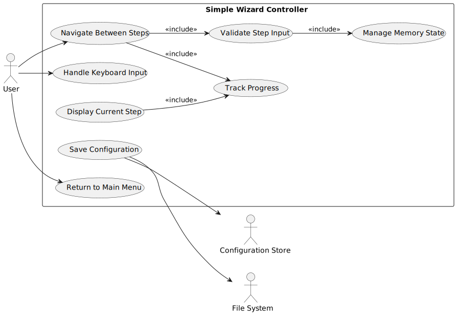

<details>
<summary>PlantUML Source</summary>

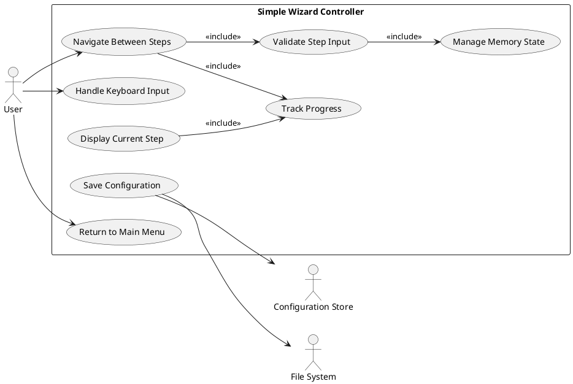
</details>

### User Stories

#### **Title: Unlimited Step Navigation**

**As a** user configuring a PeiDocker project,
**I want** to navigate freely between configuration steps in any order,
**So that** I can review and modify my choices without losing progress.

##### **Acceptance Criteria:**
1. I can click "Prev" to go back to any previous step
2. I can click "Next" to advance to the next step after validation passes
3. All my input changes are preserved when navigating between steps
4. I can jump to any step multiple times during the session
5. The progress indicator always shows my current step (1-11)

#### **Title: Memory-First Configuration**

**As a** user who might change my mind about settings,
**I want** all my configuration changes to be kept in memory until I choose to save,
**So that** I can experiment with different options without creating incomplete files.

##### **Acceptance Criteria:**
1. No files are written to disk until I click "Save" on the final step
2. I can navigate through all steps and change settings freely
3. My changes persist in memory during the entire wizard session
4. If I exit without saving, no configuration files are created
5. After saving, I can continue navigating and save again with updates

### Navigation Options

- **Prev Button**: Return to previous wizard step (SC-3 to SC-12)
- **Next Button**: Advance to next wizard step (SC-4 to SC-13)
- **Save Button**: Write configuration and remain on summary (SC-13 only)
- **Cancel Button**: Return to main menu without saving (SC-13 only)
- **Double ESC**: Return to main menu from any step
- **Single ESC**: Clear current input or go to previous state
- **Keyboard Navigation**: Tab, Enter, arrow keys for form navigation

## User Interface Framework Specification

### Layout Infrastructure

The wizard controller provides a consistent UI framework that wraps around the actual configuration step screens (SC-3 to SC-13). It provides the progress indicator, navigation controls, and common UI chrome while each step provides its specific content.

**Framework Layout Structure:**
*This shows the infrastructure provided by SC-2 - users see the step content area filled with actual configuration forms from SC-3 to SC-13.*

```
╭─ PeiDocker Configuration Wizard ────────────────── Step X of 11 ╮
│                                                                  │
│  Progress: ██████████░░░░░░░░░░░░░░░░░░░░░░░░░░░░  Step 3 of 11  │
│  ↑ Provided by SC-2 Controller Framework                        │
│                                                                  │
│  ┌─────────────────── Step Content Area ────────────────────┐   │
│  │                                                          │   │
│  │  [Step content from SC-3 to SC-13 displayed here]       │   │
│  │                                                          │   │
│  │  Step-specific forms, inputs, and validation messages    │   │
│  │  from the actual configuration screens (SC-3 to SC-13)  │   │
│  │                                                          │   │
│  │  Each step screen handles its own form layout while     │   │
│  │  SC-2 provides the consistent wrapper framework.        │   │
│  │  ↑ Content from individual step screens                 │   │
│  └──────────────────────────────────────────────────────────┘   │
│                                                                  │
│  [Prev] [Next]                                                   │
│  ↑ Provided by SC-2 Controller Framework                        │
│                                                                  │
│  Double ESC: Main Menu | Single ESC: Clear Input                │
╰──────────────────────────────────────────────────────────────────╯
```

### Progress Indicator Variations

#### Beginning Steps (1-3)
```
╭─ Project Information ──────────────────────────── Step 1 of 11 ╮
│                                                                 │
│  Progress: ████░░░░░░░░░░░░░░░░░░░░░░░░░░░░░░░░░░░░  Step 1 of 11 │
```

#### Middle Steps (4-8)
```
╭─ Port Mapping ─────────────────────────────────── Step 5 of 11 ╮
│                                                                 │
│  Progress: ████████████████░░░░░░░░░░░░░░░░░░░░░░░  Step 5 of 11 │
```

#### Final Steps (9-11)
```
╭─ Configuration Summary ────────────────────────── Step 11 of 11 ╮
│                                                                 │
│  Progress: ██████████████████████████████████████  Step 11 of 11 │
│                                                                  │
│  [Prev] [Save] [Cancel]                                          │
```

### Navigation State Display

#### Standard Navigation (Steps 1-10)
```
│  [Prev] [Next]                                                   │
│                                                                  │
│  Double ESC: Main Menu | Single ESC: Clear Input                │
```

#### Final Step Navigation (Step 11)
```
│  [Prev] [Save] [Cancel]                                          │
│                                                                  │
│  Save: Write user_config.yml and stay here for more changes     │
│  Double ESC: Main Menu | Single ESC: Clear Input                │
```

#### Post-Save State
```
│  [Prev] [Save] [Cancel]                                          │
│                                                                  │
│  ✓ Configuration saved! Navigate and save again as needed       │
│  Double ESC: Main Menu | Single ESC: Clear Input                │
```

## Behavior Specifications

### Wizard Initialization Flow

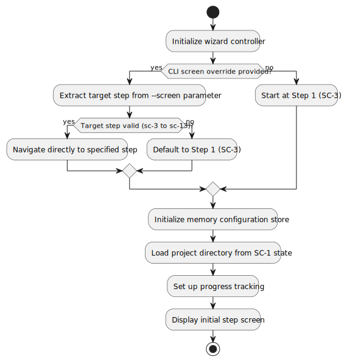

<details>
<summary>PlantUML Source</summary>

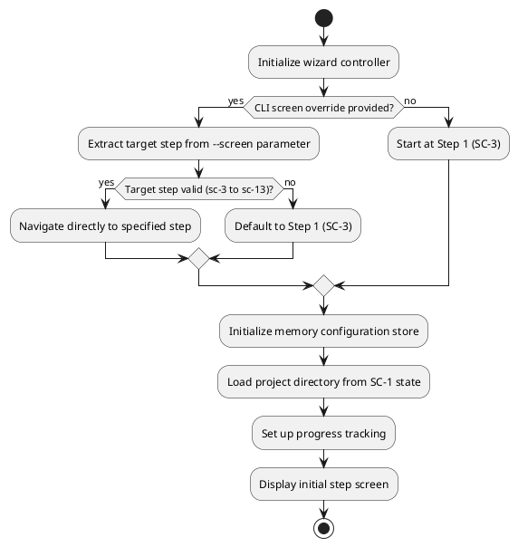
</details>

### Step Navigation Flow  

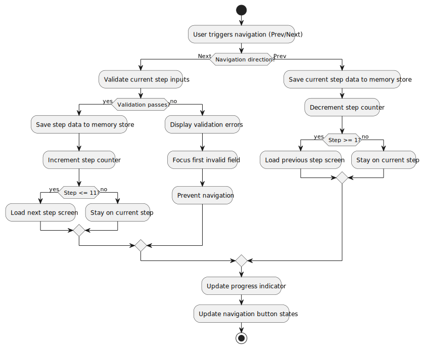

<details>
<summary>PlantUML Source</summary>

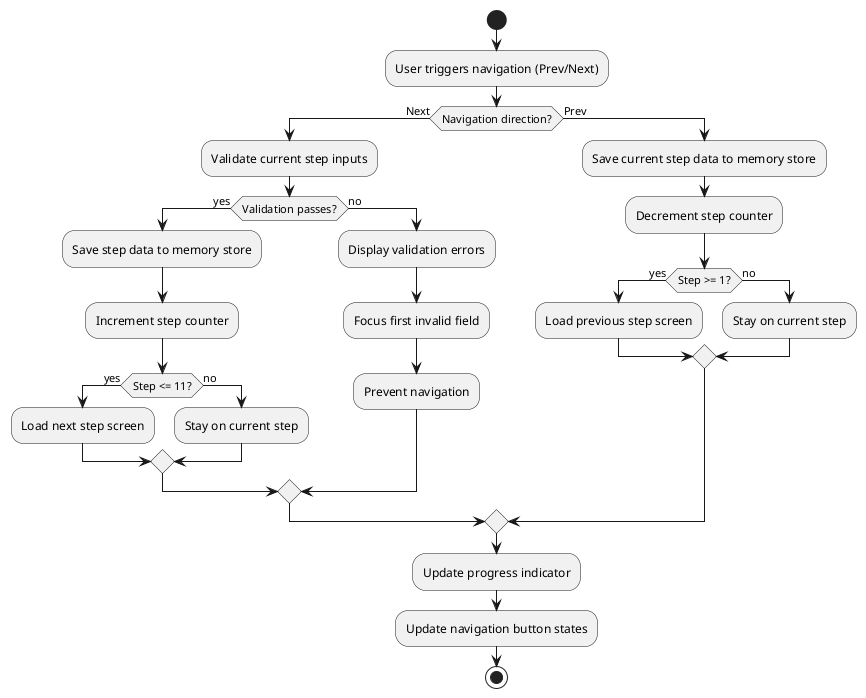
</details>

### Memory State Management

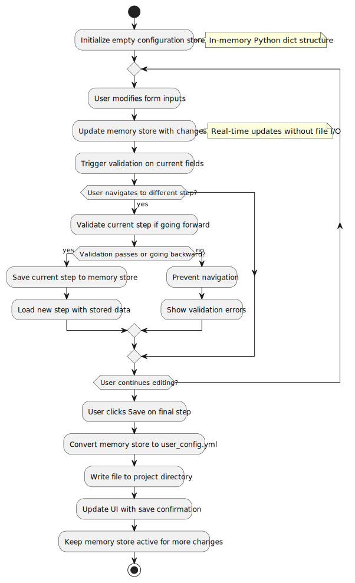

<details>
<summary>PlantUML Source</summary>

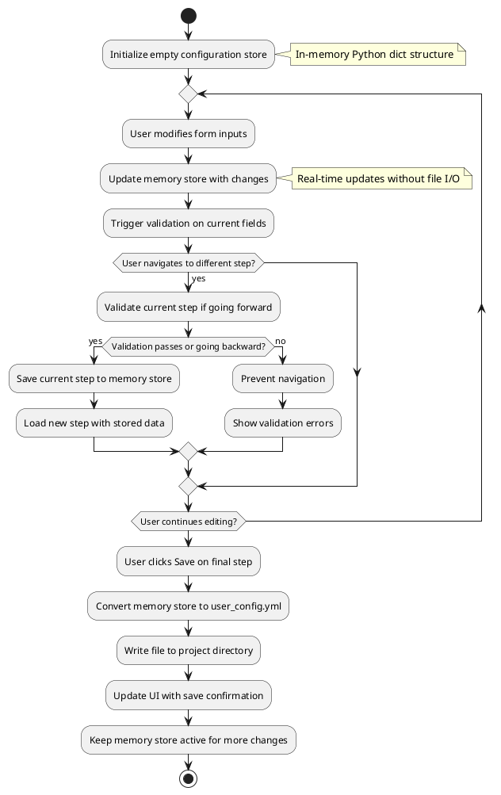
</details>

### Keyboard Input Handling

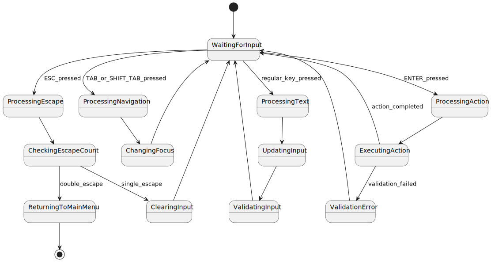

<details>
<summary>PlantUML Source</summary>

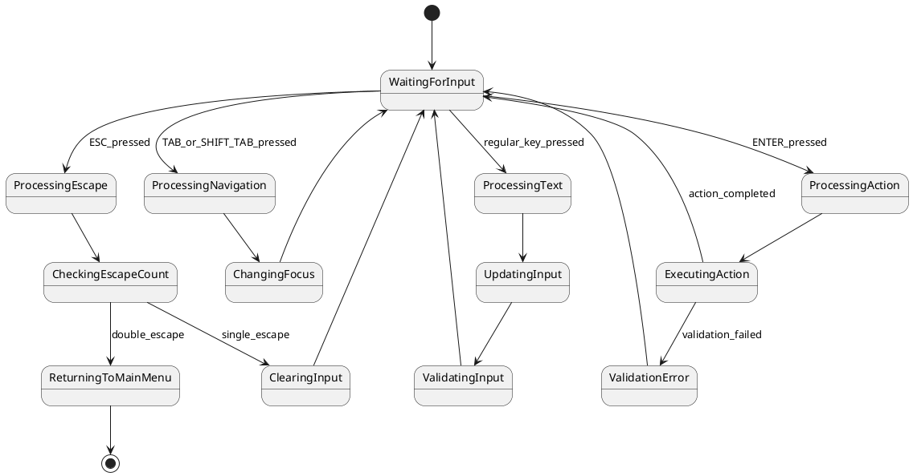
</details>

### Error Handling and Recovery

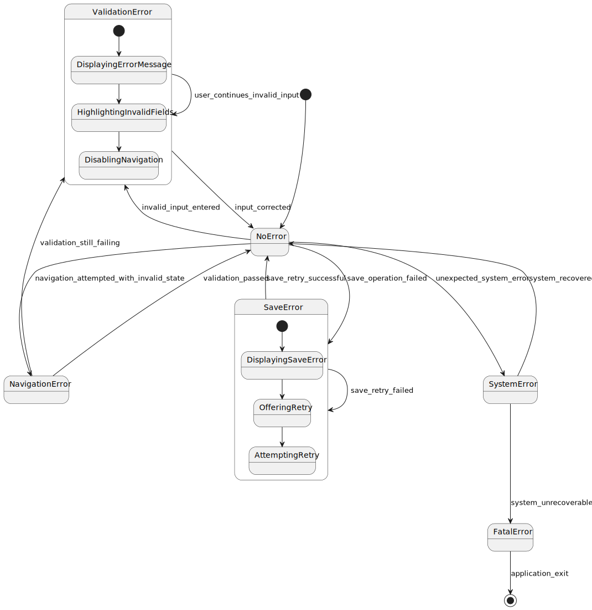

<details>
<summary>PlantUML Source</summary>

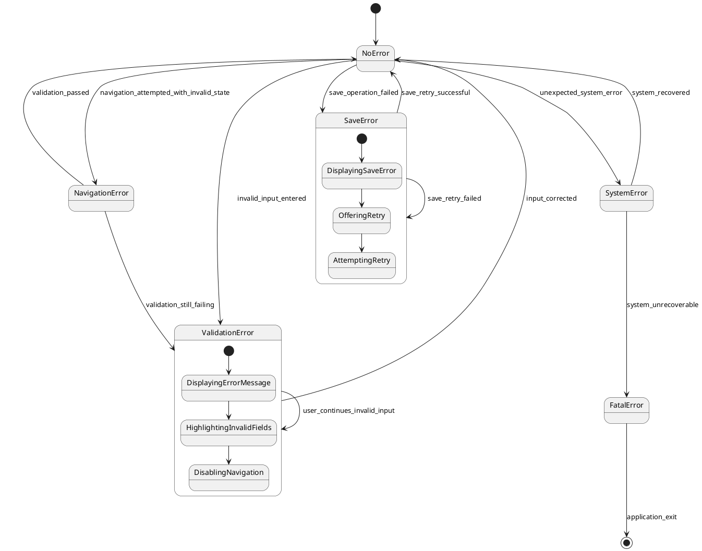
</details>

### Input Validation Rules

**Step Validation**: Each step must pass its specific validation rules before "Next" navigation is allowed  
**Required Fields**: All required fields must be completed and valid  
**Format Validation**: Input formats (ports, file paths, environment variables) must be correct  
**Cross-Step Validation**: Some validations may depend on choices made in previous steps  

## Configuration Data Model

### Memory Store Structure

The wizard controller maintains a comprehensive configuration data structure in memory:

```python
class WizardConfigurationStore:
    """In-memory configuration store for wizard data"""
    
    def __init__(self):
        self.project_info = ProjectInfoConfig()
        self.ssh_config = SSHConfig() 
        self.proxy_config = ProxyConfig()
        self.apt_config = APTConfig()
        self.port_mapping = PortMappingConfig()
        self.environment_vars = EnvironmentConfig()
        self.device_config = DeviceConfig()
        self.mount_config = MountConfig()
        self.entry_point_config = EntryPointConfig()
        self.custom_scripts_config = CustomScriptsConfig()
        self.is_saved = False
        self.save_timestamp = None
        
    def validate_step(self, step_number: int) -> ValidationResult:
        """Validate specific step configuration"""
        
    def export_to_yaml(self) -> str:
        """Convert memory store to user_config.yml format"""
        
    def save_to_file(self, project_dir: Path) -> bool:
        """Write configuration to user_config.yml file"""
```

### Step-to-Screen Mapping

The wizard controller manages the mapping between logical steps and actual screen implementations:

| Step | Screen ID | Configuration Section | Validation Requirements |
|------|-----------|----------------------|------------------------|
| 1 | SC-3 | project_info | Project name, base image |
| 2 | SC-4 | ssh_config | SSH settings, ports, credentials |
| 3 | SC-5 | proxy_config | Proxy URL and usage settings |
| 4 | SC-6 | apt_config | APT mirror selection |
| 5 | SC-7 | port_mapping | Port format and conflicts |
| 6 | SC-8 | environment_vars | Environment variable format |
| 7 | SC-9 | device_config | GPU and device settings |
| 8 | SC-10 | mount_config | Mount paths and types |
| 9 | SC-11 | entry_point_config | Script paths and execution |
| 10 | SC-12 | custom_scripts_config | Script types and paths |
| 11 | SC-13 | summary_and_save | Complete configuration review |

## Technical Implementation Notes

### Textual Framework Integration

**Screen Management**: Uses Textual's screen stack to manage step transitions while maintaining controller state  
**Reactive State**: Leverages reactive variables for real-time UI updates as configuration changes  
**Message Passing**: Implements custom messages for step-to-controller communication  
**CSS Theming**: Consistent styling across all wizard steps using shared CSS classes  

### Performance Considerations

**Memory Efficiency**: Configuration store is optimized for frequent updates without memory leaks  
**Lazy Loading**: Step screens are loaded on-demand to reduce initial memory footprint  
**Validation Caching**: Validation results are cached to avoid redundant processing  
**UI Responsiveness**: Long-running operations (like file I/O) are handled asynchronously  

### Development and Testing Support

**Step Navigation**: Supports direct navigation to specific wizard steps via `--screen sc-3` through `--screen sc-13` parameters  
**State Inspection**: Provides debug methods to inspect current configuration state and memory store  
**Validation Framework**: Each step's validation can be tested independently within the controller framework  
**Mock Data**: Supports loading test configuration data for rapid development iterations  

## Key Design Philosophy

This specification implements SC-2 as a controller framework (not a user-facing screen) that provides the infrastructure for a memory-first, simple-mode-only wizard approach with these critical features:

### Core Behavioral Changes
- **Memory-First State Management**: All changes kept in memory until explicit save operation
- **Persistent Final Page**: After saving, users remain on summary page for continued iteration
- **Unlimited Navigation**: Full bi-directional movement between any steps at any time
- **Double ESC to Main Menu**: Quick exit from any step without losing current session state

### Enhanced User Experience
- **Real-time Progress Tracking**: Visual progress bar and step indicators throughout workflow
- **Comprehensive Validation**: Input validation with clear error messages and recovery guidance  
- **Keyboard Accessibility**: Full keyboard navigation support with intuitive shortcuts
- **Iterative Workflow**: Save multiple times after making changes, supporting iterative refinement

### Technical Architecture
- **Step Screen Abstraction**: Each configuration step is a separate, testable screen component
- **Centralized State Management**: Single source of truth for all configuration data in memory
- **Pluggable Validation**: Each step can define its own validation rules and requirements
- **CLI Development Support**: Direct step access for development and testing workflows

This wizard controller framework provides a robust infrastructure foundation that enables seamless user navigation through PeiDocker project configuration (SC-3 to SC-13) while maintaining maximum flexibility, consistent user experience, and professional workflow management.