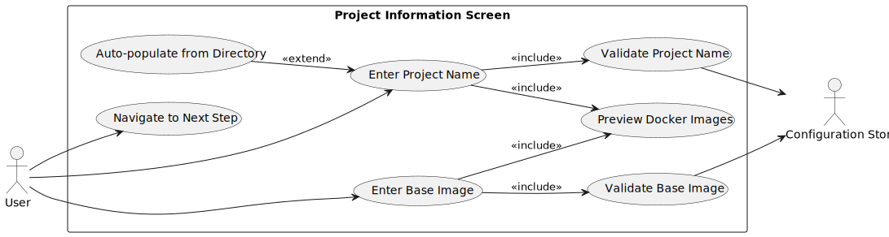
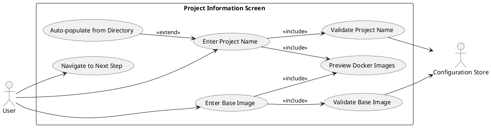
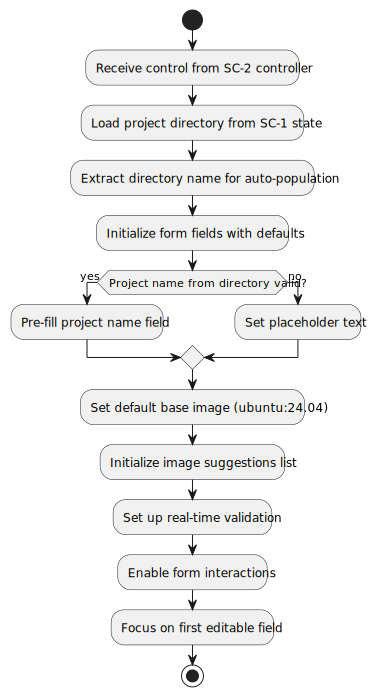
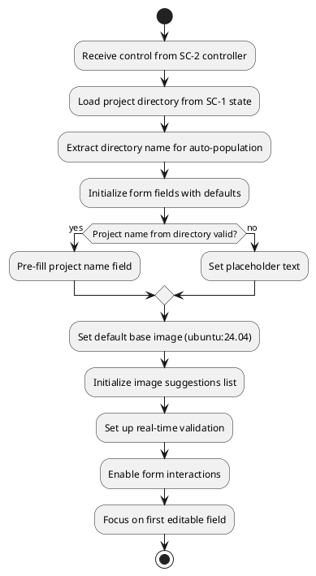
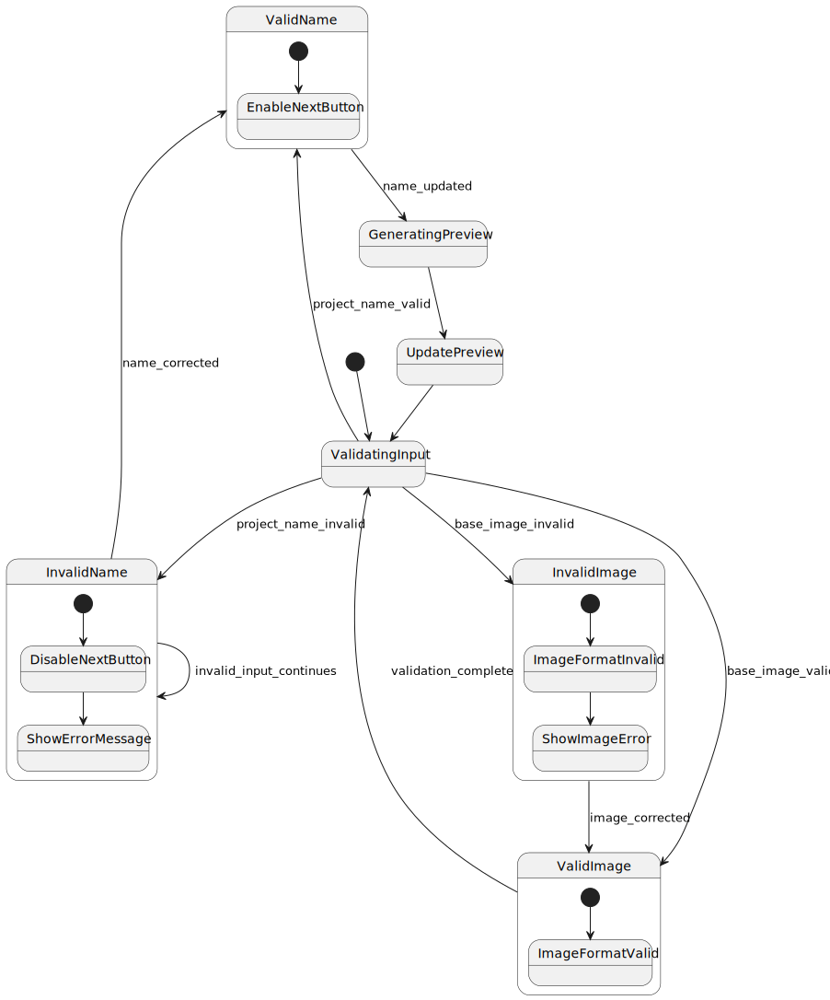
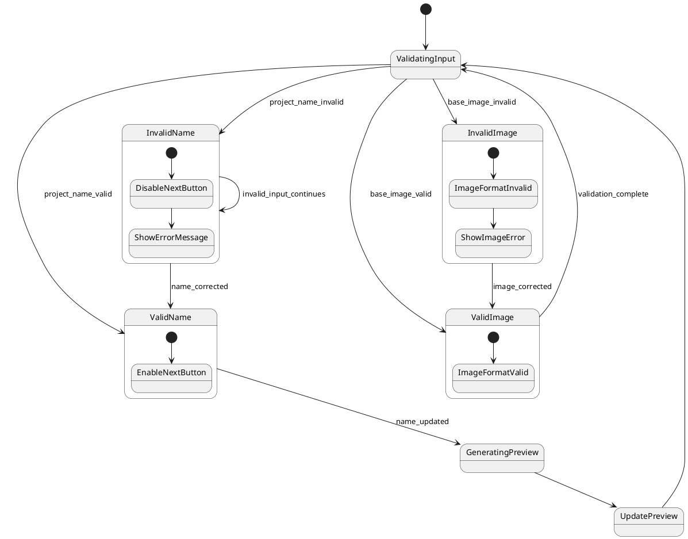
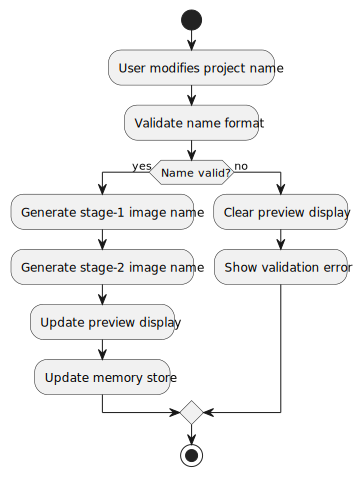
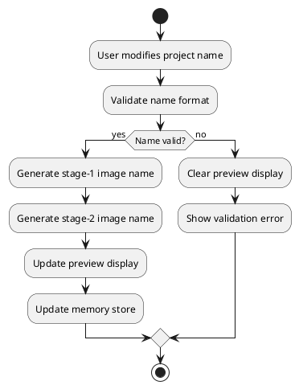

# SC-3: Project Information Screen - Technical Specification

## Overview

**Component ID:** `SC-3`  
**Component Name:** Project Information Screen  
**Type:** Configuration Wizard Step  
**Step Number:** 1 of 11  
**Purpose:** Collect project name and Docker base image  
**File Location:** `src/pei_docker/gui/screens/simple/project_info.py`  
**Controller Framework:** Managed by SC-2 (Simple Wizard Controller)  
**Figures Directory:** `figures/sc3/` (contains UML diagrams)

### Role in Wizard Flow

SC-3 is the entry point for the configuration wizard, collecting project information for subsequent steps. The SC-2 controller framework provides navigation, progress tracking, and memory state management.

### CLI Integration

For development and testing, access via `pei-docker-gui dev --project-dir <path> --screen sc-3`. The SC-2 controller framework initializes automatically.

## Functional Requirements

### Primary Objectives

1. **Project Name Validation**: Collect and validate Docker-compatible project name
2. **Base Image Selection**: Select Docker base image with validation
3. **Image Preview**: Display generated Docker image names (stage-1, stage-2)
4. **Auto-Population**: Pre-fill project name from directory selection
5. **Real-time Validation**: Immediate feedback on input validity
6. **Data Preparation**: Store configuration data for subsequent wizard steps

### Use Cases



<details>
<summary>PlantUML Source</summary>


</details>

### User Stories

#### **Project Name Entry and Validation**

**As a** user setting up a PeiDocker project,
**I want** to enter a project name that follows Docker naming conventions,
**So that** my Docker images will be named correctly and build successfully.

**Acceptance Criteria:**
1. Project name field pre-populated with directory name from SC-1
2. Project name modification follows Docker naming rules
3. Invalid characters highlighted with clear error messages
4. Docker image preview updates in real-time
5. Cannot proceed with invalid project name

#### **Base Image Selection and Validation**

**As a** user setting up my containerized application,
**I want** to enter a Docker base image name,
**So that** I can specify the foundation for my containerized application.

**Acceptance Criteria:**
1. Base image name entry with proper validation
2. Docker image name format validation
3. Clear error messages for invalid formats
4. Form submission blocked until valid image name entered

### Navigation Options

- **Prev Button**: Return to SC-1 (Project Directory Selection) - handled by SC-2 controller
- **Next Button**: Advance to SC-4 (SSH Configuration) - handled by SC-2 controller  
- **Double ESC**: Return to main menu - handled by SC-2 controller
- **Single ESC**: Clear current input or go to previous state
- **Tab Navigation**: Move between form fields
- **Enter**: Trigger next navigation (if validation passes)

## User Interface Specification

### Screen Layout

Screen content embedded within SC-2 controller framework with progress indicator and navigation.

**Complete Screen Layout:**
```
╭─ PeiDocker Configuration Wizard ────────────────── Step 1 of 11 ╮
│                                                                  │
│  Progress: ████░░░░░░░░░░░░░░░░░░░░░░░░░░░░░░░░░░░░  Step 1 of 11  │
│                                                                  │
│  ┌─────────────────── Project Information ────────────────────┐ │
│  │                                                             │ │
│  │  Basic project settings:                                   │ │
│  │                                                             │ │
│  │  Project Name: *                                            │ │
│  │  ┌─────────────────────────────────────────────────────────┐ │ │
│  │  │ my-awesome-project                                      │ │ │
│  │  └─────────────────────────────────────────────────────────┘ │ │
│  │  Docker images: my-awesome-project:stage-1, my-awesome-project:stage-2 │ │
│  │                                                             │ │
│  │  Base Docker Image: *                                       │ │
│  │  ┌─────────────────────────────────────────────────────────┐ │ │
│  │  │ ubuntu:24.04                                            │ │ │
│  │  └─────────────────────────────────────────────────────────┘ │ │
│  │                                                             │ │
│  │  * Required field                                           │ │
│  └─────────────────────────────────────────────────────────────┘ │
│                                                                  │
│  [Prev] [Next]                                                   │
│                                                                  │
│  Double ESC: Main Menu | Single ESC: Clear Input                │
╰──────────────────────────────────────────────────────────────────╯
```

### Flat Material Design Elements

**Input Fields:**
```css
/* Flat input styling */
Input {
    background: $surface;
    border: solid $outline;
    border-subtitle-color: $primary;
    padding: 1;
}

Input:focus {
    border: solid $primary;
    background: $surface-variant;
}
```

**Container Design:**
```css
/* Clean container without depth effects */
.project-info-container {
    background: $surface;
    border: none;
    padding: 2;
    margin: 1;
}

.image-suggestions {
    background: $surface-variant;
    border: none;
    padding: 1;
}
```

**Color Strategy:**
- **Primary**: Used for focus states and action buttons
- **Surface**: Clean background colors without gradients
- **Outline**: Subtle borders for field definition
- **On-Surface**: High contrast text for readability

### Validation States

#### Valid State
```
│  Project Name: *                                            │
│  ┌─────────────────────────────────────────────────────────┐ │
│  │ my-awesome-project                                      │ │
│  └─────────────────────────────────────────────────────────┘ │
│  Docker images: my-awesome-project:stage-1, my-awesome-project:stage-2 │
```

#### Error State
```
│  Project Name: *                                            │
│  ┌─────────────────────────────────────────────────────────┐ │
│  │ Invalid Project Name!                                   │ │
│  └─────────────────────────────────────────────────────────┘ │
│  ⚠ Project name must contain only lowercase letters, numbers, │
│     hyphens, and underscores. Must start with a letter.     │
```

## Behavior Specifications

### Screen Initialization Flow



<details>
<summary>PlantUML Source</summary>


</details>

### Input Validation Flow



<details>
<summary>PlantUML Source</summary>


</details>


### Real-time Preview Updates



<details>
<summary>PlantUML Source</summary>


</details>

## Data Model and Validation

### Configuration Data Structure

```python
@dataclass
class ProjectInfoConfig:
    """Configuration data for project information step"""
    
    project_name: str = ""
    base_image: str = "ubuntu:24.04"
    directory_path: str = ""
    stage1_image_name: str = ""
    stage2_image_name: str = ""
    
    def validate(self) -> ValidationResult:
        """Validate project information configuration"""
        errors = []
        
        # Project name validation
        if not self.project_name:
            errors.append("Project name is required")
        elif not self._is_valid_project_name(self.project_name):
            errors.append("Project name must contain only lowercase letters, numbers, hyphens, and underscores. Must start with a letter.")
        
        # Base image validation  
        if not self.base_image:
            errors.append("Base image is required")
        elif not self._is_valid_image_format(self.base_image):
            errors.append("Base image must be in format 'image:tag' or 'registry/image:tag'")
            
        return ValidationResult(is_valid=len(errors) == 0, errors=errors)
    
    def _is_valid_project_name(self, name: str) -> bool:
        """Validate project name against Docker naming rules"""
        return bool(re.match(r'^[a-z][a-z0-9_-]*$', name))
    
    def _is_valid_image_format(self, image: str) -> bool:
        """Validate Docker image name format"""
        return bool(re.match(r'^[a-z0-9]([a-z0-9_.-]*[a-z0-9])?(/[a-z0-9]([a-z0-9_.-]*[a-z0-9])?)*(:[\w][\w.-]{0,127})?$', image))
    
    def generate_image_names(self) -> None:
        """Generate Docker image names from project name"""
        if self.project_name:
            self.stage1_image_name = f"{self.project_name}:stage-1"
            self.stage2_image_name = f"{self.project_name}:stage-2"
```

### Validation Rules

#### Project Name Validation
- **Required**: Must not be empty
- **Format**: Lowercase letters, numbers, hyphens, underscores only  
- **Start Character**: Must start with a letter
- **Length**: 1-50 characters
- **Docker Compatibility**: Must be valid Docker image name component

#### Base Image Validation
- **Required**: Must not be empty
- **Format**: Valid Docker image name format (registry/image:tag)
- **Registry**: Optional registry prefix
- **Tag**: Optional tag (defaults to 'latest' if omitted)
- **Characters**: Alphanumeric, dots, hyphens, underscores, slashes, colons

#### Real-time Validation
- **Input Events**: Validate on keyup, focus loss, and paste events
- **Visual Feedback**: Immediate error highlighting and success indicators
- **Error Messages**: Clear, actionable descriptions of validation failures
- **Navigation Control**: Disable next button when validation fails


## Technical Implementation Notes

### Textual Framework Integration

- **Widget Composition**: Uses Textual's compound widget pattern for reusable form components
- **Reactive State**: Leverages reactive variables for real-time preview updates
- **Input Validation**: Custom validation decorators for immediate feedback
- **Message Handling**: Custom messages for communicating with SC-2 controller

### Performance Considerations

- **Debounced Input**: Text input validation debounced to reduce CPU usage
- **Memory Efficiency**: Configuration data stored efficiently in SC-2's memory store
- **UI Responsiveness**: Form validation is immediate and non-blocking

### Integration with SC-2 Controller

- **State Management**: All configuration data stored in SC-2's memory store
- **Validation Integration**: Step validation integrates with SC-2's navigation control
- **Progress Tracking**: Screen completion status reported to SC-2 for progress indication
- **Navigation Events**: Custom messages notify SC-2 of user navigation intentions

## Accessibility and Usability

### Keyboard Navigation
- **Tab Order**: Logical tab sequence through form fields
- **Keyboard Shortcuts**: Enter to proceed, Escape to clear/go back
- **Focus Indicators**: Clear visual focus indicators for keyboard users
- **Screen Reader**: Proper ARIA labels and descriptions

### Error Handling
- **Clear Messages**: Descriptive error messages with correction guidance
- **Field Highlighting**: Invalid fields are visually highlighted  
- **Error Recovery**: Clear path to correct validation errors
- **Form Validation**: Invalid input prevents progression until corrected

### User Experience
- **Auto-population**: Smart defaults based on directory selection
- **Real-time Feedback**: Immediate validation and preview updates
- **Simple Interface**: Clean, focused form without unnecessary complexity
- **Consistent Styling**: Flat material design with consistent visual language

## Key Design Philosophy

SC-3 implements the first wizard step with these principles:

### **Flat Material Design**
- Clean, geometric forms without depth effects
- Strategic color use for hierarchy and focus
- Consistent spacing and typography
- Solid backgrounds without gradients or shadows

### **Memory-First Configuration**
- All changes stored in SC-2's memory store until save
- Real-time validation without file system operations
- Seamless navigation between steps while preserving state
- Iterative workflow supporting multiple save operations

### **User-Guided Experience**  
- Smart defaults reduce cognitive load
- Clear validation prevents invalid configurations
- Immediate feedback guides users to correct input
- Simplified interface focuses on essential information