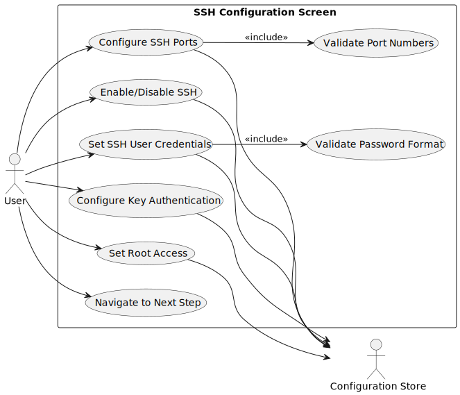
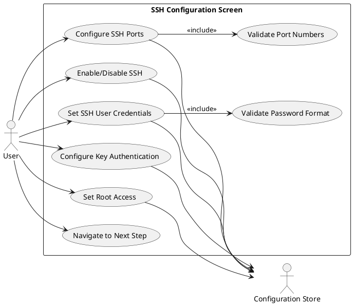
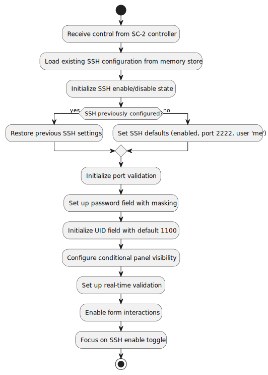
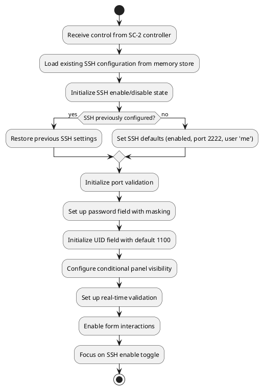
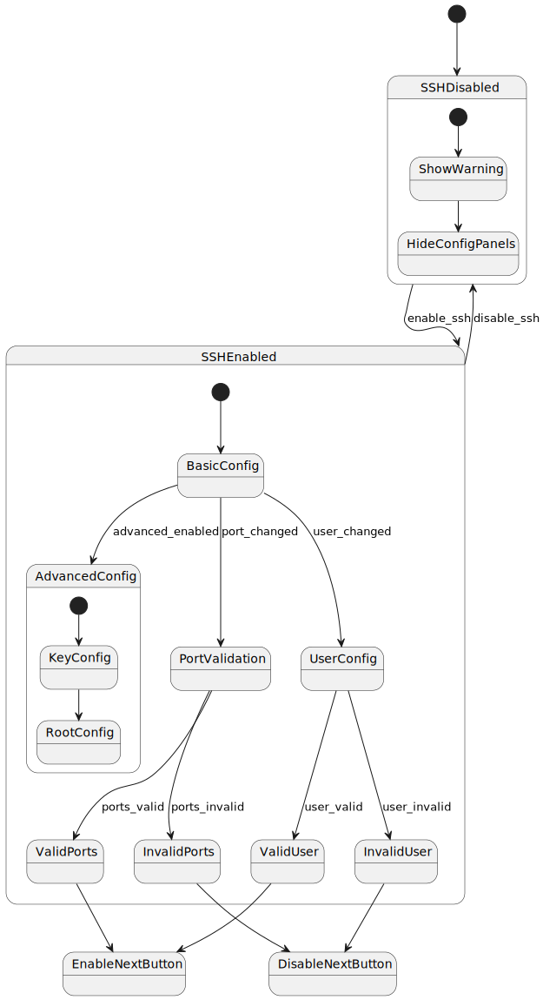
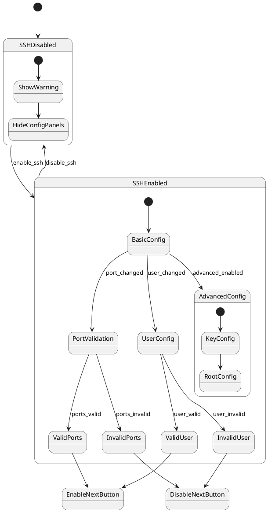
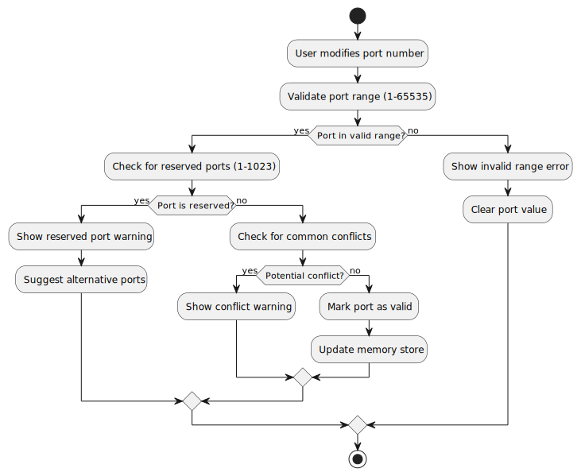
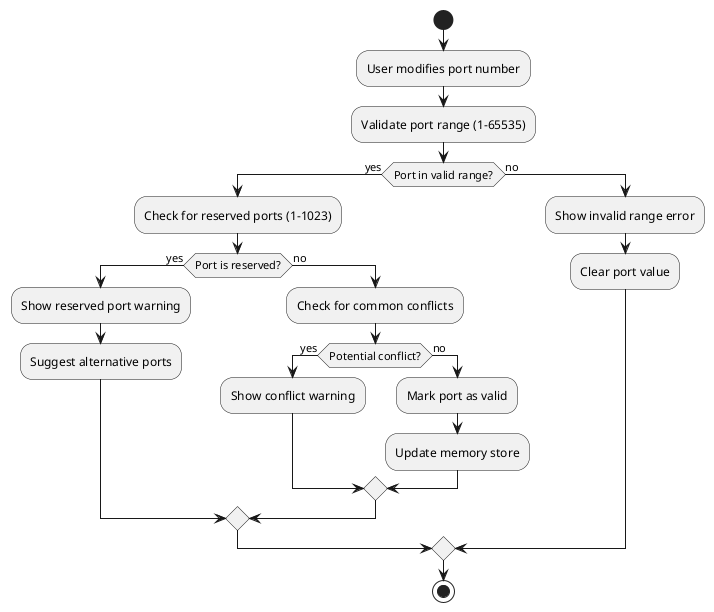
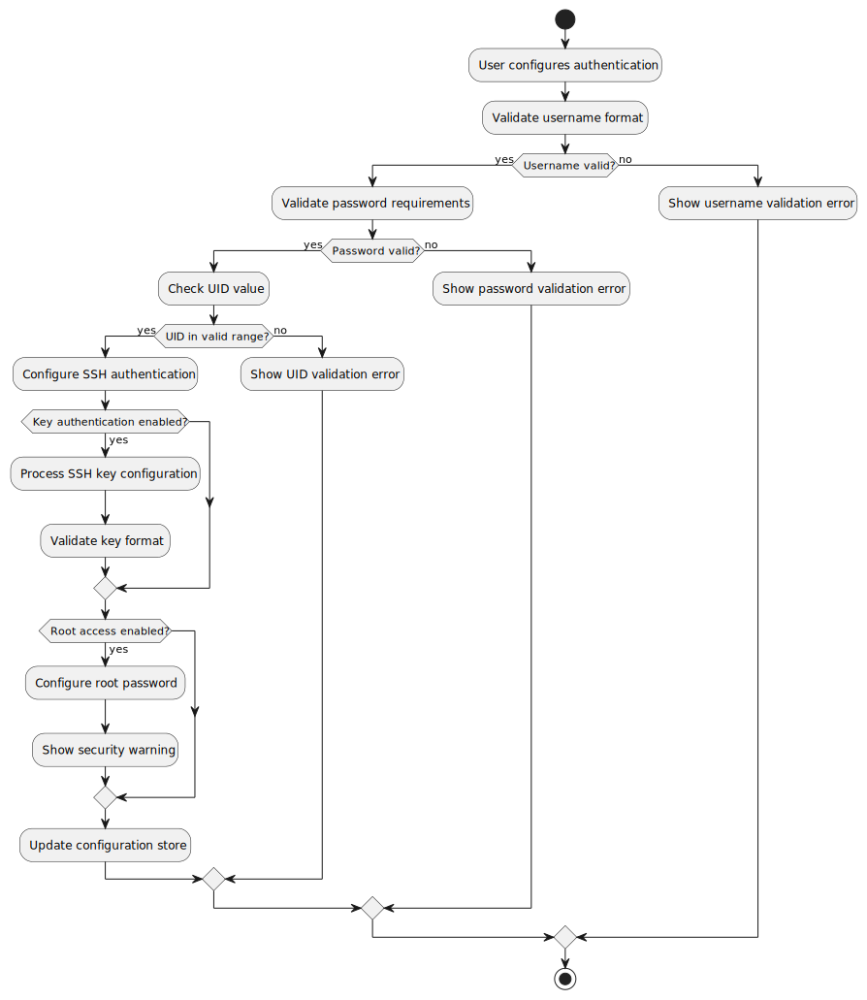
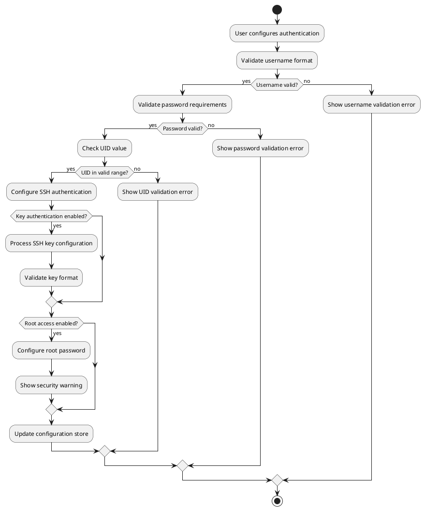

# SC-4: SSH Configuration Screen - Technical Specification

## Overview

**Component ID:** `SC-4`  
**Component Name:** SSH Configuration Screen  
**Type:** Configuration Wizard Step  
**Step Number:** 2 of 11  
**Purpose:** Configure SSH access to the container  
**File Location:** `src/pei_docker/gui/screens/simple/ssh_config.py`  
**Controller Framework:** Managed by SC-2 (Simple Wizard Controller)  
**Figures Directory:** `figures/sc4/` (contains UML diagrams)

### Role in Wizard Flow

SC-4 is the second step in the configuration wizard, configuring SSH access settings for remote container access. The SC-2 controller framework provides navigation, progress tracking, and memory state management.

### CLI Integration

For development and testing, access via `pei-docker-gui dev --project-dir <path> --screen sc-4`. The SC-2 controller framework initializes automatically.

## Functional Requirements

### Primary Objectives

1. **SSH Enable/Disable**: Toggle SSH service in the container
2. **Port Configuration**: Configure SSH container and host port mapping  
3. **User Authentication**: Set up SSH user credentials and authentication methods
4. **Security Configuration**: Configure SSH access permissions and security settings
5. **Key-based Authentication**: Optional SSH public/private key setup
6. **Root Access Control**: Configure root SSH access permissions
7. **Real-time Validation**: Immediate feedback on configuration validity

### Use Cases



<details>
<summary>PlantUML Source</summary>


</details>

### User Stories

#### **SSH Service Configuration**

**As a** user setting up container access,
**I want** to enable or disable SSH service,
**So that** I can control whether remote access is available to my container.

**Acceptance Criteria:**
1. Clear toggle between SSH enabled/disabled states
2. Conditional display of SSH configuration options
3. Warning message when SSH is disabled explaining alternative access methods
4. Cannot proceed without making SSH choice

#### **SSH Port and User Configuration**

**As a** user configuring SSH access,
**I want** to set SSH ports and user credentials,
**So that** I can access my container securely with custom settings.

**Acceptance Criteria:**
1. Validate port numbers are in valid range (1-65535)
2. Check for port conflicts with system ports
3. Username and password validation with security requirements
4. Real-time feedback on configuration validity
5. Preview of final SSH access command

#### **Advanced SSH Security Configuration**

**As a** user concerned about security,
**I want** to configure SSH key authentication and root access,
**So that** I can implement proper security practices for container access.

**Acceptance Criteria:**
1. Optional SSH public key authentication setup
2. Support for SSH key text input or system key usage
3. Root access toggle with security warnings
4. Clear explanation of security implications

### Navigation Options

- **Prev Button**: Return to SC-3 (Project Information) - handled by SC-2 controller
- **Next Button**: Advance to SC-5 (Proxy Configuration) - handled by SC-2 controller  
- **Double ESC**: Return to main menu - handled by SC-2 controller
- **Single ESC**: Clear current input or go to previous state
- **Tab Navigation**: Move between form fields and sections
- **Enter**: Trigger next navigation (if validation passes)

## User Interface Specification

### Screen Layout

Screen content embedded within SC-2 controller framework with progress indicator and navigation.

**Complete Screen Layout:**
```
╭─ PeiDocker Configuration Wizard ────────────────── Step 2 of 11 ╮
│                                                                  │
│  Progress: ████████░░░░░░░░░░░░░░░░░░░░░░░░░░░░░░░░  Step 2 of 11  │
│                                                                  │
│  ┌─────────────────── SSH Configuration ─────────────────────┐  │
│  │                                                             │  │
│  │  Configure SSH access to your container:                   │  │
│  │                                                             │  │
│  │  Enable SSH: ● Yes  ○ No                                   │  │
│  │                                                             │  │
│  │  ⚠ Selecting 'No' means you'll need to use docker exec    │  │
│  │    commands to access the container                        │  │
│  │                                                             │  │
│  │  SSH Container Port:                                        │  │
│  │  ┌─────────────────────────────────────────────────────────┐ │  │
│  │  │ 22                                                      │ │  │
│  │  └─────────────────────────────────────────────────────────┘ │  │
│  │                                                             │  │
│  │  SSH Host Port:                                             │  │
│  │  ┌─────────────────────────────────────────────────────────┐ │  │
│  │  │ 2222                                                    │ │  │
│  │  └─────────────────────────────────────────────────────────┘ │  │
│  │                                                             │  │
│  │  SSH User:                                                  │  │
│  │  ┌─────────────────────────────────────────────────────────┐ │  │
│  │  │ me                                                      │ │  │
│  │  └─────────────────────────────────────────────────────────┘ │  │
│  │                                                             │  │
│  │  SSH Password (no spaces or commas):                       │  │
│  │  ┌─────────────────────────────────────────────────────────┐ │  │
│  │  │ ••••••                                                  │ │  │
│  │  └─────────────────────────────────────────────────────────┘ │  │
│  │                                                             │  │
│  │  SSH User UID:                                              │  │
│  │  ┌─────────────────────────────────────────────────────────┐ │  │
│  │  │ 1100                                                    │ │  │
│  │  └─────────────────────────────────────────────────────────┘ │  │
│  └─────────────────────────────────────────────────────────────┘  │
│                                                                  │
│  [Prev] [Next]                                                   │
│                                                                  │
│  Double ESC: Main Menu | Single ESC: Clear Input                │
╰──────────────────────────────────────────────────────────────────╯
```

### Extended SSH Configuration (Advanced Options)

**Advanced SSH Settings Panel:**
```
╭─ SSH Keys Configuration ──────────────────────────────────╮
│                                                             │
│  SSH Public Key Authentication: ○ Yes  ● No                │
│                                                             │
│  ┌─ Public Key (when enabled) ───────────────────────────┐  │
│  │ ○ Enter key text  ○ Use system key (~)               │  │
│  │                                                       │  │
│  │ Key Text:                                             │  │
│  │ ┌───────────────────────────────────────────────────┐ │  │
│  │ │ ssh-rsa AAAAB3NzaC1yc2EAAAADAQABAAABAQ...        │ │  │
│  │ └───────────────────────────────────────────────────┘ │  │
│  └───────────────────────────────────────────────────────┘  │
│                                                             │
│  SSH Private Key: ○ Yes  ● No                               │
│                                                             │
│  Root SSH Access: ○ Yes  ● No                               │
│                                                             │
│  ┌─ Root Password (when enabled) ────────────────────────┐  │
│  │ ┌───────────────────────────────────────────────────┐ │  │
│  │ │ ••••                                              │ │  │
│  │ └───────────────────────────────────────────────────┘ │  │
│  └───────────────────────────────────────────────────────┘  │
│                                                             │
│  [Prev] [Next]                                              │
╰─────────────────────────────────────────────────────────────╯
```

### Flat Material Design Elements

**SSH Toggle and Section Design:**
```css
/* Radio button styling */
RadioSet {
    background: $surface;
    border: none;
    padding: 1;
}

RadioButton {
    background: transparent;
    border: none;
}

RadioButton:checked {
    color: $primary;
}
```

**Input Fields:**
```css
/* SSH configuration input styling */
Input {
    background: $surface;
    border: solid $outline;
    border-subtitle-color: $primary;
    padding: 1;
}

Input:focus {
    border: solid $primary;
    background: $surface-variant;
}

Input.-invalid {
    border: solid $error;
    background: $error-container;
}
```

**Password Field:**
```css
/* Password input with visibility toggle */
.password-input {
    background: $surface;
    border: solid $outline;
    color: $on-surface;
}

.password-toggle {
    background: $surface-variant;
    border: none;
    color: $primary;
}
```

**Warning and Info Messages:**
```css
/* Warning messages for disabled SSH */
.ssh-warning {
    background: $warning-container;
    color: $on-warning-container;
    border: none;
    padding: 1;
    margin: 1 0;
}

.ssh-info {
    background: $info-container;
    color: $on-info-container;
    border: none;
    padding: 1;
}
```

### Validation States

#### Valid SSH Configuration
```
│  SSH Host Port:                                             │
│  ┌─────────────────────────────────────────────────────────┐ │
│  │ 2222                                                    │ │
│  └─────────────────────────────────────────────────────────┘ │
│  ✓ Port available                                           │
```

#### Invalid Port Configuration
```
│  SSH Host Port:                                             │
│  ┌─────────────────────────────────────────────────────────┐ │
│  │ 80                                                      │ │
│  └─────────────────────────────────────────────────────────┘ │
│  ⚠ Port 80 is reserved. Use port 1024-65535               │
```

#### Password Validation Error
```
│  SSH Password (no spaces or commas):                       │
│  ┌─────────────────────────────────────────────────────────┐ │
│  │ my password                                             │ │
│  └─────────────────────────────────────────────────────────┘ │
│  ⚠ Password cannot contain spaces or commas                │
```

## Behavior Specifications

### Screen Initialization Flow



<details>
<summary>PlantUML Source</summary>


</details>

### SSH Configuration State Machine



<details>
<summary>PlantUML Source</summary>


</details>

### Port Validation Flow



<details>
<summary>PlantUML Source</summary>


</details>

### Authentication Configuration Flow



<details>
<summary>PlantUML Source</summary>


</details>

## Data Model and Validation

### Configuration Data Structure

```python
@dataclass
class SSHConfig:
    """Configuration data for SSH access setup"""
    
    enabled: bool = True
    container_port: int = 22
    host_port: int = 2222
    username: str = "me"
    password: str = ""
    user_uid: int = 1100
    
    # Advanced options
    public_key_auth: bool = False
    public_key_text: str = ""
    use_system_key: bool = False
    private_key_enabled: bool = False
    root_access_enabled: bool = False
    root_password: str = ""
    
    def validate(self) -> ValidationResult:
        """Validate SSH configuration"""
        errors = []
        warnings = []
        
        if self.enabled:
            # Port validation
            if not self._is_valid_port(self.container_port):
                errors.append("Container port must be between 1-65535")
            if not self._is_valid_port(self.host_port):
                errors.append("Host port must be between 1-65535")
            if self.host_port < 1024:
                warnings.append(f"Port {self.host_port} may require elevated privileges")
            
            # User validation
            if not self.username:
                errors.append("SSH username is required")
            elif not self._is_valid_username(self.username):
                errors.append("Username must contain only letters, numbers, and underscores")
            
            # Password validation
            if not self.password:
                errors.append("SSH password is required")
            elif not self._is_valid_password(self.password):
                errors.append("Password cannot contain spaces or commas")
            
            # UID validation
            if self.user_uid < 1000 or self.user_uid > 65535:
                errors.append("User UID should be between 1000-65535")
            
            # SSH key validation
            if self.public_key_auth and self.public_key_text:
                if not self._is_valid_ssh_key(self.public_key_text):
                    errors.append("Invalid SSH public key format")
            
            # Root access validation
            if self.root_access_enabled:
                if not self.root_password:
                    errors.append("Root password is required when root access is enabled")
                warnings.append("Root SSH access reduces container security")
                
        return ValidationResult(
            is_valid=len(errors) == 0, 
            errors=errors, 
            warnings=warnings
        )
    
    def _is_valid_port(self, port: int) -> bool:
        """Validate port number range"""
        return 1 <= port <= 65535
    
    def _is_valid_username(self, username: str) -> bool:
        """Validate SSH username format"""
        return bool(re.match(r'^[a-zA-Z][a-zA-Z0-9_]*$', username))
    
    def _is_valid_password(self, password: str) -> bool:
        """Validate SSH password constraints"""
        return ' ' not in password and ',' not in password
    
    def _is_valid_ssh_key(self, key: str) -> bool:
        """Validate SSH public key format"""
        return key.startswith(('ssh-rsa', 'ssh-ed25519', 'ssh-ecdsa'))
    
    def generate_ssh_command(self, project_name: str) -> str:
        """Generate SSH connection command for user reference"""
        if self.enabled:
            return f"ssh -p {self.host_port} {self.username}@localhost"
        return "# SSH disabled - use docker exec instead"
```

### Validation Rules

#### SSH Enable/Disable
- **Required**: Must make explicit choice about SSH service
- **Impact**: Disabling SSH shows warning about docker exec access
- **Default**: SSH enabled for user convenience

#### Port Configuration
- **Container Port**: Typically 22 (SSH standard), can be customized
- **Host Port**: Must be 1024-65535 for non-root usage
- **Conflict Detection**: Check for commonly used ports
- **Reserved Ports**: Warning for ports < 1024

#### User Credentials
- **Username**: Alphanumeric and underscores, must start with letter
- **Password**: No spaces or commas (Docker Compose constraint)
- **UID**: 1000-65535 (avoid system UIDs < 1000)
- **Security**: Password masking in UI

#### Advanced Authentication
- **SSH Keys**: Optional public key authentication
- **Key Format**: Support for RSA, Ed25519, ECDSA keys
- **System Keys**: Option to use user's ~/.ssh keys
- **Root Access**: Optional with security warnings

#### Real-time Validation
- **Port Validation**: Immediate feedback on port number changes
- **Password Strength**: Real-time password constraint checking
- **Key Validation**: SSH key format verification
- **Conflict Detection**: Port and username conflict warnings

## Technical Implementation Notes

### Textual Framework Integration

- **Conditional Panels**: Show/hide SSH configuration based on enable toggle
- **Password Masking**: Secure password input with toggle visibility
- **Port Validation**: Real-time numeric input validation
- **Radio Sets**: Clean toggle between SSH options

### Security Considerations

- **Password Constraints**: Enforce Docker Compose compatible passwords
- **UID Selection**: Avoid system user conflicts with UID 1100+ default
- **Root Access Warnings**: Clear security implications
- **Key Authentication**: Support for more secure SSH key authentication

### Integration with SC-2 Controller

- **Conditional Navigation**: Enable/disable next button based on validation
- **State Persistence**: Store SSH configuration in memory until save
- **Cross-step Integration**: SSH port used in port mapping validation
- **Default Values**: Smart defaults for common SSH configurations

## Accessibility and Usability

### Keyboard Navigation
- **Tab Order**: Logical sequence through SSH configuration options
- **Radio Navigation**: Arrow keys for SSH enable/disable selection
- **Password Toggle**: Keyboard accessible password visibility control
- **Advanced Sections**: Collapsible sections with keyboard access

### Error Handling
- **Port Conflicts**: Clear error messages with suggested alternatives
- **Password Requirements**: Helpful constraint explanations
- **SSH Key Errors**: Specific format requirements and examples
- **Validation Feedback**: Immediate validation with clear correction paths

### User Experience
- **Smart Defaults**: Common SSH configuration (port 2222, user 'me')
- **Progressive Disclosure**: Advanced options hidden until needed
- **Security Guidance**: Clear explanations of security implications
- **Docker Integration**: SSH command preview for user reference

## Key Design Philosophy

SC-4 implements SSH configuration with these principles:

### **Security-First Design**
- Clear security warnings for dangerous configurations
- Secure defaults (no root access, key authentication available)
- Password constraints that work with Docker Compose
- UID selection avoiding system user conflicts

### **Flat Material Design**
- Clean toggle interfaces without depth effects
- Color-coded validation states (error/warning/success)
- Consistent input styling with focus indicators
- Conditional panel visibility with smooth transitions

### **User-Guided Configuration**
- Progressive disclosure of advanced options
- Clear explanations of SSH vs docker exec access
- Smart defaults reducing configuration complexity
- Real-time validation preventing invalid states

### **Docker Integration**
- SSH configuration optimized for container environments
- Port mapping integration with host system
- User UID selection avoiding permission conflicts
- Container-friendly password constraints