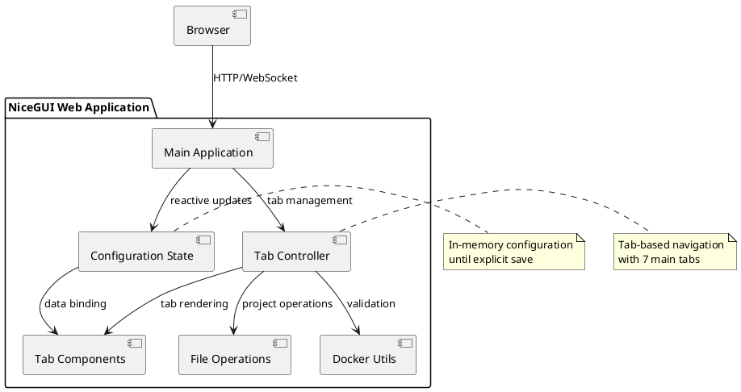
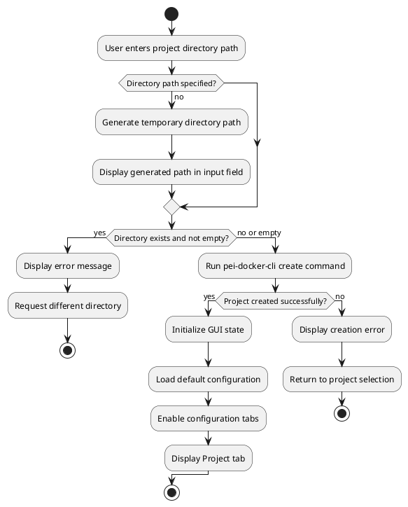
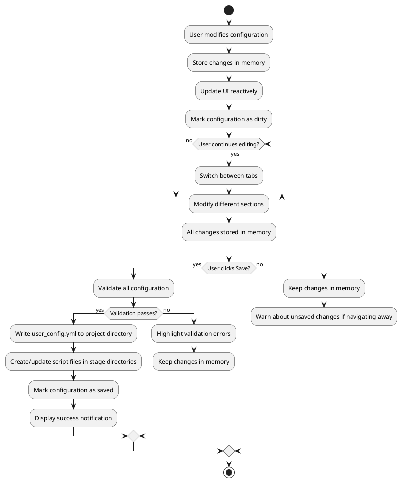
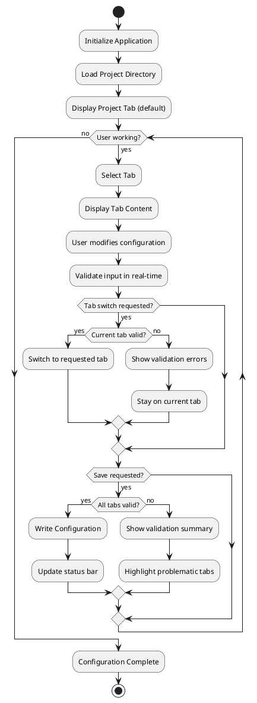

# PeiDocker Web GUI - General Design

> **Note**: Diagrams in this document are stored in `figures/webgui/` directory as SVG files.

## Overview

This document defines the design for a web-based GUI that provides PeiDocker project configuration through an intuitive browser interface. The application is a single-page web interface that manages Docker project creation, configuration, and export workflows. The GUI is designed for single-user usage and creates/manages project directories on the server filesystem.

## Single-User Design

**IMPORTANT**: The GUI is designed for single-user usage without authentication or session management. Multiple concurrent users accessing the GUI will:
- Share the same project directory and see each other's changes in real-time
- Have synchronized state through NiceGUI's WebSocket communication
- Potentially experience conflicts when multiple users modify the same configuration simultaneously

This design choice reflects NiceGUI's architecture and is suitable for local development environments and single-developer workflows.

## Design Philosophy

- **Project-centric workflow**: All operations center around creating, configuring, and managing PeiDocker projects
- **Server-side project management**: Project directories are created and managed on the server filesystem  
- **Single-page application**: All functionality contained in one web page with dynamic content updates
- **Tab-based organization**: Configuration options grouped by function into intuitive tabs  
- **Memory-first state management**: All changes kept in memory until explicit save
- **Browser-native experience**: Standard web UI patterns with responsive design
- **File-based persistence**: Projects are saved as directory structures with YAML configuration
- **Non-linear navigation**: Users can switch between tabs freely to configure different aspects

## Technology Approach

- **Framework**: NiceGUI (Python web framework)
- **Architecture**: Client-server with WebSocket communication
- **Styling**: Modern web UI with responsive design
- **State Management**: In-memory configuration with reactive updates

## Application Architecture




## Application Workflow

### Project Management States

The application operates in two main states based on whether a project is currently active:

**Initial State (No Active Project):**
- Project selection interface displayed
- "Create Project" and "Load Project" options available
- Project directory input field for user specification
- No configuration tabs accessible until project is selected

**Active Project State:**
- Project directory is set and validated
- Configuration tabs are enabled and accessible
- Memory-based state management for all configuration changes
- Save, Configure, and Download actions available

### Project Creation Workflow

#### From Scratch (Create Project)




**Create Project Process:**
1. User specifies project directory (or uses generated temporary directory)
2. System validates directory is empty or non-existent
3. System runs `pei-docker-cli create` to initialize project structure
4. GUI loads initial configuration and enables tab navigation
5. User can immediately begin configuring project through tabs

#### From Existing Project (Load Project)

**Current Status**: Not yet implemented - GUI displays warning message to user.

**Planned Behavior**:
1. User selects existing project directory
2. System validates directory contains valid PeiDocker project structure
3. GUI loads existing `user_config.yml` and project files
4. Configuration tabs populated with existing settings
5. User can modify and save changes to existing project

### Configuration Management Workflow

#### Memory-First State Management




#### Project Actions

**Save Configuration:**
- Validates all tab configurations
- Writes `user_config.yml` to project directory
- Creates script files in `stage-1/custom/` and `stage-2/custom/` directories
- Preserves inline scripts as separate files with proper references
- Displays success/error notifications

**Configure Project:**
- Runs `pei-docker-cli configure` command on current project
- Displays real-time command output and logs to user
- Shows success/error status based on command exit code
- Updates project files structure according to configuration
- Can be run multiple times as needed

**Download Project:**
- Creates ZIP archive of entire project directory
- Triggers browser download of ZIP file
- Warning dialogs displayed in specific cases:
  - Project not yet configured (no configure run)
  - Last configure command failed
  - Unsaved changes in GUI (option to save first)

### Validation and Error Handling

#### Project Directory Validation

**Directory Requirements:**
- Must be writable by NiceGUI process
- Must be empty or non-existent for new projects
- Invalid directories trigger error messages with guidance

**Path Handling:**
- Supports absolute and relative paths
- Cross-platform path normalization
- Security validation to prevent directory traversal

#### Configuration Validation

**Real-time Validation:**
- Input fields validate on change/blur events
- Invalid inputs highlighted with error styling
- Tab indicators show validation status
- Save action blocked until all validation passes

**Warning Dialogs:**
- Unsaved changes warning when switching projects
- Configuration status warnings before download
- Confirmation dialogs for destructive actions (reset, new project)

## Single-Page Application Structure

### Layout Components

The application uses a responsive layout structure that adapts based on project state:

#### Initial State Layout (No Active Project)
```
┌─────────────────────────────────────────────────────────┐
│ Header: PeiDocker Web GUI                               │
├─────────────────────────────────────────────────────────┤
│                                                         │
│              Project Selection Interface                │
│                                                         │
│  Project Directory: [___________________] 📁            │
│                                                         │
│    [🚀 Create Project]    [📂 Load Project]            │
│                                                         │
│              Welcome Information & Help                 │
│                                                         │
├─────────────────────────────────────────────────────────┤
│ Status: No active project                               │
└─────────────────────────────────────────────────────────┘
```

#### Active Project Layout (Project Selected)
```
┌─────────────────────────────────────────────────────────┐
│ Header: PeiDocker Web GUI    [Save] [Configure] [Download] │
├─────────────────────────────────────────────────────────┤
│ Project: /path/to/project            [🔄 New Project]   │
├─────────────────────────────────────────────────────────┤
│ [Project] [SSH] [Network] [Environment] [Storage] [Scripts] [Summary] │
├─────────────────────────────────────────────────────────┤
│                                                         │
│                Active Tab Content                       │
│              (Dynamic Tab Panels)                       │
│                                                         │
│                                                         │
├─────────────────────────────────────────────────────────┤
│ Status: Configuration modified • Last saved: 2:34 PM    │
└─────────────────────────────────────────────────────────┘
```

### Application Structure

The application consists of several main components that adapt based on the current state:

**Common Components:**
- **Header**: Contains application title and context-appropriate actions
- **Status Bar**: Shows project state, configuration status, and operational feedback

**Initial State Components:**
- **Project Selection Interface**: Directory input, create/load project buttons
- **Welcome Content**: Getting started information and feature overview
- **Directory Browser**: File system navigation for project selection

**Active Project Components:**
- **Project Info Bar**: Current project directory and project management actions  
- **Tab Navigation**: Horizontal tab bar for switching between configuration sections
- **Content Area**: Dynamic content area displaying active tab's configuration options
- **Action Bar**: Project-level actions (Save, Configure, Download, New Project)

Each tab is self-contained and manages its own configuration section, with real-time validation and state tracking. The interface dynamically switches between states based on whether a project is currently active.

## State Management

### Configuration State Behavior

The application maintains all configuration data in memory during the editing session. Changes are tracked and validated in real-time, with the following behavior:

**Configuration Data:**
- Project information (name, base image, directory)
- SSH access settings and authentication
- Network configuration (proxy, APT mirrors, port mappings)
- Environment variables and device access
- Storage mounts for both build and runtime stages
- Custom scripts and entry points with dual input modes (file or inline)

**State Tracking:**
- Active tab selection and navigation history
- Modification status across all configuration sections
- Validation errors with tab-specific error indicators
- Last saved timestamp and change tracking

**Reactive Updates:**
- UI automatically reflects configuration changes
- Tab indicators show validation status and modification state
- Real-time preview of generated Docker commands and configurations
- Immediate feedback for invalid inputs or configuration conflicts

## Tab Implementation

### Tab Organization

The configuration is organized into 7 logical tabs, grouping related functionality:

1. **Project** - Basic project information and Docker image settings
2. **SSH** - SSH access configuration and authentication
3. **Network** - Proxy, APT mirrors, and port mappings
4. **Environment** - Environment variables and device/GPU configuration  
5. **Storage** - Volume mounts and storage configuration
6. **Scripts** - Custom entry points and lifecycle scripts
7. **Summary** - Configuration review and save/export options

### Tab Navigation Flow




### Tab Behavior and Navigation

**Tab Switching:**
- Users can click any tab to switch between configuration sections
- Tab validation occurs before switching to prevent data loss
- Visual indicators show which tabs have validation errors
- Active tab is highlighted with distinct styling

**Tab State Management:**
- Each tab maintains its own configuration data independently
- Changes are validated in real-time as users type or select options
- Invalid inputs are highlighted with error messages
- Tab titles show visual indicators for modified or error states

## User Interface Design

### Visual Theme

- **Color Scheme**: Clean, professional blue and gray palette
- **Typography**: Clear, readable fonts with proper hierarchy
- **Layout**: Card-based design with consistent spacing
- **Responsive**: Adapts to different screen sizes
- **Accessibility**: Proper contrast ratios and keyboard navigation

### User Interface Elements

**Input Components:**
- Text inputs with inline validation and error messages
- Toggle switches for boolean options (enable/disable features)
- Dropdown selectors for predefined choices (base images, mirrors)
- Dynamic lists with add/remove functionality (port mappings, environment variables)
- File browsers with path validation
- Multi-line text areas for script content with monospace font

**Interactive Features:**
- Real-time validation with immediate feedback
- Auto-complete suggestions for common values
- Drag-and-drop reordering for lists
- Expandable sections for advanced options
- Modal dialogs for detailed configuration

**Visual Feedback:**
- Color-coded status indicators (valid/invalid/modified)
- Progress indicators showing completion status
- Loading states for async operations
- Tooltips and help text for guidance

## Navigation and Controls

### Tab Navigation Behavior

**Tab Bar:**
- Horizontal tab bar with icons and labels for each configuration section
- Active tab highlighted with blue background and white text
- Error tabs shown with red background indicating validation issues
- Hover effects provide visual feedback for interactive elements

**Navigation Flow:**
- Users can switch freely between tabs without losing data
- Current tab validates before switching to prevent data loss
- Error messages guide users to fix issues before proceeding
- Tab state is preserved when switching between sections

**Global Controls:**
- **Save Configuration**: Validates all tabs and writes `user_config.yml`
- **Reset All**: Clears all configuration data with confirmation dialog
- **Status Indication**: Shows modification state and last saved time

## Configuration Workflow

### Tab Organization and Content

The configuration is organized into 7 logical tabs that group related settings:

#### 1. Project Tab 🏗️
- **Project name and basic settings**
- Docker base image selection
- Project directory validation
- Generated image name preview

#### 2. SSH Tab 🔐
- SSH service enable/disable
- Port configuration (container and host)
- User account settings (username, password, UID)
- SSH key copying configuration (copy public/private keys into container)
- Root access settings

#### 3. Network Tab 🌐
- **Proxy Configuration**: HTTP proxy settings for build/runtime
- **APT Configuration**: Repository mirror selection (tuna, aliyun, 163, ustc, cn)
- **Port Mapping**: Additional port mappings beyond SSH

#### 4. Environment Tab ⚙️
- **Environment Variables**: Custom environment variables management
- **Device Configuration**: GPU support enablement and device access

#### 5. Storage Tab 💾
- **Stage-1 Mounts**: Volume mounting configuration for build stage
- **Stage-2 Mounts**: Volume mounting configuration for runtime stage
- Mount type selection (automatic, manual, host directory)
- Path validation and conflict detection

#### 6. Scripts Tab 📜
- **Custom Entry Points**: Stage-1 and Stage-2 entry point scripts with dual input modes
- **Custom Scripts**: Lifecycle hook scripts (on_build, on_first_run, on_every_run, on_user_login)
- **Script Creation Options**: 
  - Use existing script files (file browser and validation)
  - Create new scripts inline (name + content editor with syntax highlighting)
- **Script Management**: View, edit, and manage both external and inline scripts

#### 7. Summary Tab 📋
- **Configuration Review**: Complete configuration overview
- **Save/Export Options**: Save to user_config.yml, export settings
- **Validation Summary**: All tab validation status
- **Quick Actions**: Test configuration, generate Docker commands

### GUI to YAML Field Mapping

Each GUI tab directly modifies specific sections of the `user_config.yml` file:

**Project Tab** modifies:
- `stage_1.image.base` - Base Docker image selection
- `stage_1.image.output` - Stage-1 output image name
- `stage_2.image.output` - Stage-2 output image name

**SSH Tab** modifies:
- `stage_1.ssh.enable` - SSH service enable/disable toggle
- `stage_1.ssh.port` - SSH container port number
- `stage_1.ssh.host_port` - Host port mapping for SSH
- `stage_1.ssh.users` - User accounts with the following per-user settings:
  - `password` - User password for authentication
  - `pubkey_file` - Path to public key file to copy into container (mutually exclusive with pubkey_text)
  - `pubkey_text` - Direct public key content to copy into container (mutually exclusive with pubkey_file)
  - `privkey_file` - Path to private key file to copy into container (mutually exclusive with privkey_text)
  - `privkey_text` - Direct private key content to copy into container (mutually exclusive with privkey_file)
  - `uid` - User ID for the account

**Network Tab** modifies:
- `stage_1.proxy` - Build stage proxy configuration
- `stage_1.apt.repo_source` - APT repository mirror selection
- `stage_1.apt.use_proxy` - APT proxy usage settings
- `stage_1.ports` - Additional port mappings for stage-1
- `stage_2.proxy` - Runtime stage proxy overrides
- `stage_2.ports` - Additional port mappings for stage-2

**Environment Tab** modifies:
- `stage_1.environment` - Stage-1 environment variables list
- `stage_1.device.type` - Device configuration (CPU/GPU)
- `stage_2.environment` - Stage-2 environment variables list
- `stage_2.device.type` - Runtime device configuration overrides

**Storage Tab** modifies:
- `stage_1.mount` - Build stage volume mount configurations
- `stage_2.storage` - Runtime storage configurations (app, data, workspace)
- `stage_2.mount` - Runtime stage volume mount configurations

**Scripts Tab** modifies:
- `stage_1.custom.on_build` - Build-time execution scripts
- `stage_1.custom.on_first_run` - First container run scripts
- `stage_1.custom.on_every_run` - Every container run scripts  
- `stage_1.custom.on_user_login` - User login scripts
- `stage_1.custom.on_entry` - Custom entry point script
- `stage_2.custom.on_build` - Stage-2 build-time scripts
- `stage_2.custom.on_first_run` - Stage-2 first run scripts
- `stage_2.custom.on_every_run` - Stage-2 every run scripts
- `stage_2.custom.on_user_login` - Stage-2 user login scripts
- `stage_2.custom.on_entry` - Stage-2 entry point script

Note: Inline scripts created in the GUI are automatically saved to `stage-1/custom/` or `stage-2/custom/` directories and referenced by relative paths in the YAML configuration.

**Summary Tab** provides read-only views and does not directly modify YAML fields.

### Data Persistence Behavior

**Configuration Loading:**
- Application automatically loads existing `user_config.yml` from project directory
- Missing configuration files result in default values being used
- Invalid configuration files display error messages with guidance for correction
- Configuration structure is validated during loading

**Configuration Saving:**
- Save button validates all tab configurations before writing to disk
- Configuration is written as `user_config.yml` in YAML format in project directory
- Inline scripts are saved to stage-specific directories:
  - Stage-1 scripts: `{project_dir}/stage-1/custom/{script_name}.sh`
  - Stage-2 scripts: `{project_dir}/stage-2/custom/{script_name}.sh`
- External script files are copied to appropriate stage directories for reproducibility
- Directory structure is created automatically if it doesn't exist
- Backup of previous configuration is created before overwriting
- Success/failure notifications provide immediate feedback to users

## Script Creation and Management

The Scripts Tab provides dual-mode script creation capabilities that allow users to either reference existing script files or create new scripts directly within the GUI.

### Script Input Modes

**File Mode (Default):**
- Users provide a path to an existing script file
- File browser integration for easy selection
- Support for command-line arguments alongside file path
- Validation ensures file exists and is executable

**Inline Mode:**
- Users create scripts directly in the GUI
- Text area with monospace font for script content
- Script name input for generated filename
- Basic syntax validation and hints
- Content preview and editing capabilities

### Script Processing Behavior

**File-Based Scripts:**
- Users browse and select existing script files from filesystem
- Selected files are validated for existence and executable permissions
- Scripts are copied to project directory for reproducibility
- Command-line arguments can be specified alongside file path

**Inline Scripts:**
- Users create scripts directly within the GUI text editor
- Monospace font and syntax highlighting for better editing experience
- Real-time validation checks for basic script structure
- Generated script files are saved to stage-specific directories:
  - Stage-1 scripts: `{project_dir}/stage-1/custom/{script_name}.sh`
  - Stage-2 scripts: `{project_dir}/stage-2/custom/{script_name}.sh`

**Configuration Integration:**
- All scripts (file and inline) are processed and stored in project directory
- Final `user_config.yml` contains relative paths to processed scripts:
  - Stage-1 inline scripts referenced as `stage-1/custom/{script_name}.sh`
  - Stage-2 inline scripts referenced as `stage-2/custom/{script_name}.sh`
- File-based scripts are copied to appropriate stage directories for reproducibility
- Metadata about script origin is preserved for debugging

### User Experience Features

**Script Visualization:**
- List view showing all configured scripts with their types
- "View" button for inline scripts to display content in a modal
- Clear indication of script source (file path vs. inline)
- Script execution context (lifecycle event) clearly labeled

**Script Management:**
- Edit inline scripts directly in the interface
- Replace file scripts with updated versions
- Convert between file and inline modes
- Preview generated script execution order in summary

**Validation and Feedback:**
- Real-time validation of script names and content
- File existence checks for file-based scripts
- Syntax highlighting hints for bash scripts
- Clear error messages for configuration issues

## Error Handling and Validation

### Validation Behavior

**Real-time Validation:**
- Input fields validate as users type or when focus changes
- Invalid inputs are highlighted with red borders and error text
- Validation messages appear immediately below problematic fields
- Tab indicators show error state when validation fails

**Validation Rules:**
- Project names must contain only letters, numbers, hyphens, and underscores
- Port numbers must be valid integers between 1 and 65535
- Environment variables must follow KEY=VALUE format
- File paths are checked for existence and permissions
- Script content requires proper shebang line for executable scripts

**Error Feedback:**
- Clear, specific error messages explain what needs to be corrected
- Success notifications confirm when actions complete successfully
- Warning messages alert users to potential issues
- Color coding helps users quickly identify problem areas

## Launch and Usage

### Application Startup

The web GUI is launched via command line and runs as a local web server:

```bash
# Start web GUI
pei-docker-webgui start [--project-dir PATH] [--here] [--port 8080]

# Development mode with auto-reload
pei-docker-webgui dev [--project-dir PATH] [--here] [--port 8080] [--reload]
```

**Startup Behavior:**
- Opens web browser automatically to localhost on specified port (default 8080)
- If `--project-dir` specified and valid, loads that project directly into active state
- If `--here` specified, uses current working directory as project directory
- Otherwise, displays project selection interface in initial state
- Initializes configuration state from existing `user_config.yml` if present in loaded project
- For active projects, displays Project tab; for initial state, shows project selection interface

**Command Line Project Loading:**
- `--project-dir PATH`: Load specific project directory immediately
- `--here`: Use current working directory as project directory  
- If specified directory doesn't exist or is invalid, falls back to project selection interface
- Invalid projects display error messages with guidance for correction

### Usage Workflow

**Typical User Session:**

**Project Setup Phase:**
1. Launch web GUI - displays project selection interface
2. Enter project directory path or use generated temporary directory
3. Click "Create Project" to initialize new project structure
4. System runs `pei-docker-cli create` and validates project creation
5. GUI switches to active project state with configuration tabs enabled

**Project Configuration Phase:**
6. Configure basic project settings in Project tab (base image, project name)
7. Enable and configure SSH access if needed (SSH tab)
8. Set up network configuration - proxy, APT mirrors, ports (Network tab)
9. Define environment variables and device access (Environment tab)
10. Configure storage mounts for build and runtime (Storage tab)
11. Add custom scripts and entry points as needed (Scripts tab)
12. Review complete configuration in Summary tab

**Project Finalization Phase:**
13. Save configuration to write `user_config.yml` and script files
14. Run Configure to execute `pei-docker-cli configure` and build project structure
15. Download project as ZIP archive for deployment or sharing

**Session Management:**
- Configuration changes are kept in browser memory until explicitly saved
- Users can freely navigate between tabs without losing work
- Browser refresh preserves current session state  
- Project directory persists across browser sessions
- Validation prevents saving incomplete or invalid configurations
- Warning dialogs protect against data loss (unsaved changes, unconfigured projects)

This design provides a user-friendly web interface that maintains feature parity with the textual GUI while leveraging modern web UI patterns for improved user experience.