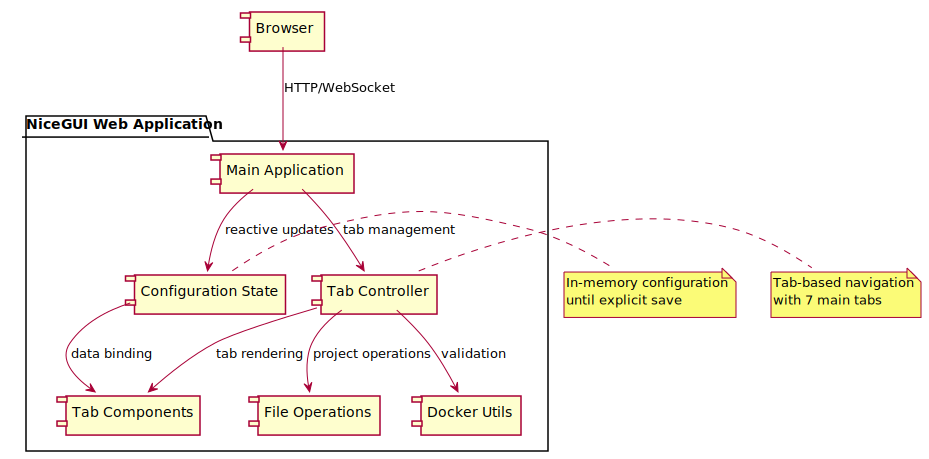

# PeiDocker Web GUI - General Design

> **Note**: Diagrams in this document are stored in `figures/webgui/` directory as SVG files.

## Overview

This document defines the design for a web-based GUI that provides PeiDocker project configuration through an intuitive browser interface. The application is a single-page web interface that manages Docker project creation, configuration, and export workflows. The GUI is designed for single-user usage and creates/manages project directories on the server filesystem.

## Single-User Design

**IMPORTANT**: The GUI is designed for single-user usage without authentication or session management. Multiple concurrent users accessing the GUI will:
- Share the same project directory and see each other's changes in real-time
- Have synchronized state through NiceGUI's WebSocket communication
- Potentially experience conflicts when multiple users modify the same configuration simultaneously

This design choice reflects NiceGUI's architecture and is suitable for local development environments and single-developer workflows.

## Design Philosophy

- **Project-centric workflow**: All operations center around creating, configuring, and managing PeiDocker projects
- **Server-side project management**: Project directories are created and managed on the server filesystem  
- **Single-page application**: All functionality contained in one web page with dynamic content updates
- **Tab-based organization**: Configuration options grouped by function into intuitive tabs  
- **Memory-first state management**: All changes kept in memory until explicit save
- **Browser-native experience**: Standard web UI patterns with responsive design
- **File-based persistence**: Projects are saved as directory structures with YAML configuration
- **Non-linear navigation**: Users can switch between tabs freely to configure different aspects

## PeiDocker Two-Stage Architecture

PeiDocker uses a sequential two-stage Docker image building process that is fundamental to understanding the GUI design:

**Stage-1 Image Building:**
- Builds `pei-image:stage-1` from base Ubuntu image
- System-level setup: SSH, proxy, networking, APT packages
- Foundation image with core system components
- Fully usable Docker image for basic use cases

**Stage-2 Image Building:**
- Builds `pei-image:stage-2` **based on Stage-1 image** as foundation
- Inherits all Stage-1 configurations (when Stage-2 values are `null`)
- Adds application-level customizations and packages
- **Key Enhancement**: Dynamic storage system unique to Stage-2
  - `/soft/app`, `/soft/data`, `/soft/workspace` directories
  - Smart linking: `/soft/xxx` → `/hard/volume/xxx` (external) OR `/hard/image/xxx` (in-image)
  - Allows switching between in-image and external storage after build

**Both Images Are Usable:**
- Users can run either: `docker compose up stage-1` or `docker compose up stage-2`
- Stage-2 is typically the target due to enhanced features
- Configuration inheritance: Stage-2 inherits Stage-1 settings, can override or append

**GUI Design Implications:**
- Configuration affects sequential image builds, not temporal build vs runtime phases
- Storage tab emphasizes Stage-2's unique dynamic storage feature
- Scripts tab manages lifecycle hooks for both image stages
- Environment and device settings follow inheritance patterns

### Handling Stage-Specific Configuration in the GUI

While the PeiDocker architecture separates configurations into `stage-1` and `stage-2`, the Web GUI may simplify some of these settings into a single, unified interface for a better user experience. This introduces a specific pattern for loading and saving these configurations.

**Guiding Principle**: If the GUI provides a single section for a setting that is configured separately for `stage-1` and `stage-2` in `user_config.yml`, the GUI should treat it as a combined configuration.

**Configuration Loading Behavior:**
- When a project is loaded, the GUI will merge the values from both stages.
- If a setting exists in both `stage_1` and `stage_2` (e.g., an environment variable with the same name), the value from `stage_2` takes precedence and overrides the `stage_1` value. This is analogous to applying `stage_1` settings and then applying `stage_2` settings on top.

**Configuration Saving Behavior:**
- When the user saves changes from a unified GUI control, the application will write the configured values to **both** the `stage_1` and `stage_2` sections in the `user_config.yml` file. This ensures that the simplified view in the GUI is consistently reflected in the underlying staged configuration.

**Example Application:**
- **Environment Variables**: The `Environment` tab might show a single list of variables. On load, it merges `stage_1.environment` and `stage_2.environment`, with `stage_2` values overriding. On save, the combined list is written back to both `stage_1.environment` and `stage_2.environment`.

**Important Exception**: This merging logic **does not apply** if the GUI already provides separate, distinct controls for Stage 1 and Stage 2 settings (e.g., separate "Stage-1 Mounts" and "Stage-2 Mounts" sections). In such cases, the GUI controls map directly to their corresponding sections in `user_config.yml` without any merging.

## Technology Approach

- **Framework**: NiceGUI (Python web framework)
- **Architecture**: Client-server with WebSocket communication
- **Styling**: Modern web UI with responsive design
- **State Management**: In-memory configuration with reactive updates

## Application Architecture




## Application Workflow

### Project Management States

The application operates in two main states based on whether a project is currently active:

**Initial State (No Active Project):**
- Project selection interface displayed
- "Create Project" and "Load Project" options available
- Project directory input field for user specification
- No configuration tabs accessible until project is selected

**Active Project State:**
- Project directory is set and validated
- Configuration tabs are enabled and accessible
- Memory-based state management for all configuration changes
- Save, Configure, and Download actions available

### Project Creation Workflow

#### From Scratch (Create Project)


**Create Project Process:**
1. User specifies project directory (or uses generated temporary directory)
2. System validates directory is empty or non-existent
3. System runs `pei-docker-cli create` to initialize project structure
4. GUI loads initial configuration and enables tab navigation
5. User can immediately begin configuring project through tabs

#### From Existing Project (Load Project)

**Current Status**: Not yet implemented - GUI displays warning message to user.

**Planned Behavior**:
1. User selects existing project directory
2. System validates directory contains valid PeiDocker project structure
3. GUI loads existing `user_config.yml` and project files
4. Configuration tabs populated with existing settings
5. User can modify and save changes to existing project

### Configuration Management Workflow

#### Memory-First State Management


#### Project Actions

**Save Configuration:**
- Validates all tab configurations
- Writes `user_config.yml` to project directory
- Creates script files in `stage-1/custom/` and `stage-2/custom/` directories
- Preserves inline scripts as separate files with proper references
- Displays success/error notifications

**Configure Project:**
- Runs `pei-docker-cli configure` command on current project
- Displays real-time command output and logs to user
- Shows success/error status based on command exit code
- Updates project files structure according to configuration
- Can be run multiple times as needed

**Download Project:**
- Creates ZIP archive of entire project directory
- Triggers browser download of ZIP file
- Warning dialogs displayed in specific cases:
  - Project not yet configured (no configure run)
  - Last configure command failed
  - Unsaved changes in GUI (option to save first)

### Validation and Error Handling

#### Project Directory Validation

**Directory Requirements:**
- Must be writable by NiceGUI process
- Must be empty or non-existent for new projects
- Invalid directories trigger error messages with guidance

**Path Handling:**
- Supports absolute and relative paths
- Cross-platform path normalization
- Security validation to prevent directory traversal

#### Configuration Validation

**Real-time Validation:**
- Input fields validate on change/blur events
- Invalid inputs highlighted with error styling
- Tab indicators show validation status
- Save action blocked until all validation passes

**Warning Dialogs:**
- Unsaved changes warning when switching projects
- Configuration status warnings before download
- Confirmation dialogs for destructive actions (reset, new project)

## Single-Page Application Structure

### Layout Components

The application uses a responsive layout structure that adapts based on project state:

#### Initial State Layout (No Active Project)
```
┌─────────────────────────────────────────────────────────┐
│ Header: PeiDocker Web GUI                               │
├─────────────────────────────────────────────────────────┤
│                                                         │
│              Project Selection Interface                │
│                                                         │
│  Project Directory: [___________________] 📁            │
│                                                         │
│    [🚀 Create Project]    [📂 Load Project]            │
│                                                         │
│              Welcome Information & Help                 │
│                                                         │
├─────────────────────────────────────────────────────────┤
│ Status: No active project                               │
└─────────────────────────────────────────────────────────┘
```

#### Active Project Layout (Project Selected)
```
┌─────────────────────────────────────────────────────────┐
│ Header: PeiDocker Web GUI    [Save] [Configure] [Download] │
├─────────────────────────────────────────────────────────┤
│ Project: /path/to/project            [🔄 New Project]   │
├─────────────────────────────────────────────────────────┤
│ [Project] [SSH] [Network] [Environment] [Storage] [Scripts] [Summary] │
├─────────────────────────────────────────────────────────┤
│                                                         │
│                Active Tab Content                       │
│              (Dynamic Tab Panels)                       │
│                                                         │
│                                                         │
├─────────────────────────────────────────────────────────┤
│ Status: Configuration modified • Last saved: 2:34 PM    │
└─────────────────────────────────────────────────────────┘
```

### Application Structure

The application consists of several main components that adapt based on the current state:

**Common Components:**
- **Header**: Contains application title and context-appropriate actions
- **Status Bar**: Shows project state, configuration status, and operational feedback

**Initial State Components:**
- **Project Selection Interface**: Directory input, create/load project buttons
- **Welcome Content**: Getting started information and feature overview
- **Directory Browser**: File system navigation for project selection

**Active Project Components:**
- **Project Info Bar**: Current project directory and project management actions  
- **Tab Navigation**: Horizontal tab bar for switching between configuration sections
- **Content Area**: Dynamic content area displaying active tab's configuration options
- **Action Bar**: Project-level actions (Save, Configure, Download, New Project)

Each tab is self-contained and manages its own configuration section, with real-time validation and state tracking. The interface dynamically switches between states based on whether a project is currently active.

## State Management

### Configuration State Behavior

The application maintains all configuration data in memory during the editing session. Changes are tracked and validated in real-time, with the following behavior:

**Configuration Data:**
- Project information (name, base image, directory)
- SSH access settings and authentication
- Network configuration (proxy, APT mirrors, port mappings)
- Environment variables and device access
- Storage mounts for Stage-1 and Stage-2 sequential image builds
- Custom scripts and entry points with dual input modes (file or inline)

**State Tracking:**
- Active tab selection and navigation history
- Modification status across all configuration sections
- Validation errors with tab-specific error indicators
- Last saved timestamp and change tracking

**Reactive Updates:**
- UI automatically reflects configuration changes
- Tab indicators show validation status and modification state
- Real-time preview of generated Docker commands and configurations
- Immediate feedback for invalid inputs or configuration conflicts

## Tab Implementation

### Tab Organization

The configuration is organized into 7 logical tabs, grouping related functionality:

1. **Project** - Basic project information and Docker image settings
2. **SSH** - SSH access configuration and authentication
3. **Network** - Proxy, APT mirrors, and port mappings
4. **Environment** - Environment variables and device/GPU configuration  
5. **Storage** - Volume mounts and storage configuration
6. **Scripts** - Custom entry points and lifecycle scripts
7. **Summary** - Configuration review and save/export options

### Tab Navigation Flow


### Tab Behavior and Navigation

**Tab Switching:**
- Users can click any tab to switch between configuration sections
- Tab validation occurs before switching to prevent data loss
- Visual indicators show which tabs have validation errors
- Active tab is highlighted with distinct styling

**Tab State Management:**
- Each tab maintains its own configuration data independently
- Changes are validated in real-time as users type or select options
- Invalid inputs are highlighted with error messages
- Tab titles show visual indicators for modified or error states

## User Interface Design

### Visual Theme

- **Color Scheme**: Clean, professional blue and gray palette
- **Typography**: Clear, readable fonts with proper hierarchy
- **Layout**: Card-based design with consistent spacing
- **Responsive**: Adapts to different screen sizes
- **Accessibility**: Proper contrast ratios and keyboard navigation

### User Interface Elements

**Input Components:**
- Text inputs with inline validation and error messages
- Toggle switches for boolean options (enable/disable features)
- Dropdown selectors for predefined choices (base images, mirrors)
- Dynamic lists with add/remove functionality (port mappings, environment variables)
- File browsers with path validation
- Multi-line text areas for script content with monospace font

**Interactive Features:**
- Real-time validation with immediate feedback
- Auto-complete suggestions for common values
- Drag-and-drop reordering for lists
- Expandable sections for advanced options
- Modal dialogs for detailed configuration

**Visual Feedback:**
- Color-coded status indicators (valid/invalid/modified)
- Progress indicators showing completion status
- Loading states for async operations
- Tooltips and help text for guidance

## Navigation and Controls

### Tab Navigation Behavior

**Tab Bar:**
- Horizontal tab bar with icons and labels for each configuration section
- Active tab highlighted with blue background and white text
- Error tabs shown with red background indicating validation issues
- Hover effects provide visual feedback for interactive elements

**Navigation Flow:**
- Users can switch freely between tabs without losing data
- Current tab validates before switching to prevent data loss
- Error messages guide users to fix issues before proceeding
- Tab state is preserved when switching between sections

**Global Controls:**
- **Save Configuration**: Validates all tabs and writes `user_config.yml`
- **Reset All**: Clears all configuration data with confirmation dialog
- **Status Indication**: Shows modification state and last saved time

## Configuration Workflow

### Tab Organization and Content

The configuration is organized into 7 logical tabs that group related settings:

#### 1. Project Tab 🏗️
- **Project name and basic settings**
- Docker base image selection
- Project directory validation
- Generated image name preview

#### 2. SSH Tab 🔐
- SSH service enable/disable
- Port configuration (container and host)
- User account settings (username, password, UID)
- SSH key copying configuration (copy public/private keys into container)
- Root access settings

#### 3. Network Tab 🌐
- **Proxy Configuration**: HTTP proxy settings enabled globally for both stages
  - Address input with "http://" fixed prefix label and hostname/IP input field
  - Default address: `host.docker.internal:7890`
  - Enable/disable toggle with global proxy settings
- **APT Configuration**: Repository mirror selection (tuna, aliyun, 163, ustc, cn)
- **Port Mapping**: Additional port mappings beyond SSH with dynamic add/remove functionality
  - **Supported Formats**: Docker Compose networking format
    - Single port mapping: `2222:22` (host_port:container_port)
    - Port range mapping: `9090-9099:9090-9099` 
    - Both Stage-1 and Stage-2 port configurations
  - **GUI Interaction**: 
    - Dynamic list with "Add Port Mapping" button
    - Each entry has host port and container port input fields
    - Individual "Remove" button for each mapping
    - Real-time validation for port numbers (1-65535)
    - Support for both single ports and port ranges
    - Visual feedback for invalid port entries
  - **Stage Behavior**: Stage-2 port mappings are appended to Stage-1 mappings
  - **SSH Separation**: SSH port mapping (2222:22) configured separately in SSH tab

#### 4. Environment Tab ⚙️
- **Environment Variables**: Custom environment variables for both stages (Stage-2 inherits and can add more)
- **Device Configuration**: GPU support enablement and device access (Stage-2 can override Stage-1 settings)

#### 5. Storage Tab 💾

**Storage vs Mount - Two Different Concepts:**

- **Storage (Stage-2 ONLY)**: Stage-2's unique dynamic storage system for predefined directories
  - **Predefined directories**: `/soft/app`, `/soft/data`, `/soft/workspace` only
  - **Smart linking**: `/soft/xxx` → `/hard/volume/xxx` (external) OR `/hard/image/xxx` (in-image)
  - **Dynamic switching**: Can switch between in-image and external storage after build
  - **Four storage types**: `auto-volume`, `manual-volume`, `host`, `image`
  - **Stage-2 exclusive**: This dynamic storage system is what differentiates Stage-2 from Stage-1

- **Mount (Both Stages)**: General volume mounting for any directory
  - **User-defined**: Any volume name, any destination path in container
  - **No inheritance**: Stage-1 mounts don't transfer to Stage-2, must be redefined
  - **Three mount types**: `auto-volume`, `manual-volume`, `host` (NOT `image`)
  - **Flexible destinations**: Can mount external volumes to any container path

**Storage Types (Stage-2 storage only):**
- `auto-volume`: Docker auto-creates and manages the volume
- `manual-volume`: User specifies custom volume name
- `host`: Direct mount of host directory
- `image`: Keep data inside the image itself (no external storage)

**Mount Types (Both stages):**
- `auto-volume`: Docker auto-creates and manages the volume  
- `manual-volume`: User specifies custom volume name
- `host`: Direct mount of host directory
- Path validation and conflict detection

**Storage GUI Layout:**
The storage section displays 3 fixed, always-visible entries for predefined directories:

1. **App Storage (/soft/app)**: Fixed destination, cannot be removed or renamed
2. **Data Storage (/soft/data)**: Fixed destination, cannot be removed or renamed  
3. **Workspace Storage (/soft/workspace)**: Fixed destination, cannot be removed or renamed

Each storage entry has 3 input fields with label-input pairing:
1. **Storage type**: Dropdown selector (`auto-volume`, `manual-volume`, `host`, `image`)
2. **Host path**: Text input, only editable when type=`host`, otherwise grayed out
3. **Volume name**: Text input, only editable when type=`manual-volume`, otherwise grayed out

**Storage Default Behavior:**
- Storage entries are always visible (cannot be created or removed)
- Default storage type is `image` (keeps data inside the image)
- Destinations are predefined (/soft/app, /soft/data, /soft/workspace) and not editable
- Conditional fields use disabled styling (gray background, muted text) when not applicable
- Field enabling/disabling happens dynamically based on storage type selection

**Mount GUI Layout:**
Each mount entry displays 5 input fields with label-input pairing:

1. **Mount name**: Text input with UUID-based default (`mount-{8-char-uuid}`)
2. **Mount type**: Dropdown selector (`auto-volume`, `manual-volume`, `host`)
3. **Destination path**: Text input with default `/mnt/mount-{uuid}` (not linked to name changes)
4. **Host path**: Text input, only editable when type=`host`, otherwise grayed out
5. **Volume name**: Text input, only editable when type=`manual-volume`, otherwise grayed out

**Mount Default Behavior:**
- Mount sections are empty by default (no pre-populated examples)
- "Add mount" button creates new mount with auto-generated UUID-based defaults
- Conditional fields use disabled styling (gray background, muted text) when not applicable
- Field enabling/disabling happens dynamically based on mount type selection

#### 6. Scripts Tab 📜
- **Sequential Stage Scripts**: Both Stage-1 and Stage-2 have full lifecycle hook support during their respective image building processes
- **Custom Entry Points**: Stage-1 and Stage-2 entry point scripts with dual input modes and format options
  - **String format**: `'stage-2/custom/my-entry.sh --mode=production'`
  - **Array format**: `['stage-2/custom/my-entry.sh --mode=production --log-level=info']`
- **Custom Scripts with Parameters**: Lifecycle hook scripts (on_build, on_first_run, on_every_run, on_user_login) for both image stages
  - **Parameter Support**: Scripts support shell-like parameters using shlex parsing
  - **Parameter Format**: `'script.sh --param1=value1 --param2="value with spaces"'`
  - **Example**: `'stage-1/custom/setup.sh --initialize --create-dirs --config=/tmp/build.conf'`
- **Script Creation Options**: 
  - Use existing script files (file browser and validation) with parameter input
  - Create new scripts inline (name + content editor + parameters with syntax highlighting)
  - Both modes support parameter specification and validation
- **Script Management**: View, edit, and manage both external and inline scripts with parameters for both stages
- **Container Path Mapping**: Scripts are mapped from host paths to container paths using `$PEI_STAGE_DIR_{stage_number}/` prefix
- **Wrapper Script Generation**: PeiDocker generates wrapper scripts that handle proper path resolution and parameter passing

**CRITICAL Path Access Constraints:**
- **Stage-1 Scripts**: Can ONLY reference paths starting with `stage-1/` (cannot access `stage-2/` paths as stage-2 doesn't exist during stage-1 build)
- **Stage-2 Scripts**: Can reference paths starting with BOTH `stage-1/` and `stage-2/` (inherits all stage-1 resources plus stage-2 resources)
- **Architectural Reason**: Stage-1 builds first and becomes the foundation; Stage-2 builds on top of Stage-1 with access to both layers
- **GUI Validation**: Path validation must enforce these constraints based on the selected stage context

#### 7. Summary Tab 📋
- **Configuration Review**: Complete configuration overview
- **Save/Export Options**: Save to user_config.yml, export settings
- **Validation Summary**: All tab validation status
- **Quick Actions**: Test configuration, generate Docker commands

### GUI to YAML Field Mapping

Each GUI tab directly modifies specific sections of the `user_config.yml` file:

**Project Tab** modifies:
- `stage_1.image.base` - Base Docker image selection
- `stage_1.image.output` - Stage-1 output image name
- `stage_2.image.output` - Stage-2 output image name

**SSH Tab** modifies:
- `stage_1.ssh.enable` - SSH service enable/disable toggle
- `stage_1.ssh.port` - SSH container port number
- `stage_1.ssh.host_port` - Host port mapping for SSH
- `stage_1.ssh.users` - User accounts with the following per-user settings:
  - `password` - User password for authentication
  - `pubkey_file` - Path to public key file to copy into container (mutually exclusive with pubkey_text)
  - `pubkey_text` - Direct public key content to copy into container (mutually exclusive with pubkey_file)
  - `privkey_file` - Path to private key file to copy into container (mutually exclusive with privkey_text)
  - `privkey_text` - Direct private key content to copy into container (mutually exclusive with privkey_file)
  - `uid` - User ID for the account

**Network Tab** modifies:
- `stage_1.proxy` and `stage_2.proxy` - Proxy configuration applied to both stages
  - `address` - Proxy server address (default: `host.docker.internal`)
  - `port` - Proxy server port (default: `7890`)
  - `enable_globally: true` and `remove_after_build: false` when proxy is enabled
- `stage_1.apt.repo_source` - APT repository mirror selection (tuna, aliyun, 163, ustc, cn, or empty for default)
- `stage_1.apt.use_proxy` - APT proxy usage settings
- `stage_1.ports` - Stage-1 port mappings in Docker Compose format (array of strings)
  - Format: `['2222:22', '8080:80', '9090-9099:9090-9099']`
- `stage_2.ports` - Stage-2 port mappings (appended to Stage-1 mappings)
  - Same format as Stage-1, merged during compose generation

**Environment Tab** modifies:
- `stage_1.environment` - Stage-1 environment variables (inherited by Stage-2)
- `stage_1.device.type` - Stage-1 device configuration (CPU/GPU)
- `stage_2.environment` - Stage-2 additional environment variables (appended to Stage-1)
- `stage_2.device.type` - Stage-2 device configuration (overrides Stage-1 when specified)

**Storage Tab** modifies:

*Storage (Stage-2 ONLY):*
The storage section provides 3 fixed GUI entries that map to YAML fields:

- **App Storage GUI** → `stage_2.storage.app` - Stage-2 dynamic storage for `/soft/app` directory
  - **Storage type** (GUI field) → `type`: `auto-volume` | `manual-volume` | `host` | `image` (defaults to `image`)
  - **Host path** (GUI field) → `host_path`: Host directory path (when `type=host`, otherwise `null`)
  - **Volume name** (GUI field) → `volume_name`: Custom volume name (when `type=manual-volume`, otherwise `null`)

- **Data Storage GUI** → `stage_2.storage.data` - Stage-2 dynamic storage for `/soft/data` directory
  - Same GUI field mapping as App Storage

- **Workspace Storage GUI** → `stage_2.storage.workspace` - Stage-2 dynamic storage for `/soft/workspace` directory
  - Same GUI field mapping as App Storage

*Storage GUI Behavior:*
- 3 fixed, always-visible storage entries (cannot be created or removed)
- Predefined destinations: `/soft/app`, `/soft/data`, `/soft/workspace` (not editable in GUI)
- Default type is `image` even when omitted from `user_config.yml`

*Mount (Both Stages):*
- `stage_1.mount` - Stage-1 general volume mount configurations (user-defined mounts)
  - **GUI Field Mapping (5 GUI fields → 4 YAML fields):**
    - **Mount name** (GUI field) → `{mount_name}` (YAML key, e.g., `mount-a1b2c3d4`)
    - **Mount type** (GUI field) → `{mount_name}.type`: `auto-volume` | `manual-volume` | `host` (NOT `image`)
    - **Destination path** (GUI field) → `{mount_name}.dst_path`: Destination path in container
    - **Host path** (GUI field) → `{mount_name}.host_path`: Host directory path (when `type=host`, otherwise `null`)
    - **Volume name** (GUI field) → `{mount_name}.volume_name`: Custom volume name (when `type=manual-volume`, otherwise `null`)
- `stage_2.mount` - Stage-2 general volume mount configurations (same GUI field mapping as Stage-1)

*Key Differences:*
- **Storage**: Fixed predefined directories (`app`, `data`, `workspace`) with smart linking system
- **Mount**: Flexible user-defined volumes that can mount to any container path
- **Types**: Storage supports `image` type, Mount does not
- **Inheritance**: Mounts don't inherit between stages, Storage only exists in Stage-2

**Scripts Tab** modifies:
- `stage_1.custom.on_build` - Scripts executed during Stage-1 image building
  - **Format**: Array of strings with optional parameters: `['stage-1/custom/script.sh --param=value']`
  - **Path Constraint**: ONLY `stage-1/` paths allowed (stage-2 doesn't exist yet)
  - **Parameter Support**: Shell-like parameters parsed using shlex: `'script.sh --verbose --config="/tmp/build.conf"'`
- `stage_1.custom.on_first_run` - Scripts executed on first run of Stage-1 containers
  - **Format**: Array of strings with parameters: `['stage-1/custom/setup.sh --initialize --create-dirs']`
  - **Path Constraint**: ONLY `stage-1/` paths allowed
- `stage_1.custom.on_every_run` - Scripts executed on every run of Stage-1 containers
  - **Format**: Array of strings with parameters: `['stage-1/custom/health-check.sh --check-services']`
  - **Path Constraint**: ONLY `stage-1/` paths allowed
- `stage_1.custom.on_user_login` - Scripts executed on user login to Stage-1 containers
  - **Format**: Array of strings with parameters: `['stage-1/custom/welcome.sh --show-motd --check-updates']`
  - **Path Constraint**: ONLY `stage-1/` paths allowed
- `stage_1.custom.on_entry` - Custom entry point script for Stage-1 containers
  - **String Format**: `'stage-1/custom/my-entry.sh --mode=production'`
  - **Array Format**: `['stage-1/custom/my-entry.sh --mode=production --log-level=info']`
  - **Path Constraint**: ONLY `stage-1/` paths allowed
- `stage_2.custom.on_build` - Scripts executed during Stage-2 image building (based on Stage-1)
  - **Format**: Array of strings with parameters: `['stage-2/custom/install-gui.sh --enable-desktop --theme=dark']`
  - **Path Access**: Can reference BOTH `stage-1/` and `stage-2/` paths
- `stage_2.custom.on_first_run` - Scripts executed on first run of Stage-2 containers
  - **Format**: Array of strings with parameters: `['stage-2/custom/setup-workspace.sh --clone-repos']`
  - **Path Access**: Can reference BOTH `stage-1/` and `stage-2/` paths
- `stage_2.custom.on_every_run` - Scripts executed on every run of Stage-2 containers
  - **Format**: Array of strings with parameters: `['stage-2/custom/update-status.sh --log-startup']`
  - **Path Access**: Can reference BOTH `stage-1/` and `stage-2/` paths
- `stage_2.custom.on_user_login` - Scripts executed on user login to Stage-2 containers
  - **Format**: Array of strings with parameters: `['stage-2/custom/dev-setup.sh --activate-venv --cd-to-project']`
  - **Path Access**: Can reference BOTH `stage-1/` and `stage-2/` paths (e.g., `['stage-1/system/base-setup.sh', 'stage-2/custom/user-config.sh']`)
- `stage_2.custom.on_entry` - Custom entry point script for Stage-2 containers
  - **String Format**: `'stage-2/custom/my-entry.sh --mode=production'`
  - **Array Format**: `['stage-2/custom/my-entry.sh --mode=production --log-level=info']`
  - **Path Access**: Can reference BOTH `stage-1/` and `stage-2/` paths

**Script Processing Details:**
- **Parameter Parsing**: All script parameters are parsed using Python's `shlex.split()` for safe shell-like argument handling
- **Container Path Mapping**: Script paths are mapped from `{script_path}` to `$PEI_STAGE_DIR_{stage_number}/{script_path}` in containers
- **Wrapper Generation**: PeiDocker generates wrapper scripts in `{project_dir}/installation/stage-{1,2}/generated/` that execute user scripts with proper argument handling
- **Entry Point Storage**: For `on_entry` scripts, the script path and default arguments are stored in separate files in `{project_dir}/installation/stage-{1,2}/internals/`

**Inline Script Creation Behavior:**
- Inline scripts are automatically saved to `stage-1/custom/` or `stage-2/custom/` directories
- **Fixed Path Labels**: GUI displays non-editable labels `stage-1/custom/` or `stage-2/custom/` before filename input
- **Auto-generated Filenames**: Script filenames are auto-generated using UUID format: `script-{8-char-uuid}.bash`
- **Combined Path Format**: Results in paths like `stage-1/custom/script-a1b2c3d4.bash --param=value`
- Scripts are referenced by relative paths in YAML configuration
- Parameters are preserved in the YAML as part of the script entry string

**Summary Tab** provides read-only views and does not directly modify YAML fields.

### Data Persistence Behavior

**Configuration Loading:**
- Application automatically loads existing `user_config.yml` from project directory
- Missing configuration files result in default values being used
- Invalid configuration files display error messages with guidance for correction
- Configuration structure is validated during loading

**Configuration Saving:**
- Save button validates all tab configurations before writing to disk
- Configuration is written as `user_config.yml` in YAML format in project directory
- Inline scripts are saved to stage-specific directories:
  - Stage-1 scripts: `{project_dir}/stage-1/custom/{script_name}.sh`
  - Stage-2 scripts: `{project_dir}/stage-2/custom/{script_name}.sh`
- External script files are copied to appropriate stage directories for reproducibility
- Directory structure is created automatically if it doesn't exist
- Backup of previous configuration is created before overwriting
- Success/failure notifications provide immediate feedback to users

## Script Creation and Management

The Scripts Tab provides dual-mode script creation capabilities that allow users to either reference existing script files or create new scripts directly within the GUI. **CRITICAL**: All script input modes must support shell-like parameter specification.

### Script Input Modes

**File Mode (Enhanced with Parameters and Stage-Constrained Path Freedom):**
- Users provide a path to an existing script file within allowed project directories
- **Full Path Input**: Users can specify complete paths within stage access constraints
- **Stage-1 Paths**: Can ONLY reference `stage-1/` paths (e.g., `stage-1/system/scripts/setup.sh`, `stage-1/custom/my-script.sh`)
- **Stage-2 Paths**: Can reference BOTH `stage-1/` and `stage-2/` paths (e.g., `stage-2/custom/app.sh`, `stage-1/system/base.sh`)
- **Default Hint**: Input field defaults to `stage-{1,2}/custom/script-{uuid}.bash --param=value` as helpful guidance
- **Parameter Support**: Combined format results in `'valid/stage/path/script.sh --param1=value1 --param2="value with spaces"'`
- File browser integration for easy selection within allowed directories
- **Stage-Aware Validation**: Ensures file exists, is executable, and path is accessible from the current stage context
- Parameter syntax validation using shlex parsing

**Inline Mode (Enhanced with Parameters and Fixed Directory):**
- Users create scripts directly in the GUI
- **Fixed Directory Constraint**: All inline scripts MUST be saved to `stage-{1,2}/custom/` directory
- **GUI Display**: Shows fixed, non-editable label `stage-{1,2}/custom/` before filename input
- **Auto-generated Filenames**: System generates unique filenames using `script-{uuid}.bash` format
- Text area with monospace font for script content
- **Parameter Support**: Parameters combined with fixed path: `'stage-{n}/custom/script-{uuid}.bash --param=value'`
- **Path Immutability**: Users cannot change the directory part, only script content and parameters
- Basic syntax validation and hints
- Content preview and editing capabilities

### Script Processing Behavior

**File-Based Scripts (with Parameters and Stage-Constrained Path Access):**
- Users can specify script paths within stage-appropriate directory structures
- **Stage-1 Path Constraints**: Can ONLY reference `stage-1/` subdirectories like `stage-1/system/`, `stage-1/custom/`, `stage-1/contrib/`
- **Stage-2 Path Flexibility**: Can reference BOTH `stage-1/` and `stage-2/` subdirectories across all available paths
- **Default Guidance**: Input field suggests `stage-{1,2}/custom/script-{uuid}.bash --param=value` but is editable within constraints
- **Parameter Integration**: Parameters combined with user-specified valid path
- **Final Format**: `'stage-appropriate/path/script.sh --param1=value1 --param2="value with spaces"'`
- **Stage-Aware Validation**: Files validated for existence, executable permissions, and stage accessibility
- Scripts are copied to project directory for reproducibility
- Parameters preserved in YAML configuration as part of script entry

**Inline Scripts (with Parameters and Auto-generation):**
- Users create scripts directly within the GUI text editor
- Monospace font and syntax highlighting for better editing experience
- Real-time validation checks for basic script structure
- **Path Display**: GUI shows fixed labels `stage-{1,2}/custom/` before auto-generated filename
- **Auto-generated Filenames**: System generates unique filenames using format `script-{8-char-uuid}.bash`
- **Parameter Integration**: Parameters from GUI input field are combined with generated script path
- **Path Format**: Complete path displayed as `stage-1/custom/script-a1b2c3d4.bash --param=value`
- Generated script files are saved to stage-specific directories:
  - Stage-1 scripts: `{project_dir}/installation/stage-1/custom/script-{uuid}.bash`
  - Stage-2 scripts: `{project_dir}/installation/stage-2/custom/script-{uuid}.bash`
- **Final YAML Entry**: `'stage-1/custom/script-{uuid}.bash --param=value'`

**Entry Point Handling:**
- **Format Selection**: GUI provides radio buttons or dropdown for entry point format selection
  - **String Format Option**: Single text input for `'script.sh --param=value'`
  - **Array Format Option**: Single text input that gets converted to `['script.sh --param=value']`
- **Default Arguments**: Entry point parameters are treated as default arguments
- **Container Processing**: PeiDocker separates script path from arguments and stores them in different files for container access

**Configuration Integration:**
- All scripts (file and inline) are processed and stored in project directory with parameters
- Final `user_config.yml` contains relative paths with parameters:
  - Stage-1 scripts: `'stage-1/custom/{script_name}.sh --param=value'`
  - Stage-2 scripts: `'stage-2/custom/{script_name}.sh --param=value'`
- File-based scripts are copied to appropriate stage directories for reproducibility
- Parameters are preserved exactly as entered in GUI
- Metadata about script origin and parameter source is preserved for debugging

### User Experience Features

**Script Visualization:**
- List view showing all configured scripts with their types and parameters
- "View" button for inline scripts to display content in a modal
- **Parameter Display**: Clear indication of script parameters alongside script path
- Clear indication of script source (file path vs. inline)
- Script execution context (lifecycle event) clearly labeled
- **Entry Point Format Indicator**: Visual indication of string vs array format for entry points

**Script Management:**
- Edit inline scripts directly in the interface with parameter modification
- Replace file scripts with updated versions while preserving parameters
- **Parameter Editing**: Dedicated interface for editing script parameters separately from script content
- Convert between file and inline modes while preserving parameters
- Preview generated script execution order with parameters in summary
- **Format Conversion**: Convert entry points between string and array formats

**Validation and Feedback:**
- Real-time validation of script names, content, and parameters
- **Parameter Syntax Validation**: Validate parameter syntax using shlex parsing
- **Parameter Format Hints**: Provide examples and syntax help for parameter input
- File existence checks for file-based scripts
- Syntax highlighting hints for bash scripts
- **Parameter Error Feedback**: Specific error messages for invalid parameter syntax
- Clear error messages for configuration issues
- **Format Validation**: Validate entry point format selection and syntax

## Error Handling and Validation

### Validation Behavior

**Real-time Validation:**
- Input fields validate as users type or when focus changes
- Invalid inputs are highlighted with red borders and error text
- Validation messages appear immediately below problematic fields
- Tab indicators show error state when validation fails

**Validation Rules:**
- Project names must contain only letters, numbers, hyphens, and underscores
- Port numbers must be valid integers between 1 and 65535
- Environment variables must follow KEY=VALUE format
- File paths are checked for existence and permissions
- Script content requires proper shebang line for executable scripts

**Error Feedback:**
- Clear, specific error messages explain what needs to be corrected
- Success notifications confirm when actions complete successfully
- Warning messages alert users to potential issues
- Color coding helps users quickly identify problem areas

## Launch and Usage

### Application Startup

The web GUI is launched via command line and runs as a local web server:

```bash
# Start web GUI
pei-docker-webgui start [--project-dir PATH] [--here] [--port 8080]

# Development mode with auto-reload
pei-docker-webgui dev [--project-dir PATH] [--here] [--port 8080] [--reload]
```

**Startup Behavior:**
- Opens web browser automatically to localhost on specified port (default 8080)
- If `--project-dir` specified and valid, loads that project directly into active state
- If `--here` specified, uses current working directory as project directory
- Otherwise, displays project selection interface in initial state
- Initializes configuration state from existing `user_config.yml` if present in loaded project
- For active projects, displays Project tab; for initial state, shows project selection interface

**Command Line Project Loading:**
- `--project-dir PATH`: Load specific project directory immediately
- `--here`: Use current working directory as project directory  
- If specified directory doesn't exist or is invalid, falls back to project selection interface
- Invalid projects display error messages with guidance for correction

### Usage Workflow

**Typical User Session:**

**Project Setup Phase:**
1. Launch web GUI - displays project selection interface
2. Enter project directory path or use generated temporary directory
3. Click "Create Project" to initialize new project structure
4. System runs `pei-docker-cli create` and validates project creation
5. GUI switches to active project state with configuration tabs enabled

**Project Configuration Phase:**
6. Configure basic project settings in Project tab (base image, project name)
7. Enable and configure SSH access if needed (SSH tab)
8. Set up network configuration - proxy, APT mirrors, ports (Network tab)
9. Define environment variables and device access (Environment tab)
10. Configure storage mounts for Stage-1 and Stage-2 images, including Stage-2's dynamic storage (Storage tab)
11. Add custom scripts and entry points as needed (Scripts tab)
12. Review complete configuration in Summary tab

**Project Finalization Phase:**
13. Save configuration to write `user_config.yml` and script files
14. Run Configure to execute `pei-docker-cli configure` and generate Docker compose files
15. Build Docker images: `docker compose build stage-1` then `docker compose build stage-2`
16. Download project as ZIP archive for deployment or sharing

**Session Management:**
- Configuration changes are kept in browser memory until explicitly saved
- Users can freely navigate between tabs without losing work
- Browser refresh preserves current session state  
- Project directory persists across browser sessions
- Validation prevents saving incomplete or invalid configurations
- Warning dialogs protect against data loss (unsaved changes, unconfigured projects)

This design provides a user-friendly web interface that maintains feature parity with the textual GUI while leveraging modern web UI patterns for improved user experience.