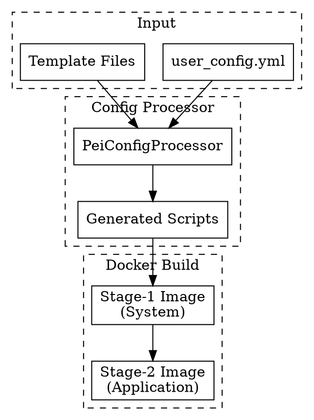
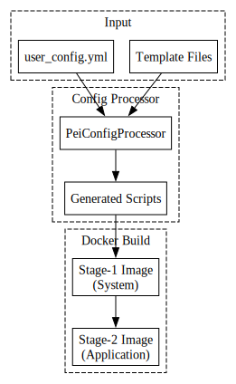
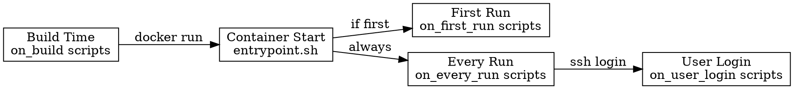
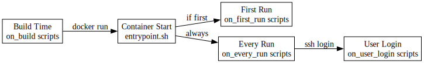
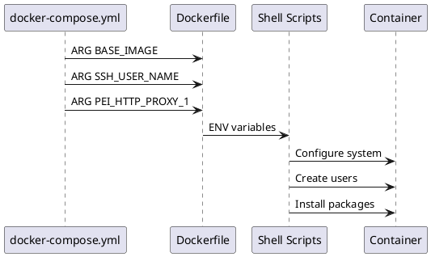
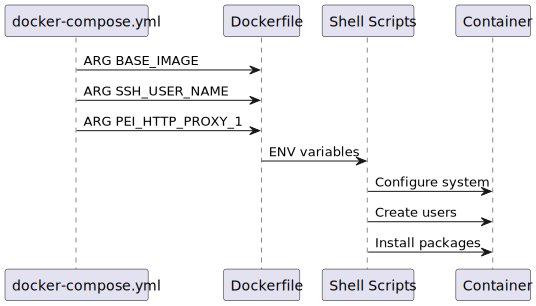

# PeiDocker Build Internals

This document describes how PeiDocker transforms `user_config.yml` into Docker images through its two-stage build process.

## Architecture Overview

PeiDocker uses a two-stage build system where configuration from `user_config.yml` is processed into Docker build arguments and shell scripts that execute during image build and container runtime.





## Configuration Processing

The `PeiConfigProcessor` reads `user_config.yml` and:

1. **Validates** configuration against the peidocker-data-model
2. **Generates** docker-compose.yml with build arguments
3. **Creates** shell scripts in `installation/stage-*/generated/`
4. **Copies** template Dockerfiles and scripts

### Generated Files Structure

```
project_dir/
├── docker-compose.yml        # Generated from template
├── stage-1.Dockerfile        # Copied template
├── stage-2.Dockerfile        # Copied template
└── installation/
    ├── stage-1/
    │   ├── internals/        # Core scripts (copied)
    │   ├── generated/        # Generated from config
    │   │   ├── on-build.txt
    │   │   ├── on-first-run.txt
    │   │   ├── on-every-run.txt
    │   │   └── on-user-login.txt
    │   ├── custom/          # User scripts
    │   └── system/          # System configs
    └── stage-2/
        └── [same structure]
```

## Build Process

### Stage-1: System Image

**Purpose**: Install system packages and configure base environment

**Dockerfile Operations**:

1. **ARG Reception**: Receives ~30 build arguments from docker-compose.yml
   - Base image, SSH config, proxy settings, APT config
   - Script paths, environment variables

2. **File Copy**: `ADD ${PEI_STAGE_HOST_DIR_1} ${PEI_STAGE_DIR_1}`
   - Copies entire `installation/stage-1/` to `/pei-from-host/stage-1/`

3. **Script Preparation**:
   - Convert CRLF to LF: `dos2unix`
   - Make executable: `chmod +x`

4. **Execution Sequence**:
   ```
   setup-env.sh         # Configure environment variables
   install-essentials.sh # Install basic packages
   setup-ssh.sh         # Configure SSH if enabled
   setup-profile-d.sh   # Configure shell profiles
   custom-on-build.sh   # Execute user scripts from on_build
   setup-users.sh       # Create users and set passwords
   cleanup.sh          # Clean APT cache, remove proxy
   ```

5. **Entrypoint Setup**: Copies `entrypoint.sh` to `/entrypoint.sh`

### Stage-2: Application Image

**Purpose**: Build on stage-1 with application-specific configurations

**Dockerfile Operations**:

1. **Base Selection**: Uses stage-1 output or custom base

2. **Storage Setup**:
   ```
   /soft/            # Symlinks to actual storage
   ├── app          -> /hard/volume/app or /hard/image/app
   ├── data         -> /hard/volume/data or /hard/image/data
   └── workspace    -> /hard/volume/workspace or /hard/image/workspace
   ```

3. **Directory Creation**: `create-dirs.sh` creates storage structure

4. **Script Execution**: Same sequence as stage-1 with stage-2 scripts

## Script Lifecycle





### Entrypoint Execution

The `/entrypoint.sh` script:

1. Executes `on-entry.sh` (internal setup)
2. Checks for first run: `/pei-init/stage-*-init-done`
3. If first run: executes scripts from `on_first_run`
4. Always executes scripts from `on_every_run`
5. Starts SSH service if configured
6. Launches shell or custom entrypoint

### User Login Scripts

When users SSH in, `/etc/profile.d/pei-login.sh`:
- Sources environment variables
- Executes scripts from `on_user_login`

## Configuration Mapping

### SSH Configuration

`user_config.yml`:
```yaml
ssh:
  enable: true
  port: 22
  users:
    me:
      password: '123456'
      pubkey_file: 'key.pub'
```

Becomes Docker ARGs:
```
SSH_USER_NAME=me
SSH_USER_PASSWORD=123456
SSH_PUBKEY_FILE=stage-1/key.pub
SSH_CONTAINER_PORT=22
```

Processed by `setup-ssh.sh`:
- Creates users with specified UIDs
- Sets passwords
- Configures authorized_keys
- Modifies sshd_config

### Proxy Configuration

`user_config.yml`:
```yaml
proxy:
  address: host.docker.internal
  port: 7890
  enable_globally: true
```

Becomes:
```
PEI_HTTP_PROXY_1=http://host.docker.internal:7890
ENABLE_GLOBAL_PROXY=true
```

Applied in `setup-env.sh`:
- Sets `http_proxy`, `https_proxy` environment variables
- Configures APT proxy if `apt.use_proxy: true`

### Storage Configuration

`user_config.yml`:
```yaml
storage:
  app:
    type: auto-volume  # or: manual-volume, host, image
    host_path: /host/path
    volume_name: my-volume
```

Generates in docker-compose.yml:
```yaml
volumes:
  - type: volume
    source: auto-generated-name
    target: /hard/volume/app
```

The `create-dirs.sh` script:
1. Creates `/hard/image/*` directories
2. Creates `/soft/*` symlinks
3. Links point to `/hard/volume/*` if mounted, else `/hard/image/*`

### Custom Scripts

`user_config.yml`:
```yaml
custom:
  on_build:
    - 'stage-1/custom/install.sh --verbose'
```

Processing:
1. Config processor writes to `generated/on-build.txt`
2. `custom-on-build.sh` reads the file
3. Parses arguments using shell evaluation
4. Executes: `bash install.sh --verbose`

## Build Arguments Flow





## Environment Variables

Three types of environment variables:

1. **Build-time ARGs**: Consumed during image build
2. **Runtime ENVs**: Available in running container
3. **User-defined**: From `environment:` section

Inheritance:
- Stage-2 inherits stage-1 environment
- `PEI_BAKE_ENV_STAGE_*` controls persistence
- Docker Compose substitution: `${VAR:-default}`

Boolean normalization rules (applies across build/run scripts and templates):
- Accepts `true`/`false` in a case-insensitive manner and numeric `1`/`0`.
- Empty value is respected as “use system/default” (not coerced to true/false).
- When generating merged artifacts, `merged.env` emits lowercase `true`/`false` for booleans.

## Port Mapping

Stage-specific port configurations:

```yaml
stage_1:
  ports: ["5432:5432"]  # Database ports
  ssh:
    host_port: 2222      # SSH special handling

stage_2:
  ports: ["8080:8080"]  # Application ports
```

SSH port receives special treatment:
- Internal port from `ssh.port`
- External mapping from `ssh.host_port`
- Added to stage's port list

## APT Repository Management

Special repository handling:

```yaml
apt:
  repo_source: 'tuna'  # Special keyword
```

Maps to:
- `tuna` → `http://mirrors.tuna.tsinghua.edu.cn/ubuntu/`
- `aliyun` → `http://mirrors.aliyun.com/ubuntu/`

Or custom file:
```yaml
apt:
  repo_source: 'stage-1/system/apt/custom.list'
```

Applied in `install-essentials.sh`:
- Backs up `/etc/apt/sources.list`
- Replaces with specified source
- Optionally restored after build

## File Processing

All shell scripts undergo:

1. **CRLF → LF conversion**: `dos2unix` or `sed -i 's/\r$//'`
2. **Executable permission**: `chmod +x`
3. **Path resolution**: Relative to `/pei-from-host/stage-*/`

## Summary

PeiDocker transforms declarative YAML configuration into:
- Docker build arguments
- Shell scripts for lifecycle management
- Directory structures for storage
- System configurations for SSH, proxy, APT

The two-stage architecture separates:
- **Stage-1**: System-level, reusable base
- **Stage-2**: Application-specific, with external storage

Scripts execute at precise lifecycle points, enabling customization without Dockerfile knowledge.

## Generated Diagrams

The diagrams in this document have been generated and are available in the `internals-diagrams/` subdirectory:

- `architecture-overview.svg` - Overall data flow diagram
- `script-lifecycle.svg` - Script execution lifecycle
- `build-arguments-flow.svg` - Build arguments flow sequence

To regenerate the diagrams:

**For Graphviz diagrams:**
```sh
cd docs/internals-diagrams
dot -Tsvg architecture-overview.dot -o architecture-overview.svg
dot -Tsvg script-lifecycle.dot -o script-lifecycle.svg
```

**For PlantUML diagrams:**
```sh
cd docs/internals-diagrams
plantuml -tsvg build-arguments-flow.puml
```
