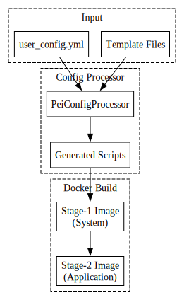

# Architecture

PeiDocker has a small public surface and a larger template/runtime surface behind it. The core job is to transform a typed YAML config into reproducible build and runtime artifacts.

## System Overview

1. The CLI loads `user_config.yml`.
2. `pei_utils.py` performs config-time environment substitution and validation.
3. `PeiConfigProcessor` merges the config into a compose template.
4. Generated wrapper scripts are written under `installation/stage-*/generated/`.
5. Docker builds `stage-1` and then `stage-2`.
6. Runtime entrypoint scripts prepare storage, run lifecycle hooks, and hand off to SSH, a custom entrypoint, or a fallback shell/blocking process.

## Main Components

| Area | Role |
| --- | --- |
| `src/pei_docker/pei.py` | CLI entry points for `create`, `configure`, `remove` |
| `src/pei_docker/config_processor.py` | Config-to-compose transformation and generated wrapper creation |
| `src/pei_docker/pei_utils.py` | YAML loading, env substitution, path helpers, passthrough rewriting |
| `src/pei_docker/user_config/` | Typed config model |
| `src/pei_docker/project_files/` | Dockerfiles, installation scripts, and runtime internals |
| `src/pei_docker/templates/` | Full config template, quick templates, base compose template |
| `src/pei_docker/webgui/` | Deprecated but still present GUI code |

## Source Tree Mapping

- `user_config/*`: the shape of accepted YAML
- `project_files/installation/stage-1/internals`: system bootstrap and SSH setup
- `project_files/installation/stage-2/internals`: storage linking and runtime lifecycle
- `project_files/installation/stage-1/system`: canonical built-in installers
- `project_files/installation/stage-2/system`: mostly forwarding wrappers

## Related Pages

- [Build Pipeline](build-pipeline.md)
- [Config Processing](config-processing.md)
- [Entrypoint System](entrypoint-system.md)
