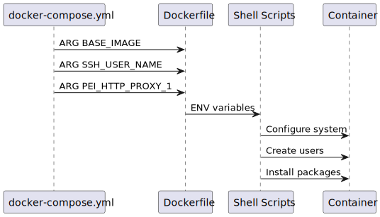

# Build Pipeline

This page traces how one `user_config.yml` becomes generated Docker and Compose artifacts.

## High-Level Flow

1. `pei-docker-cli create` writes a project skeleton.
2. `pei-docker-cli configure` loads `user_config.yml` and `compose-template.yml`.
3. Config-time `${VAR}` substitution runs.
4. `PeiConfigProcessor` applies pre-resolution build settings into `x-cfg-stage-*` sections.
5. The compose template is resolved.
6. Final service-level settings such as environment, ports, storage, and mounts are applied.
7. Wrapper scripts and stage environment files are written.
8. `docker-compose.yml` is emitted. Optional merged artifacts are emitted when requested.

## Stage-1

Stage-1 build args cover:

- base image
- SSH users, ports, key paths, UID/GID values
- APT mirror and proxy settings
- global proxy toggles
- stage-1 environment bake flags

The stage-1 Dockerfile copies the installation files into `/pei-from-host/stage-1`, runs core setup scripts, and produces the reusable system image.

## Stage-2

Stage-2 typically inherits the stage-1 output image as its base. After resolution, the processor appends:

- stage-1 ports plus stage-2 ports
- cumulative stage environment map
- stage-2 storage mounts
- stage-specific custom wrapper scripts

Stage-2 runtime storage is finalized at container startup, not at build time.

## Merged Build Mode

`pei-docker-cli configure --with-merged` also emits:

- `merged.Dockerfile`
- `merged.env`
- `build-merged.sh`
- `run-merged.sh`

This is a convenience path for CI or users who prefer a plain `docker build` flow. It is intentionally stricter than compose output and rejects passthrough markers.
