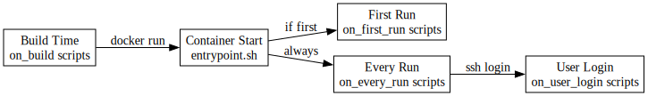

# Entrypoint System

The entrypoint scripts are the last layer of PeiDocker behavior before control reaches SSH, a user command, a custom `on_entry`, or a fallback shell/blocking loop.

## Preparation First

Both stage entrypoints always run `on-entry.sh` before any handoff branch.

- stage-1 runs `stage-1/internals/on-entry.sh`
- stage-2 runs stage-1 `on-entry.sh` and then stage-2 `on-entry.sh`

The stage-2 `on-entry.sh` script creates storage links, runs `on_first_run` once, and then runs `on_every_run`.

## Handoff Rules

Order of precedence:

1. stage-2 custom `on_entry`
2. stage-1 custom `on_entry`
3. explicit user command
4. default-mode options such as `--no-block`
5. interactive bash fallback
6. non-interactive blocking sleep fallback

## Logging

The default mode supports `--verbose`, which sets `PEI_ENTRYPOINT_VERBOSE=1`. Generated wrapper scripts and runtime preparation scripts use that variable to print extra banners.

## SIGTERM Handling

The non-interactive fallback no longer uses `exec sleep infinity` as PID 1. Instead, Bash stays as PID 1, traps `TERM`, and waits on a child `sleep infinity`. This preserves a bounded shutdown path on environments where PID 1 would otherwise ignore `SIGTERM`.

## Generated Wrapper Policy

`_custom-on-entry.sh` is generated per stage. A zero-length file means “no custom on-entry configured”. The runtime checks file size before deciding whether to select that branch.
