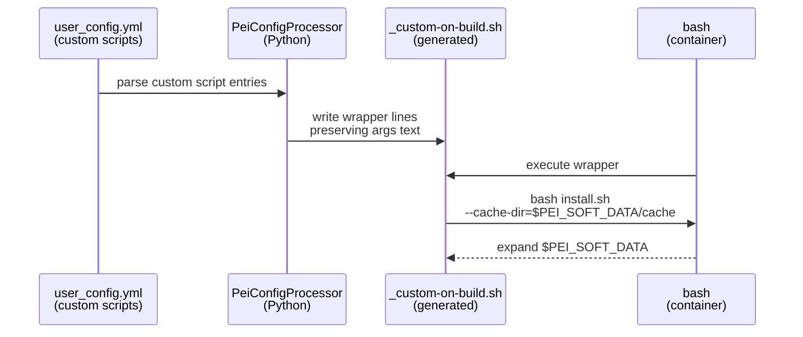
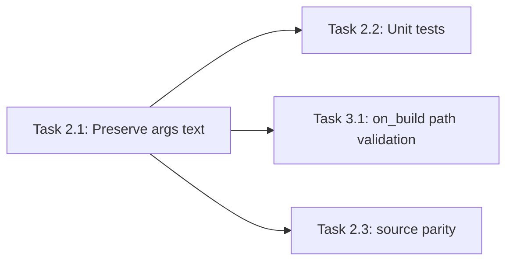

# Implementation Guide: Custom Script Args (Env Var-Safe)

**Group**: 2 | **Change**: storage-agnostic-install-scripts | **Tasks**: [2.1]–[2.3]

## Goal

Ensure custom lifecycle scripts (`custom.on_build`, `on_first_run`, `on_every_run`, `on_user_login`) can include environment variable tokens in their arguments (e.g. `$HOME`, `$PEI_SOFT_DATA`) and have those tokens expand at execution time inside the container.

Key constraint: generated wrapper scripts must not “single-quote away” `$VARS`.

## Public APIs

### Task 2.1: Preserve user-provided argument text during wrapper generation

The public surface is the `user_config.yml` custom script string format:

```yaml
custom:
  on_build:
    - 'stage-2/system/pixi/install-pixi.bash --cache-dir=$PEI_SOFT_DATA/cache --verbose'
```

Implementation target: `PeiConfigProcessor` in `src/pei_docker/config_processor.py` should render wrapper lines that preserve env var expansion.

Implemented helper API (Python):

```python
# src/pei_docker/config_processor.py

from __future__ import annotations

from typing import Tuple


class PeiConfigProcessor:
    @staticmethod
    def _parse_script_entry(script_entry: str) -> Tuple[str, str]:
        """Parse a script entry into (script_path, args_text)."""
        ...

    def _generate_script_text(self, on_what: str, filelist: list[str] | None) -> str:
        """Generate the wrapper script for a lifecycle hook.

        Uses `_parse_script_entry()` so wrappers can append args text without
        re-quoting and breaking `$VARS` expansion.
        """
        ...
```

Parsing approach guidelines:

- Parse only the *script path* safely (so existence checks work).
- Preserve the remainder as argument text without rewriting `$VARS` into single quotes.
- Keep semantics for quoted values with spaces (do not turn `"a b"` into `a b`).

### Task 2.2: Add unit tests for argument passthrough

Add tests that verify wrapper text preserves:

- quoted values with spaces: `--message="hello world"`
- env var tokens: `--cache-dir=$HOME/cache`, `--cache-dir=$PEI_SOFT_DATA/cache`
- `--flag=value` forms

### Task 2.3: Align `on_user_login` behavior (`source`) with other hooks

`on_user_login` wrappers use `source` instead of `bash`. Ensure the same argument handling rules apply so `$VARS` expand and quoting is preserved.

**Usage Flow**:



**Pseudocode**:

```python
def parse_script_entry(script_entry: str) -> tuple[str, str]:
    # 1) parse only the first token (script path) using shlex
    # 2) keep the trailing substring as args_text for runtime expansion
    return script_path, args_text

def generate_wrapper_lines(entries: list[str], runner: str) -> list[str]:
    for entry in entries:
        script_path, args_text = parse_script_entry(entry)
        if args_text:
            yield f'{runner} "$DIR/../../{script_path}" {args_text}'
        else:
            yield f'{runner} "$DIR/../../{script_path}"'
```

---

## Group Integration



## Testing

### Test Input

- A small set of script entry strings used directly in unit tests.
- Optional: reuse `tests/configs/custom-script-params-test.yml` patterns with added `$VARS`.

### Test Procedure

```bash
# Unit tests focused on wrapper rendering
pixi run pytest -q tests/test_custom_script_args.py
```

### Test Output

- Tests demonstrate wrapper output contains `$HOME` / `$PEI_SOFT_DATA` un-single-quoted.
- Tests demonstrate quoted strings with spaces remain quoted in wrapper output.

## References

- Proposal: `openspec/changes/storage-agnostic-install-scripts/proposal.md`
- Design: `openspec/changes/storage-agnostic-install-scripts/design.md`
- Specs: `openspec/changes/storage-agnostic-install-scripts/specs/install-script-parameter-interface/spec.md`

## Implementation Summary

Wrapper generation now preserves user-provided argument text so `$VARS` expand at
execution time (instead of being rewritten into single-quoted tokens).

### What has been implemented

- Implemented `PeiConfigProcessor._parse_script_entry()` in `src/pei_docker/config_processor.py`:
  - parses only the first token (script path) via `shlex`
  - preserves the remainder of the entry as a raw-ish args string
- Updated wrapper generation (`PeiConfigProcessor._generate_script_text`) to:
  - call `_parse_script_entry()` per entry
  - emit `bash "$DIR/../../<script>" <args_text>` or `source ... <args_text>` without re-tokenizing
- Added unit coverage in `tests/test_custom_script_args.py` for:
  - quoted args (`--message="hello world"`)
  - `$HOME` and `$PEI_SOFT_DATA` tokens
  - parity between `bash`-executed hooks and `source`-executed `on_user_login`

### How to verify

- Run the focused unit test:
  - `pixi run pytest -q tests/test_custom_script_args.py`
- Optional smoke check (inspect generated wrappers):
  - run `pei-docker-cli configure` on a config containing `$HOME` / `$PEI_SOFT_*` tokens
  - verify `<project>/installation/stage-2/generated/_custom-on-*.sh` keeps `$VARS` un-single-quoted
