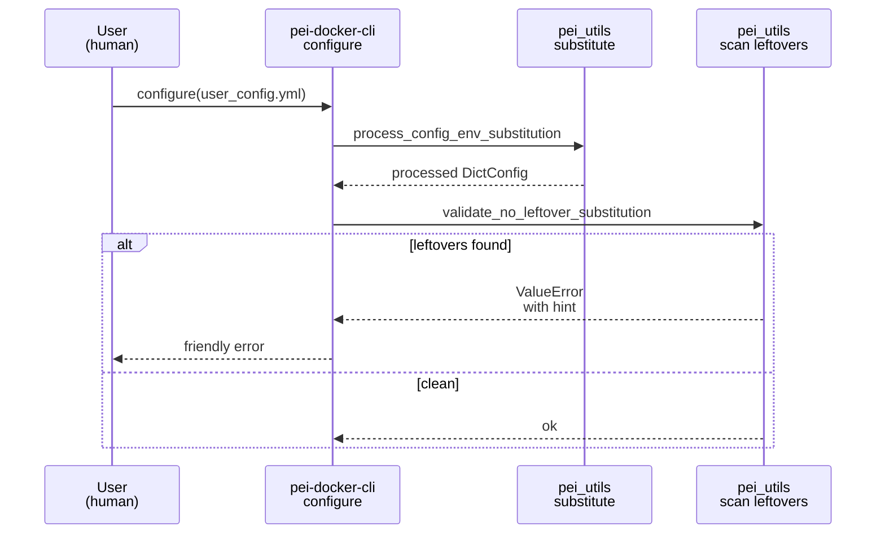
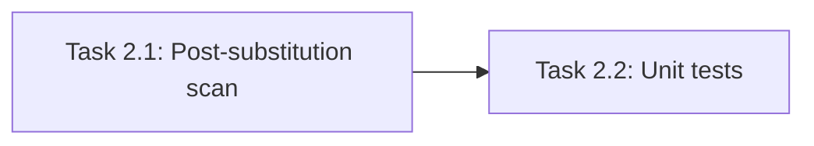

# Implementation Guide: Config-Time Substitution Hard Errors

**Group**: 2 | **Change**: env-var-passthrough-and-port-strings | **Tasks**: [2.1]–[2.2]

## Goal

Make `${VAR}` / `${VAR:-default}` strictly a configure-time feature: after `process_config_env_substitution`, reject any remaining `${...}` sequences in the processed user config so OmegaConf never sees unresolved `${...}` and users get a clear action item.

## Public APIs

### Task 2.1: Add a post-substitution scan that rejects leftover `${...}`

Deliverable: a validator that traverses the fully processed user config and fails fast if any `${...}` tokens remain.

Suggested API (in `src/pei_docker/pei_utils.py`):

```python
# src/pei_docker/pei_utils.py

def validate_no_leftover_substitution(cfg: DictConfig) -> None:
    """Raise ValueError if any '${...}' tokens remain anywhere in cfg.

    Error message should:
    - include a config path to the offending value
    - suggest: set env var at configure time OR use '{{...}}' for compose passthrough
    """
    ...
```

Integration point (CLI configure flow):

```python
# src/pei_docker/pei.py

in_config = process_config_env_substitution(in_config)
validate_no_leftover_substitution(in_config)
```

**Usage Flow**:



**Pseudocode**:

```python
def validate_no_leftover_substitution(cfg):
    container = OmegaConf.to_container(cfg, resolve=False)
    for each string value at path:
        if regex_search(r"\$\{[^}]*\}", value):
            raise ValueError(f"... at {path} ... use {{VAR}} or set env at configure time")
```

### Task 2.2: Add unit tests for leftover `${...}` errors

Add tests that cover:

- Undefined `${VAR}`: substitution leaves it unchanged, and validation rejects it.
- Nested defaults `${A:-${B}}`: default is treated literally and then rejected via the no-leftover rule.
- Mixed-mode strings: `"${PROJECT_NAME:-app}-{{TAG:-dev}}"` passes as long as the `${...}` part resolves and the `{{...}}` marker remains intact.

Example test shape:

```python
# tests/test_env_var_passthrough.py

def test_reject_undefined_var_leftover() -> None:
    cfg = OmegaConf.create({"k": "${UNDEFINED}"})
    with pytest.raises(ValueError):
        pei_utils.validate_no_leftover_substitution(pei_utils.process_config_env_substitution(cfg))
```

## Group Integration



## Testing

### Test Input

- Small OmegaConf configs created in tests (no filesystem dependencies).

### Test Procedure

```bash
pixi run pytest tests/test_env_var_passthrough.py -k ConfigTimeSubstitutionErrors
```

### Test Output

- Undefined or nested-default `${...}` tokens fail fast with a friendly message.
- Valid mixed-mode strings pass once `${...}` is resolved.

## References

- Proposal: `openspec/changes/env-var-passthrough-and-port-strings/proposal.md`
- Design: `openspec/changes/env-var-passthrough-and-port-strings/design.md`
- Specs: `openspec/changes/env-var-passthrough-and-port-strings/specs/`

## Implementation Summary

(TBD after implementation.)

