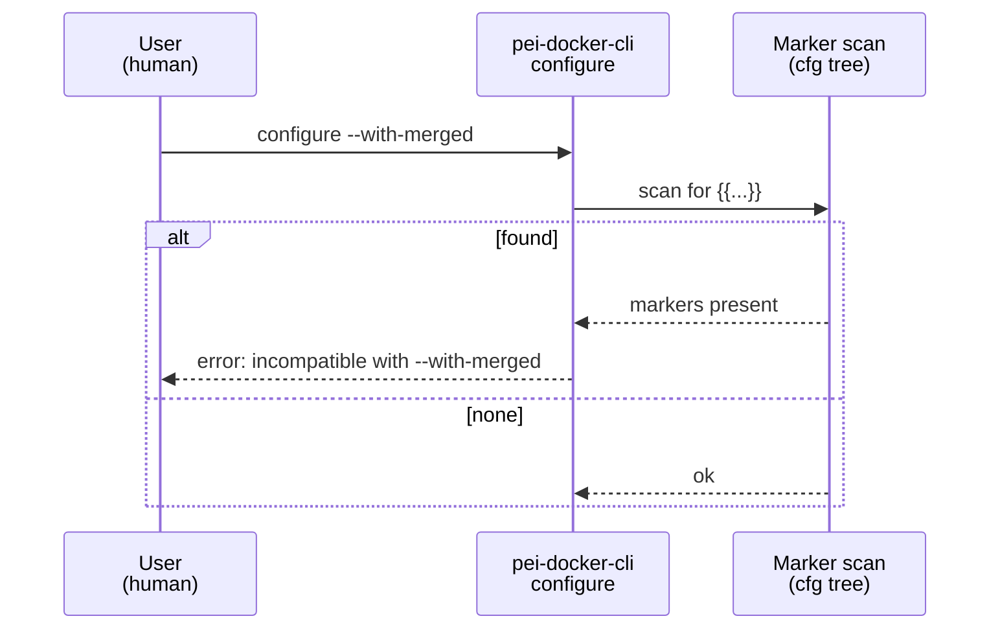
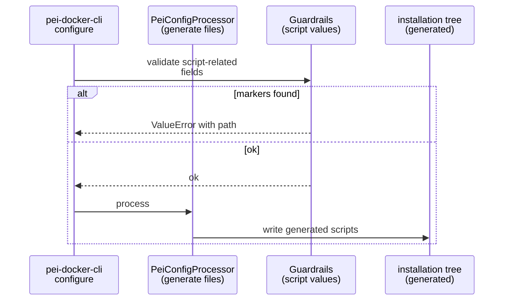
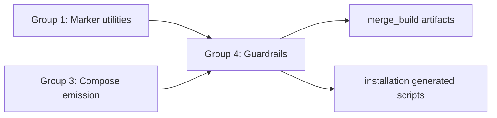

# Implementation Guide: Unsupported Context Guardrails

**Group**: 4 | **Change**: env-var-passthrough-and-port-strings | **Tasks**: [4.1]–[4.3]

## Goal

Enforce the “compose-only passthrough (initial scope)” rule:

- `{{...}}` is allowed only for values that end up in `docker-compose.yml`.
- If a config value is consumed by PeiDocker-generated scripts or stage internals without Docker Compose interpolation, reject `{{...}}` to prevent silent misconfiguration.
- Reject incompatible workflows (`--with-merged`, env baking) when passthrough markers are present.

## Public APIs

### Task 4.1: Reject `pei-docker-cli configure --with-merged` when any markers are present

`--with-merged` generates standalone artifacts (`merged.Dockerfile`, `merged.env`, `build-merged.sh`, `run-merged.sh`) that are **not** interpreted by Docker Compose variable substitution.

Recommended guardrail (early in CLI `configure`):

```python
# src/pei_docker/pei.py

def _has_passthrough_markers(cfg: DictConfig) -> bool:
    """Return True if any string in cfg contains a '{{...}}' marker."""
    ...

if with_merged and _has_passthrough_markers(in_config):
    raise ValueError(
        "Passthrough markers '{{...}}' are supported only for docker-compose.yml "
        "and are incompatible with --with-merged. Remove markers or disable --with-merged."
    )
```

**Usage Flow**:



**Pseudocode**:

```python
def _has_passthrough_markers(cfg):
    for each string in OmegaConf.to_container(cfg, resolve=False):
        if "{{" in string and "}}" in string:
            return True
    return False
```

### Task 4.2: Reject env baking when stage environment contains markers that would be baked

Env baking copies the generated `installation/stage-*/generated/_etc_environment.sh` into `/etc/environment` during image build (controlled by `PEI_BAKE_ENV_STAGE_1` / `PEI_BAKE_ENV_STAGE_2`).

Guardrail behavior:

- Allow `{{...}}` in `stage_?.environment` in general (it becomes compose `environment:`).
- If baking is enabled for a stage, reject passthrough markers in that stage’s environment values because they would be written literally into `/etc/environment`.

Recommended detection approach (compose-emitted build args are the only reliable “source of truth”):

```python
# src/pei_docker/pei.py (or src/pei_docker/config_processor.py)

def _is_env_baking_enabled(out_compose: DictConfig, stage: str) -> bool:
    """Return True if services.<stage>.build.args enables PEI_BAKE_ENV_STAGE_*."""
    ...
```

Implementation notes:

- Prefer reading `services.stage-1.build.args.PEI_BAKE_ENV_STAGE_1` and `services.stage-2.build.args.PEI_BAKE_ENV_STAGE_2` from the resolved compose.
- Treat `"true"`, `"1"`, `True` as enabled (match stage internals’ normalization behavior).
- If the compose template does not surface the bake args, this check is effectively “disabled” (baking cannot be requested through PeiDocker unless the template is extended).

### Task 4.3: Reject markers in values baked into generated scripts during `configure`

Any config value that is written into a generated file and then executed/sourced without Docker Compose interpolation must reject `{{...}}`.

High-impact sources in current code:

- Custom script entries in `stage_?.custom.*` (become `installation/stage-*/generated/_custom-on-*.sh`).
- Custom entry point path/args (become `installation/stage-*/internals/custom-entry-path` and `custom-entry-args`).
- Stage env values written into `installation/stage-*/generated/_etc_environment.sh` (reject only when baking enabled; see Task 4.2).

Suggested validator:

```python
# src/pei_docker/config_processor.py

def _reject_passthrough_markers_in_generated_scripts(user_config: UserConfig) -> None:
    """Fail configure if any script-related config strings contain '{{...}}'."""
    ...
```

**Usage Flow**:



## Group Integration



## Testing

### Test Input

- Configs that place `{{...}}` markers in:
  - compose-only fields (should pass)
  - `stage_?.custom.*` entries (should fail)
  - `stage_?.custom.entry` fields (should fail)
  - stage env values when baking is enabled in compose build args (should fail)

### Test Procedure

```bash
pixi run pytest -k passthrough_guardrails
```

### Test Output

- `--with-merged` + markers fails with a clear, actionable error.
- Script-generation contexts fail fast when markers are present.
- Baking-enabled stage env fails fast when markers are present.

## References

- Proposal: `openspec/changes/env-var-passthrough-and-port-strings/proposal.md`
- Design: `openspec/changes/env-var-passthrough-and-port-strings/design.md`
- Specs: `openspec/changes/env-var-passthrough-and-port-strings/specs/`

## Implementation Summary

(TBD after implementation.)
