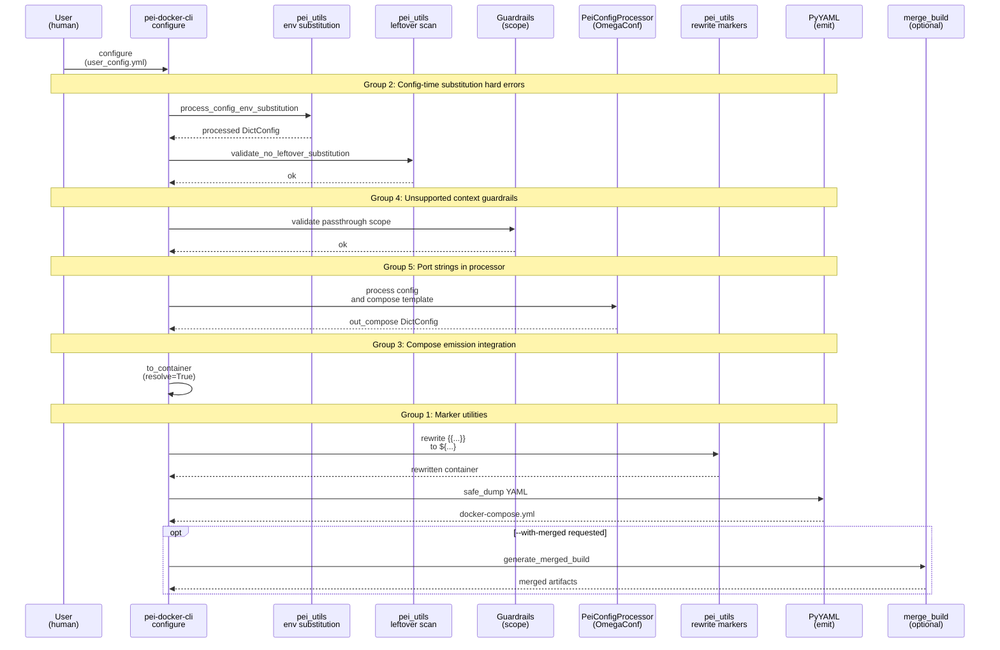
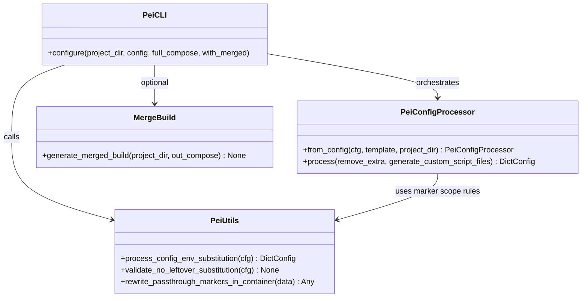
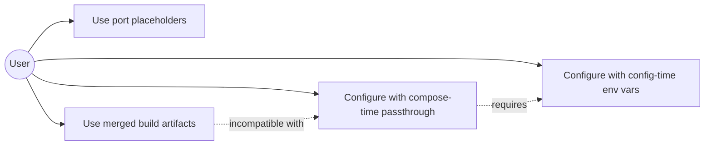
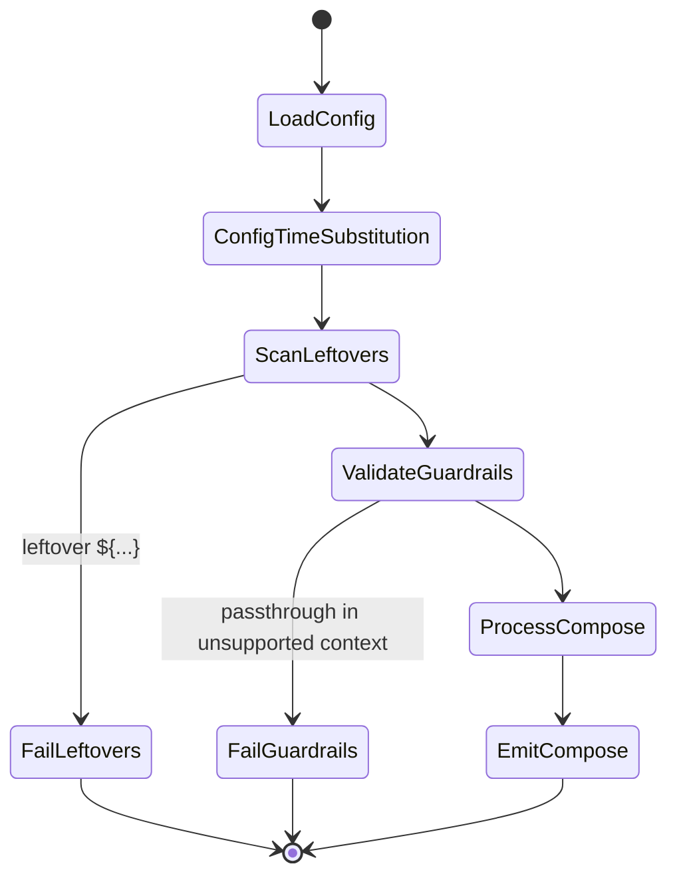

# Integration Guide: env-var-passthrough-and-port-strings

**Change**: `env-var-passthrough-and-port-strings` | **Groups**: 6

## Overview

This change introduces a second placeholder syntax that survives configuration parsing and is emitted into `docker-compose.yml` for Docker Compose to resolve at runtime:

- **Config-time substitution**: `${VAR}` / `${VAR:-default}` is expanded during `pei-docker-cli configure`.
- **Compose-time passthrough**: `{{VAR}}` / `{{VAR:-default}}` is preserved through OmegaConf processing and rewritten to Docker Compose `${...}` only at the final compose emission step.

To keep the behavior predictable, the change also:

- hard-errors any leftover `${...}` after config-time substitution
- adds guardrails that forbid passthrough markers in non-compose contexts (merged build artifacts, baking into `/etc/environment`, generated scripts)
- makes port mappings string-based so placeholders can safely appear in `ports:` entries

## Group Flow

**MUST HAVE: End-to-End Sequence Diagram**



## Artifact Flow Between Groups

```mermaid
graph TD
    subgraph G2["Group 2: Config-time substitution hard errors"]
        C1[user_config.yml] --> C2[processed config<br/>no leftover ${...}];
    end

    subgraph G5["Group 5: Port mapping string model"]
        P1[stage ports as strings] --> P2[services stage ports strings];
    end

    subgraph G3["Group 3: Compose emission integration"]
        O1[out_compose DictConfig] --> O2[plain container<br/>resolve=True];
        O2 --> O3[docker-compose.yml];
    end

    subgraph G1["Group 1: Marker utilities"]
        M1[validate markers] --> M2[rewrite {{...}} to ${...}];
    end

    subgraph G4["Group 4: Guardrails"]
        G4A[reject --with-merged] --> G4B[reject baking/script contexts];
    end

    C2 --> O1;
    P2 --> O1;
    M2 --> O3;
    G4B -.->|blocks invalid| O3;
```

## System Architecture



## Use Cases



## Activity Flow



## Inter-Group Dependencies

### Group 1 → Group 3

**Artifacts**:

- `rewrite_passthrough_markers_in_container` is invoked only during compose emission.

**Code Dependencies**:

```python
# Group 3 uses Group 1 utilities
from pei_docker.pei_utils import rewrite_passthrough_markers_in_container
```

### Group 2 → Group 3

**Artifacts**:

- Processed config must contain **no** `${...}` tokens before OmegaConf sees it.

**Code Dependencies**:

```python
from pei_docker.pei_utils import process_config_env_substitution, validate_no_leftover_substitution
```

### Group 4 → Group 3 / merged artifacts

**Artifacts**:

- Guardrails may block writing `docker-compose.yml` or generating merged artifacts if passthrough markers are in unsupported contexts.

### Group 5 → Group 3

**Artifacts**:

- Port entries are preserved as strings in `services.*.ports` and (if they contain markers) rewritten during compose emission.

## Integration Testing

```bash
# End-to-end (project in tmp/<subdir>)
pixi run pei-docker-cli create -p tmp/env-var-passthrough-and-port-strings-test --quick minimal
# minimal template already uses ubuntu:24.04 as base on stage-1
# Networking note: for download-related steps, either use a China-based mirror or use host proxy 127.0.0.1:7890.
pixi run pei-docker-cli configure -p tmp/env-var-passthrough-and-port-strings-test

# Unit tests for marker utilities and leftover checks
pixi run pytest tests/test_env_var_passthrough.py

# Processor-level integration tests (ports, compose emission)
pixi run pytest -k port_mapping_string_model
pixi run pytest -k compose_emission_rewrites_markers
```

## Critical Integration Points

1. **No leftover `${...}` before OmegaConf**: the leftover scan must run immediately after config-time env substitution.
2. **Rewrite after resolution**: `{{...}}` → `${...}` must happen only after `OmegaConf.to_container(..., resolve=True)`.
3. **No OmegaConf after rewrite**: YAML must be emitted from a plain container; do not feed `${...}` back into OmegaConf.
4. **Scope guardrails**: reject passthrough markers in merged build artifacts and script-generated contexts to avoid silent “literal string” failures.
5. **Ports are strings**: port merge must preserve order and avoid int parsing so placeholders remain valid.

## References

- Individual group guides:
  - `openspec/changes/env-var-passthrough-and-port-strings/impl-guides/grp1-passthrough-marker-utilities.md`
  - `openspec/changes/env-var-passthrough-and-port-strings/impl-guides/grp2-config-time-substitution-hard-errors.md`
  - `openspec/changes/env-var-passthrough-and-port-strings/impl-guides/grp3-compose-emission-integration.md`
  - `openspec/changes/env-var-passthrough-and-port-strings/impl-guides/grp4-unsupported-context-guardrails.md`
  - `openspec/changes/env-var-passthrough-and-port-strings/impl-guides/grp5-port-mapping-string-model.md`
  - `openspec/changes/env-var-passthrough-and-port-strings/impl-guides/grp6-docs-and-examples.md`
- Proposal: `openspec/changes/env-var-passthrough-and-port-strings/proposal.md`
- Tasks breakdown: `openspec/changes/env-var-passthrough-and-port-strings/tasks.md`
- Design: `openspec/changes/env-var-passthrough-and-port-strings/design.md`
- Specs: `openspec/changes/env-var-passthrough-and-port-strings/specs/`
