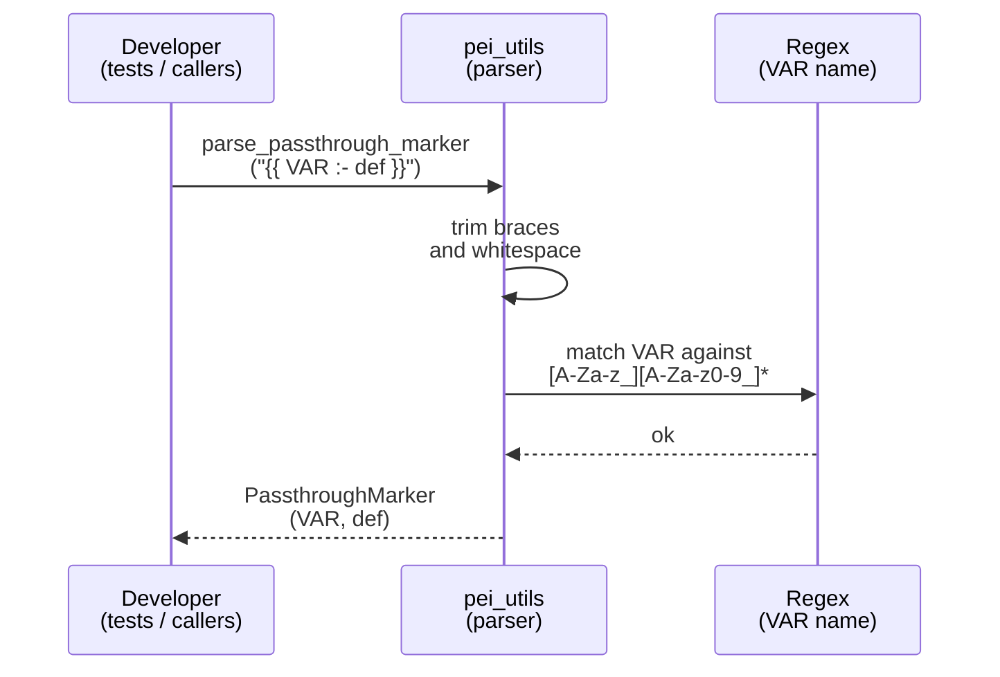
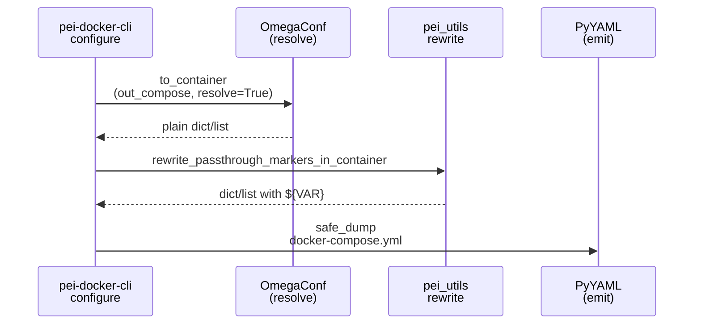
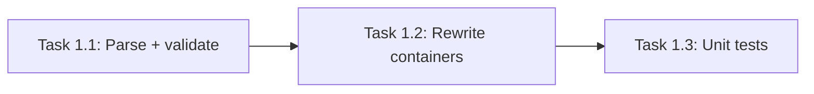

# Implementation Guide: Passthrough Marker Utilities

**Group**: 1 | **Change**: env-var-passthrough-and-port-strings | **Tasks**: [1.1]–[1.3]

## Goal

Provide strict, predictable `{{VAR}}` / `{{VAR:-default}}` marker parsing + rewriting so PeiDocker can preserve placeholders through config processing and emit Docker Compose `${...}` substitutions only in the generated `docker-compose.yml`.

## Public APIs

### Task 1.1: Implement passthrough marker parsing + validation

Deliverable: a strict parser/validator for the only supported forms:

- `{{VAR}}`
- `{{VAR:-default}}`

Rules (from proposal/spec/design):

- Trim whitespace inside braces (e.g. `{{ VAR }}` is treated as `{{VAR}}`).
- Validate `VAR` with `[A-Za-z_][A-Za-z0-9_]*`.
- Treat the default opaquely, but reject defaults containing the terminator `}}` (prevents nested/ambiguous markers).

Suggested API surface (keep in `src/pei_docker/pei_utils.py` to match existing call sites/tests):

```python
# src/pei_docker/pei_utils.py

from __future__ import annotations

from dataclasses import dataclass

_PASSTHROUGH_VAR_RE = re.compile(r"^[A-Za-z_][A-Za-z0-9_]*$")


@dataclass(frozen=True)
class PassthroughMarker:
    var: str
    default: str | None = None


def is_passthrough_marker(text: str) -> bool:
    """Return True only if the whole string is a valid {{...}} marker."""
    ...


def parse_passthrough_marker(text: str) -> PassthroughMarker:
    """Parse a full marker string like '{{VAR:-default}}'.

    Raises:
        ValueError: If the marker is malformed or unsupported.
    """
    ...


def validate_passthrough_marker(text: str) -> None:
    """Raise ValueError if `text` is a malformed passthrough marker."""
    ...
```

Notes:

- Keep `parse_passthrough_marker` as the single source of truth for trimming, regex validation, and default constraints.
- `is_passthrough_marker` should return `False` for “marker-looking” strings that are malformed (`"{{VAR"`, `"{{1BAD}}"`, etc.), not merely check `startswith("{{")`.

**Usage Flow**:



**Pseudocode**:

```python
def parse_passthrough_marker(text):
    if not (text.startswith("{{") and text.endswith("}}")):
        raise ValueError("not a marker")
    inner = text[2:-2].strip()
    if inner == "":
        raise ValueError("empty marker")

    if ":-" in inner:
        var_raw, default_raw = inner.split(":-", 1)
        var = var_raw.strip()
        default = default_raw.strip()
        if "}}" in default:
            raise ValueError("default contains terminator")
    else:
        var = inner.strip()
        default = None

    if not _PASSTHROUGH_VAR_RE.fullmatch(var):
        raise ValueError("invalid var name")
    return PassthroughMarker(var=var, default=default)
```

### Task 1.2: Implement plain-container tree-walk rewrite for compose output

Deliverable: a plain-Python (dict/list) tree-walker that rewrites *all* `{{...}}` occurrences inside strings to Docker Compose `${...}` equivalents, with clear errors on invalid markers.

Suggested API:

```python
# src/pei_docker/pei_utils.py

def rewrite_passthrough_markers(text: str, *, context_path: str = "") -> str:
    """Rewrite all {{...}} markers inside `text` to ${...}.

    Raises:
        ValueError: If any marker occurrence is malformed/unsupported.
    """
    ...


def rewrite_passthrough_markers_in_container(data: Any, *, context_path: str = "") -> Any:
    """Recursively rewrite markers in dict/list containers."""
    ...
```

Error reporting guidance:

- Include `context_path` when available (example: `services.stage-2.ports[0]`).
- Include the original substring (example: `{{1BAD}}`) in the message.
- Recommend fixes: “use only `{{VAR}}` / `{{VAR:-default}}`”, or “use `${...}` only for config-time substitution”.

**Usage Flow**:



**Pseudocode**:

```python
def rewrite_passthrough_markers(text, context_path=""):
    for each "{{...}}" occurrence in text:
        parsed = parse_passthrough_marker(full_marker_text)
        normalized_inner = parsed.var if parsed.default is None else f"{parsed.var}:-{parsed.default}"
        text = text.replace(full_marker_text, f"${{{normalized_inner}}}")
    return text

def rewrite_passthrough_markers_in_container(data, context_path=""):
    if isinstance(data, dict):
        return {k: rewrite_passthrough_markers_in_container(v, context_path=join(context_path, k)) for k, v in data.items()}
    if isinstance(data, list):
        return [rewrite_passthrough_markers_in_container(v, context_path=f"{context_path}[{i}]") for i, v in enumerate(data)]
    if isinstance(data, str):
        return rewrite_passthrough_markers(data, context_path=context_path)
    return data
```

### Task 1.3: Add unit tests for marker validation + rewrite

Add/extend tests in `tests/test_env_var_passthrough.py`:

- Valid: whitespace trimming, defaults, empty defaults.
- Invalid: bad var names, malformed braces, defaults containing `}}`.
- Rewrite: multiple markers per string, mixed-mode strings, container recursion.

Example test shape:

```python
# tests/test_env_var_passthrough.py

def test_rewrite_multiple_markers() -> None:
    assert pei_utils.rewrite_passthrough_markers("{{A}}-{{B:-x}}") == "${A}-${B:-x}"
```

## Group Integration



## Testing

### Test Input

- Pure in-memory strings and dict/list containers (no filesystem dependencies).

### Test Procedure

```bash
pixi run pytest tests/test_env_var_passthrough.py -k PassthroughMarkers
```

### Test Output

- `tests/test_env_var_passthrough.py` passes.
- Invalid markers raise `ValueError` with a clear, path-aware message when applicable.

## References

- Proposal: `openspec/changes/env-var-passthrough-and-port-strings/proposal.md`
- Design: `openspec/changes/env-var-passthrough-and-port-strings/design.md`
- Specs: `openspec/changes/env-var-passthrough-and-port-strings/specs/`

## Implementation Summary

(TBD after implementation.)

