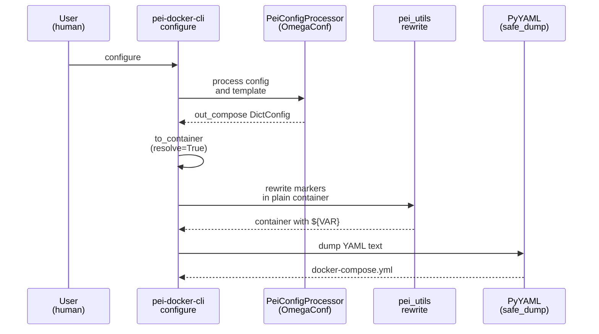

# Implementation Guide: Compose Emission Integration

**Group**: 3 | **Change**: env-var-passthrough-and-port-strings | **Tasks**: [3.1]–[3.2]

## Goal

Ensure passthrough markers are rewritten **only** for `docker-compose.yml` emission:

- Keep `{{...}}` markers as plain strings through config processing and OmegaConf resolution.
- After OmegaConf resolution, convert to a plain container and rewrite `{{...}}` → `${...}`.
- Emit YAML without re-introducing `${...}` into OmegaConf (prevents interpolation errors).

## Public APIs

### Task 3.1: Integrate passthrough rewrite into compose emission only

The critical integration rule is: **rewrite after OmegaConf is done** and **before YAML write**, and do not pass the rewritten `${...}` values back through OmegaConf.

Suggested helper:

```python
# src/pei_docker/pei.py

def _emit_docker_compose_yaml(out_compose: DictConfig) -> str:
    """Render docker-compose.yml text with {{...}} rewritten to ${...}.

    Steps:
    1) Resolve OmegaConf interpolation into a plain dict/list
    2) Rewrite passthrough markers in that plain container
    3) Dump YAML via PyYAML (not OmegaConf) to avoid interpolation parsing
    """
    ...
```

Call site:

```python
# src/pei_docker/pei.py

out_compose = proc.process(remove_extra=not full_compose)
out_yaml = _emit_docker_compose_yaml(out_compose)
Path(out_compose_path).write_text(out_yaml, encoding="utf-8")
```

Implementation details:

- Plain-container conversion: `oc.OmegaConf.to_container(out_compose, resolve=True)`
- Rewrite: `pei_utils.rewrite_passthrough_markers_in_container(...)`
- YAML dump: `yaml.safe_dump(..., sort_keys=False, default_flow_style=False, indent=2)`

**Usage Flow**:



**Pseudocode**:

```python
def _emit_docker_compose_yaml(out_compose):
    plain = OmegaConf.to_container(out_compose, resolve=True)
    rewritten = rewrite_passthrough_markers_in_container(plain)
    return yaml.safe_dump(rewritten, sort_keys=False, default_flow_style=False, indent=2)
```

### Task 3.2: Regression tests for `${...}` placeholders without OmegaConf errors

Add a regression test that exercises the “OmegaConf first, rewrite last” rule:

- Build `out_compose` via `PeiConfigProcessor` using a config that includes `{{...}}` markers in compose-emitted locations.
- Emit YAML via the new compose-emission helper.
- Assert `${...}` appears in the emitted YAML (not `{{...}}`).
- Assert the pipeline does not raise OmegaConf interpolation errors (the rewrite must not happen before `to_container(resolve=True)`).

Suggested test shape:

```python
# tests/test_env_var_passthrough.py (or a new tests/test_compose_emission_passthrough.py)

def test_compose_emission_rewrites_markers(tmp_path: Path) -> None:
    in_config = OmegaConf.create(
        {
            "stage_1": {"image": {"base": "ubuntu:24.04", "output": "t:stage-1"}},
            "stage_2": {
                "image": {"output": "t:{{TAG:-dev}}"},
                "storage": {"app": {"type": "image"}, "data": {"type": "image"}, "workspace": {"type": "image"}},
            },
        }
    )
    proc = PeiConfigProcessor.from_config(in_config, _load_compose_template(), project_dir=str(tmp_path))
    out_compose = proc.process(remove_extra=True)
    yml = _emit_docker_compose_yaml(out_compose)
    assert "${TAG:-dev}" in yml
    assert "{{TAG:-dev}}" not in yml
```

## Group Integration

```mermaid
graph LR
    T11[Group 1: Marker utilities] --> T31[Task 3.1: Compose-only rewrite];
    T21[Group 2: No leftover ${...}] --> T31;
    T31 --> T32[Task 3.2: Regression tests];
```

## Testing

### Test Input

- In-memory configs (OmegaConf DictConfig) containing `{{...}}` values in compose-emitted fields.
- Compose template: `src/pei_docker/templates/base-image-gen.yml`.

### Test Procedure

```bash
pixi run pytest -k compose_emission_rewrites_markers
```

### Test Output

- Generated YAML contains `${...}` placeholders where `{{...}}` markers were provided.
- Tests pass without OmegaConf interpolation errors.

## References

- Proposal: `openspec/changes/env-var-passthrough-and-port-strings/proposal.md`
- Design: `openspec/changes/env-var-passthrough-and-port-strings/design.md`
- Specs: `openspec/changes/env-var-passthrough-and-port-strings/specs/`

## Implementation Summary

(TBD after implementation.)

