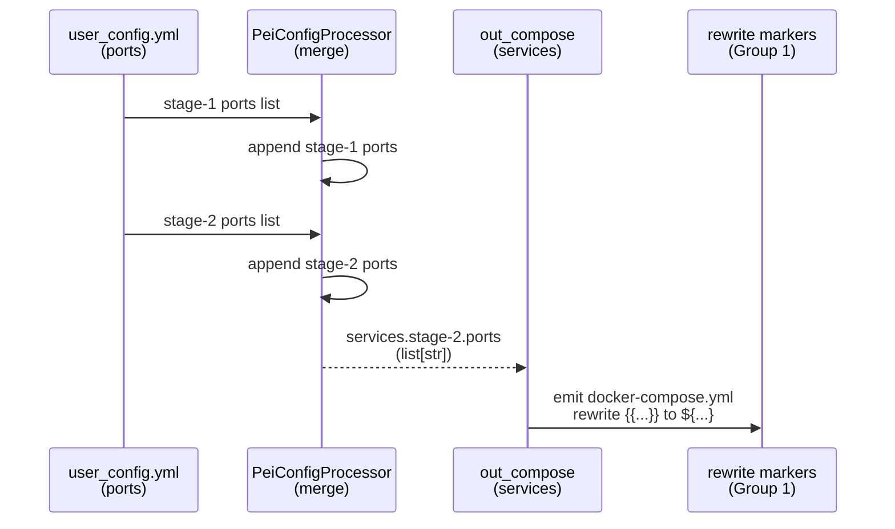
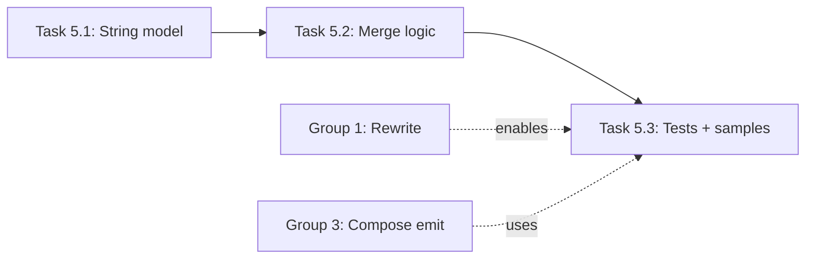

# Implementation Guide: Port Mapping String Model (BREAKING)

**Group**: 5 | **Change**: env-var-passthrough-and-port-strings | **Tasks**: [5.1]–[5.3]

## Goal

Treat `stage_1.ports` and `stage_2.ports` as ordered lists of Docker Compose port mapping **strings**:

- No integer parsing (ports may contain `{{...}}` passthrough markers).
- Stage-2 effective ports = stage-1 ports + stage-2 ports (+ SSH mapping when configured).
- Preserve order exactly as provided by users.

## Public APIs

### Task 5.1: Update config model/parsing to be string-first (no int parsing)

Stage config already models ports as `List[str]`, but the processing code must stop converting them to `dict[int, int]`.

Recommended adjustments:

- Keep `StageConfig.ports: Optional[list[str]]` as the user-facing type.
- Do not call `port_mapping_str_to_dict` in the main compose generation path.
- Treat ports as opaque strings; optional best-effort warnings may parse only fully-numeric entries.

Suggested API note in `src/pei_docker/user_config/stage.py`:

```python
# src/pei_docker/user_config/stage.py

@define(kw_only=True)
class StageConfig:
    ports: Optional[list[str]] = field(factory=list)
    """Ordered list of docker compose port mapping strings."""
```

### Task 5.2: Update port merge logic in compose generation

The merge is currently implemented via `dict[int, int]` in `PeiConfigProcessor._apply_config_to_resolved_compose`, which breaks placeholders and reorders entries.

New behavior:

- Accumulate a `list[str]` of ports as the stage loop progresses.
- Append stage-1 ports first, then stage-2 ports.
- If SSH `host_port` is configured, append it as a string mapping (`"{host}:{container}"`).

Suggested code shape:

```python
# src/pei_docker/config_processor.py

ports_accum: list[str] = []

for stage_config, stage_compose in stages:
    if stage_config.ports:
        ports_accum.extend(stage_config.ports)

    if stage_config.ssh and stage_config.ssh.host_port is not None:
        ports_accum.append(f"{stage_config.ssh.host_port}:{stage_config.ssh.port}")

    oc.OmegaConf.update(stage_compose, "ports", ports_accum)
```

**Usage Flow**:



### Task 5.3: Add tests + update sample configs (include markers in ports)

Add tests that ensure:

- Stage-2 ports include stage-1 ports first, preserving order.
- SSH port mapping is appended as a string.
- Placeholder-containing port strings are preserved through processing and rewritten at compose emission time:
  - input: `"{{SSH_HOST_PORT:-2222}}:22"`
  - output compose: `"${SSH_HOST_PORT:-2222}:22"`

Suggested test shape:

```python
def test_ports_are_concatenated_and_preserved(tmp_path: Path) -> None:
    in_config = OmegaConf.create(
        {
            "stage_1": {"image": {"base": "ubuntu:24.04", "output": "t:stage-1"}, "ports": ["2222:22"]},
            "stage_2": {
                "image": {"output": "t:stage-2"},
                "ports": ["{{WEB_PORT:-8080}}:80"],
                "storage": {"app": {"type": "image"}, "data": {"type": "image"}, "workspace": {"type": "image"}},
            },
        }
    )
    out_compose = PeiConfigProcessor.from_config(in_config, _load_compose_template(), project_dir=str(tmp_path)).process()
    yml = _emit_docker_compose_yaml(out_compose)
    assert "2222:22" in yml
    assert "${WEB_PORT:-8080}:80" in yml
```

## Group Integration



## Testing

### Test Input

- OmegaConf configs with:
  - stage-1 ports entries
  - stage-2 ports entries
  - placeholder-containing port strings

### Test Procedure

```bash
pixi run pytest -k port_mapping_string_model
```

### Test Output

- Compose output ports are ordered and concatenated as specified.
- Placeholder port entries survive processing and appear as `${...}` in emitted compose YAML.

## References

- Proposal: `openspec/changes/env-var-passthrough-and-port-strings/proposal.md`
- Design: `openspec/changes/env-var-passthrough-and-port-strings/design.md`
- Specs: `openspec/changes/env-var-passthrough-and-port-strings/specs/`

## Implementation Summary

(TBD after implementation.)

