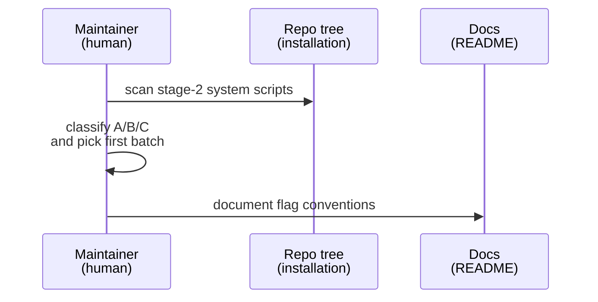
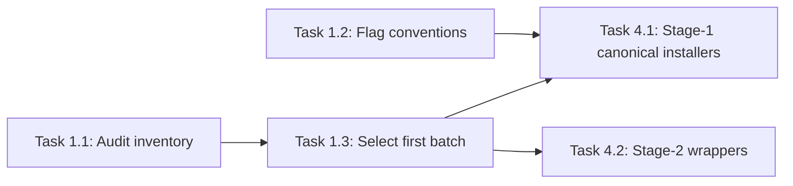

# Implementation Guide: Inventory and Conventions

**Group**: 1 | **Change**: storage-agnostic-install-scripts | **Tasks**: [1.1]–[1.3]

## Goal

Create a concrete inventory of `installation/stage-2/system/**` installers, decide which ones become stage-1 canonical vs stage-2 wrappers, and document a consistent installer CLI convention for explicit path inputs.

## Public APIs

### Task 1.1: Audit stage-2 system installers

Deliverable: a classification list used to drive refactors in Group 4.

Suggested inventory format (keep this list in the PR description or a short note under this change dir):

- Script path
- Current behavior: writes to `/soft/*`? probes `/soft/*`? uses `/hard/*`?
- Classification:
  - (A) stage-1 canonical implementation
  - (B) stage-2 wrapper forwarder
  - (C) stage-2-only (must justify)
- Required tool-specific flags (if any)

### Task 1.2: Standardize installer script parameter conventions

The “API” here is the installer scripts’ CLI flags. Use the same small set of names across scripts when applicable:

- `--install-dir=...` (where the tool is installed)
- `--cache-dir=...` (where caches/downloads go)
- `--tmp-dir=...` (where transient install files go)
- `--user <name>` (target user, when user-scoped installs exist)

Bash flag parsing template (use per script; keep defaults tool-appropriate):

```bash
# src/pei_docker/project_files/installation/stage-1/system/<tool>/install-<tool>.sh

INSTALL_DIR=""
CACHE_DIR=""
TMP_DIR=""
TARGET_USER=""

while [[ $# -gt 0 ]]; do
  case "$1" in
    --install-dir=*) INSTALL_DIR="${1#*=}"; shift 1 ;;
    --cache-dir=*)   CACHE_DIR="${1#*=}"; shift 1 ;;
    --tmp-dir=*)     TMP_DIR="${1#*=}"; shift 1 ;;
    --user)          TARGET_USER="${2:-}"; shift 2 ;;
    --help|-h)       usage; exit 0 ;;
    *)               echo "Unknown option: $1" >&2; exit 2 ;;
  esac
done
```

Path flags should accept absolute container paths (e.g. `/hard/image/app/pixi`, `/soft/data/cache`).

### Task 1.3: Select the first refactor batch (record targets)

Pick at least:

- one installer that currently hardcodes or probes `/soft/*` (e.g. `stage-2/system/conda/install-miniconda.sh`)
- one installer that already supports explicit path flags (e.g. `stage-2/system/pixi/install-pixi.bash`)

Record the intended canonical + wrapper layout:

- canonical: `installation/stage-1/system/<tool>/...`
- wrapper: `installation/stage-2/system/<tool>/...` (thin forwarder to stage-1)

**Usage Flow**:



**Pseudocode**:

```text
1) list stage-2 installers under installation/stage-2/system
2) for each script:
   - find /soft usage (hardcode or probe)
   - find storage selection logic
3) decide: stage-1 canonical vs stage-2 wrapper
4) choose first batch for refactor and tests
```

---

## Group Integration



## Testing

### Test Input

- `src/pei_docker/project_files/installation/stage-2/system/` (script corpus to audit)

### Test Procedure

```bash
# Find hardcoded/probing /soft usage
rg -n "/soft/" src/pei_docker/project_files/installation/stage-2/system

# Find explicit mentions of hard paths
rg -n "/hard/(image|volume)/" src/pei_docker/project_files/installation/stage-2/system
```

### Test Output

- A clear list of scripts that need refactor (no ambiguity about “first batch”)
- A documented, consistent flag convention ready to apply in Group 4

## References

- Proposal: `openspec/changes/storage-agnostic-install-scripts/proposal.md`
- Design: `openspec/changes/storage-agnostic-install-scripts/design.md`
- Specs: `openspec/changes/storage-agnostic-install-scripts/specs/`

## Implementation Summary

TODO(after implementation): summarize the final audited inventory and which scripts were moved vs wrapped.

### What has been implemented

TODO(after implementation)

### How to verify

TODO(after implementation)

