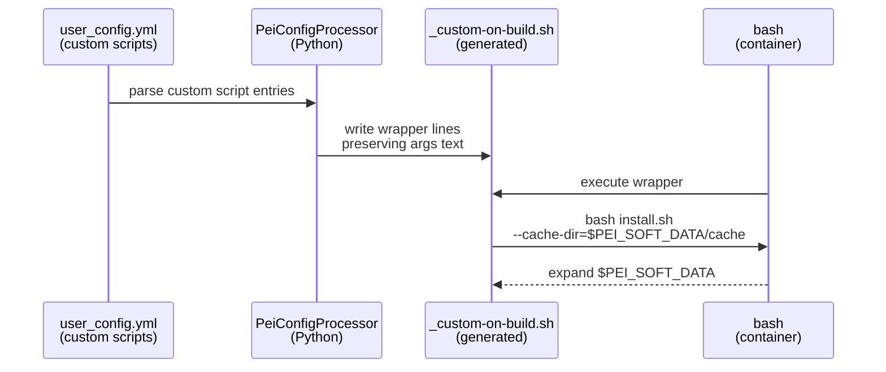
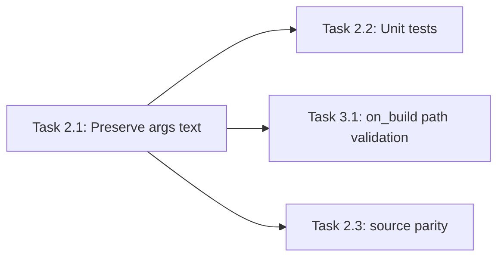

# Implementation Guide: Custom Script Args (Env Var-Safe)

**Group**: 2 | **Change**: storage-agnostic-install-scripts | **Tasks**: [2.1]–[2.3]

## Goal

Ensure custom lifecycle scripts (`custom.on_build`, `on_first_run`, `on_every_run`, `on_user_login`) can include environment variable tokens in their arguments (e.g. `$HOME`, `$PEI_SOFT_DATA`) and have those tokens expand at execution time inside the container.

Key constraint: generated wrapper scripts must not “single-quote away” `$VARS`.

## Public APIs

### Task 2.1: Preserve user-provided argument text during wrapper generation

The public surface is the `user_config.yml` custom script string format:

```yaml
custom:
  on_build:
    - 'stage-2/system/pixi/install-pixi.bash --cache-dir=$PEI_SOFT_DATA/cache --verbose'
```

Implementation target: `PeiConfigProcessor` in `src/pei_docker/config_processor.py` should render wrapper lines that preserve env var expansion.

Proposed helper API (Python):

```python
# src/pei_docker/config_processor.py

from __future__ import annotations

from dataclasses import dataclass
from typing import Literal


@dataclass(frozen=True)
class ScriptInvocation:
    script_path: str
    args_text: str  # raw-ish trailing args (may be empty, no leading spaces)

    def render(self, *, runner: Literal["bash", "source"], prefix: str) -> str:
        """Render a wrapper line that preserves shell expansion.

        Args:
            runner: Execution mode ("bash" for most hooks, "source" for login).
            prefix: The prefix path to prepend (e.g. '$DIR/../../').

        Returns:
            A single shell line invoking the script with arguments.
        """
        if self.args_text:
            return f'{runner} {prefix}{self.script_path} {self.args_text}'
        return f'{runner} {prefix}{self.script_path}'
```

Parsing approach guidelines:

- Parse only the *script path* safely (so existence checks work).
- Preserve the remainder as argument text without rewriting `$VARS` into single quotes.
- Keep semantics for quoted values with spaces (do not turn `"a b"` into `a b`).

### Task 2.2: Add unit tests for argument passthrough

Add tests that verify wrapper text preserves:

- quoted values with spaces: `--message="hello world"`
- env var tokens: `--cache-dir=$HOME/cache`, `--cache-dir=$PEI_SOFT_DATA/cache`
- `--flag=value` forms

### Task 2.3: Align `on_user_login` behavior (`source`) with other hooks

`on_user_login` wrappers use `source` instead of `bash`. Ensure the same argument handling rules apply so `$VARS` expand and quoting is preserved.

**Usage Flow**:



**Pseudocode**:

```python
def parse_invocation(script_entry: str) -> ScriptInvocation:
    # 1) split only the first token as the path (shlex)
    # 2) keep the trailing substring as args_text
    return ScriptInvocation(script_path, args_text)

def generate_wrapper_lines(entries: list[str], runner: str) -> list[str]:
    for entry in entries:
        inv = parse_invocation(entry)
        yield inv.render(runner=runner, prefix="$DIR/../../")
```

---

## Group Integration



## Testing

### Test Input

- A small set of script entry strings used directly in unit tests.
- Optional: reuse `tests/configs/custom-script-params-test.yml` patterns with added `$VARS`.

### Test Procedure

```bash
# Unit tests focused on wrapper rendering
pixi run pytest -q tests/test_custom_script_args.py
```

### Test Output

- Tests demonstrate wrapper output contains `$HOME` / `$PEI_SOFT_DATA` un-single-quoted.
- Tests demonstrate quoted strings with spaces remain quoted in wrapper output.

## References

- Proposal: `openspec/changes/storage-agnostic-install-scripts/proposal.md`
- Design: `openspec/changes/storage-agnostic-install-scripts/design.md`
- Specs: `openspec/changes/storage-agnostic-install-scripts/specs/install-script-parameter-interface/spec.md`

## Implementation Summary

TODO(after implementation): summarize changes to wrapper generation and how env var expansion is preserved.

### What has been implemented

TODO(after implementation)

### How to verify

TODO(after implementation)

