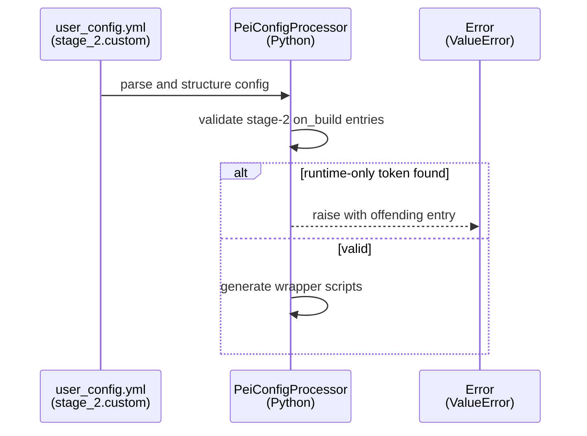
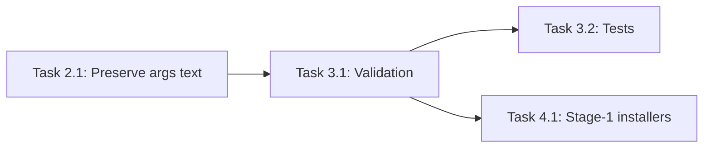

# Implementation Guide: on_build Path Validation

**Group**: 3 | **Change**: storage-agnostic-install-scripts | **Tasks**: [3.1]–[3.3]

## Goal

Reject stage-2 build-time custom scripts (`stage_2.custom.on_build`) that pass runtime-only storage paths (or soft-path env var tokens) in their arguments, because `/soft/*` symlinks and mounted volumes are not available during `docker build`.

## Public APIs

### Task 3.1: Validate stage-2 `custom.on_build` script arguments

Add an explicit validation step in `src/pei_docker/config_processor.py` that runs after `UserConfig` is structured (via `cattrs`) and before scripts/compose are generated.

Proposed helper API (Python):

```python
# src/pei_docker/config_processor.py

from __future__ import annotations

from typing import Iterable


RUNTIME_ONLY_TOKENS = (
    "/soft/",
    "/hard/volume/",
    "$PEI_PATH_SOFT",
    "$PEI_SOFT_",
)


def validate_stage2_on_build_script_entries(script_entries: Iterable[str]) -> None:
    """Reject runtime-only paths in stage-2 on_build custom scripts.

    This intentionally validates the *configured string* (not post-rendered
    wrapper output) so errors are actionable and stable.
    """
    for entry in script_entries:
        if any(tok in entry for tok in RUNTIME_ONLY_TOKENS):
            raise ValueError(
                "stage_2.custom.on_build may not reference runtime-only paths "
                "(/soft, /hard/volume) or soft-path env vars ($PEI_SOFT_*, $PEI_PATH_SOFT). "
                f"Offending script entry: {entry!r}"
            )
```

Notes:

- Validate only stage-2 `on_build` (runtime hooks may still use `/soft/...`).
- Prefer pointing users to `/hard/image/...` for build-time installs.

### Task 3.2: Unit tests for validator behavior

Add tests that:

- accept: `/hard/image/...`, `/opt/...`, `/usr/local/...`
- reject: `/soft/...`, `/hard/volume/...`, `$PEI_SOFT_DATA`, `$PEI_PATH_SOFT`

### Task 3.3: Improve user-facing error/help text

Where errors surface (CLI / logs), include the lifecycle rule:

- Build-time: use in-image paths (typically `/hard/image/...`)
- Runtime: `/soft/...` is allowed

**Usage Flow**:



**Pseudocode**:

```text
if stage_2.custom.on_build contains:
  - "/soft/"
  - "/hard/volume/"
  - "$PEI_SOFT_*" tokens
  - "$PEI_PATH_SOFT"
then:
  fail fast with a clear error
```

---

## Group Integration



## Testing

### Test Input

- Minimal structured configs for stage-2 `custom.on_build`:
  - valid entries using `/hard/image/...`
  - invalid entries using `/soft/...`, `/hard/volume/...`, `$PEI_SOFT_DATA`, `$PEI_PATH_SOFT`

### Test Procedure

```bash
pixi run pytest -q tests/test_on_build_path_validation.py
```

### Test Output

- Valid configs pass without error
- Invalid configs fail during configuration parsing with a message that:
  - includes the offending entry
  - explains why `/soft` is unavailable during build

## References

- Proposal: `openspec/changes/storage-agnostic-install-scripts/proposal.md`
- Design: `openspec/changes/storage-agnostic-install-scripts/design.md`
- Specs:
  - `openspec/changes/storage-agnostic-install-scripts/specs/stage2-wrapper-forwarding/spec.md`
  - `openspec/changes/storage-agnostic-install-scripts/specs/single-dockerfile-ci-install-flow/spec.md`

## Implementation Summary

TODO(after implementation): summarize the validator, test coverage, and error UX changes.

### What has been implemented

TODO(after implementation)

### How to verify

TODO(after implementation)

