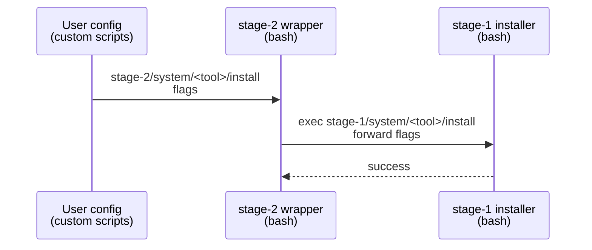

# Implementation Guide: Stage-1 Canonical Installers and Stage-2 Wrappers

**Group**: 4 | **Change**: storage-agnostic-install-scripts | **Tasks**: [4.1]–[4.4]

## Goal

Make installers storage-agnostic by moving canonical implementations to `installation/stage-1/system/...` (when feasible) and converting `installation/stage-2/system/...` into thin forwarders that only map stage-2 storage preferences into explicit tool-specific flags.

## Public APIs

### Task 4.1: Create stage-1 canonical installers (first batch)

The public API is each installer’s CLI flags (tool-specific) and its absence of `/soft/*` assumptions.

Example stage-1 canonical wrapper shape:

```bash
# src/pei_docker/project_files/installation/stage-1/system/<tool>/install-<tool>.sh

# MUST NOT probe /soft to decide behavior.
# MUST NOT hardcode writes to /soft/app|data|workspace.
# SHOULD accept explicit flags for non-default paths.
```

### Task 4.2: Convert stage-2 installers into minimal forwarders

Stage-2 wrappers should:

- forward user-provided flags unchanged
- optionally inject stage-2 glue via explicit flags (e.g. default cache dir)
- avoid re-implementing installer logic

Example forwarder pattern:

```bash
# src/pei_docker/project_files/installation/stage-2/system/<tool>/install-<tool>.sh

set -euo pipefail

if [[ -z "${PEI_STAGE_DIR_1:-}" ]]; then
  echo "PEI_STAGE_DIR_1 is not set; cannot forward to stage-1 installer" >&2
  exit 2
fi

exec "$PEI_STAGE_DIR_1/system/<tool>/install-<tool>.sh" "$@"
```

### Task 4.3: Remove `/soft/*` probing from selected installers and wrappers

Replace patterns like:

- `if [ -d "/soft/app/..." ]; then ...`

with:

- `--install-dir=...` or `--conda-dir=...` passed explicitly by the caller (stage-1 or stage-2 wrapper)

### Task 4.4: Update READMEs and examples to prefer stage-1 script paths

Doc rule:

- Prefer: `stage-1/system/<tool>/...` for storage-agnostic installers
- Keep: `stage-2/system/<tool>/...` as compatibility wrapper (where needed)

**Usage Flow**:



**Pseudocode**:

```text
for each selected installer:
  - implement canonical logic in stage-1
  - keep stage-2 path as a wrapper that execs stage-1
  - ensure no /soft probing or /soft hardcoding remains
```

---

## Group Integration


## Testing

### Test Input

- First-batch installer scripts under:
  - `src/pei_docker/project_files/installation/stage-1/system/`
  - `src/pei_docker/project_files/installation/stage-2/system/`

### Test Procedure

```bash
# Verify wrappers are thin forwarders (no duplicated logic)
rg -n "/soft/" src/pei_docker/project_files/installation/stage-2/system/<tool>

# Verify stage-1 canonical scripts do not probe /soft
rg -n "/soft/" src/pei_docker/project_files/installation/stage-1/system/<tool>
```

### Test Output

- First-batch installers run in a plain `docker build` context (no `/soft/*` dependency)
- Stage-2 wrappers remain available for compatibility but primarily forward to stage-1

## References

- Proposal: `openspec/changes/storage-agnostic-install-scripts/proposal.md`
- Design: `openspec/changes/storage-agnostic-install-scripts/design.md`
- Specs:
  - `openspec/changes/storage-agnostic-install-scripts/specs/install-script-parameter-interface/spec.md`
  - `openspec/changes/storage-agnostic-install-scripts/specs/stage2-wrapper-forwarding/spec.md`

## Implementation Summary

Pixi + Conda were migrated as the first “canonical stage-1” batch, and the
corresponding stage-2 scripts were converted into thin forwarders that locate
the canonical implementation via `$PEI_STAGE_DIR_1`.

### What has been implemented

- Stage-1 canonical Pixi scripts added under:
  - `src/pei_docker/project_files/installation/stage-1/system/pixi/`
    - `install-pixi.bash`
    - `create-env-common.bash`
    - `create-env-ml.bash`
    - `pixi-utils.bash`
    - `README.md` (preferred usage + lifecycle examples)
- Stage-2 Pixi scripts converted to wrappers under:
  - `src/pei_docker/project_files/installation/stage-2/system/pixi/`
    - exec wrappers: `install-pixi.bash`, `create-env-common.bash`, `create-env-ml.bash`
    - source wrapper: `pixi-utils.bash`
- Stage-1 canonical Conda scripts added under:
  - `src/pei_docker/project_files/installation/stage-1/system/conda/`
    - `install-miniconda.sh` (storage-agnostic; supports `--install-dir` and `--tmp-dir`)
    - `activate-conda-on-login.sh`
    - helper files copied from stage-2 (pip/conda repo scripts + mirror template)
- Stage-2 Conda scripts converted to wrappers under:
  - `src/pei_docker/project_files/installation/stage-2/system/conda/`
    - `install-miniconda.sh`, `activate-conda-on-login.sh`

### How to verify

- Confirm wrappers forward via `$PEI_STAGE_DIR_1`:
  - `sed -n '1,80p' src/pei_docker/project_files/installation/stage-2/system/pixi/install-pixi.bash`
  - `sed -n '1,80p' src/pei_docker/project_files/installation/stage-2/system/conda/install-miniconda.sh`
- Confirm stage-1 scripts avoid implicit `/soft/*` behavior:
  - `rg -n \"/soft/\" src/pei_docker/project_files/installation/stage-1/system/pixi`
  - `rg -n \"/soft/\" src/pei_docker/project_files/installation/stage-1/system/conda`
