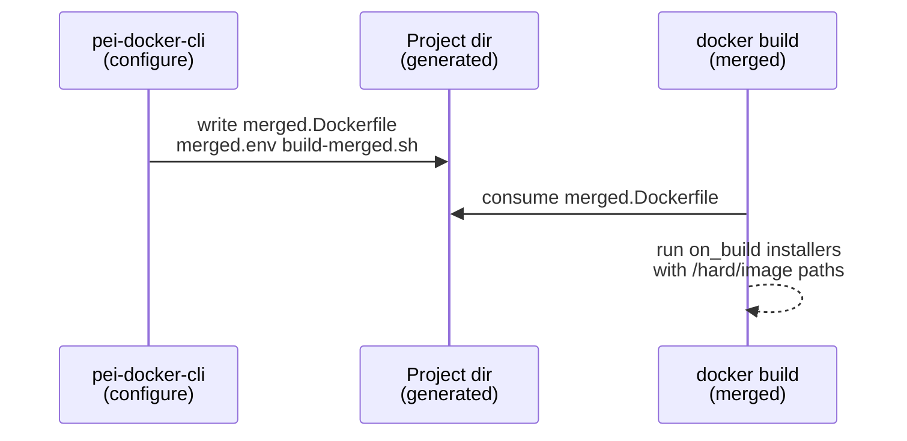
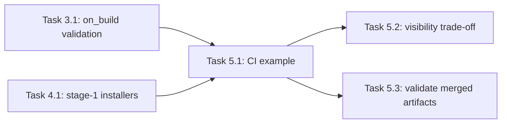

# Implementation Guide: Merged / Single-Dockerfile CI Docs

**Group**: 5 | **Change**: storage-agnostic-install-scripts | **Tasks**: [5.1]–[5.3]

## Goal

Document a minimal “single `docker build`” flow that runs installers during build without relying on `/soft/*`, and explain the visibility trade-off when runtime storage points `/soft/...` at mounted volumes.

## Public APIs

### Task 5.1: Add minimal single-Dockerfile example

User-facing API:

- `pei-docker-cli configure --with-merged` produces:
  - `merged.Dockerfile`
  - `merged.env`
  - `build-merged.sh`

Doc example should show:

1) generating merged artifacts
2) building via `docker build`
3) calling installers at build time with explicit flags targeting `/hard/image/...`

### Task 5.2: Document visibility trade-off

Explain clearly:

- build-time installs into `/hard/image/...` are baked into image layers
- at runtime, `/soft/...` may point at `/hard/volume/...` (mounted volume)
- mounted volume can hide the in-image content under `/hard/image/...`

### Task 5.3: Validate merged artifact generation and link docs

Verify docs are consistent with actual generated filenames and the CLI flag name (`--with-merged`).

**Usage Flow**:



---

## Group Integration



## Testing

### Test Input

- A minimal config that uses `stage_2.custom.on_build` installers with `/hard/image/...` flags.
- A second config that (intentionally) uses `/soft/...` in `on_build` and must be rejected.

### Test Procedure

```bash
# Build-time validation should fail fast for /soft usage
pixi run pei-docker-cli configure -p <project>  # with invalid on_build args

# Merged flow output artifacts should exist
pixi run pei-docker-cli configure -p <project> --with-merged
ls -la <project>/merged.Dockerfile <project>/merged.env <project>/build-merged.sh
```

### Test Output

- Docs match generated filenames and CLI flags
- Example paths use `/hard/image/...` for build-time installer flags
- Validation prevents `/soft/...` in build-time scripts

## References

- Proposal: `openspec/changes/storage-agnostic-install-scripts/proposal.md`
- Design: `openspec/changes/storage-agnostic-install-scripts/design.md`
- Spec: `openspec/changes/storage-agnostic-install-scripts/specs/single-dockerfile-ci-install-flow/spec.md`

## Implementation Summary

Documentation was updated to make the merged/single-Dockerfile path explicit and
to include a minimal build-time installer example that avoids `/soft/*` during
`docker build`.

### What has been implemented

- Documented the merged build workflow and artifacts:
  - `docs/index.md`
  - `docs/cli_reference.md`
- Added a minimal CI example showing `stage_2.custom.on_build` calling an installer
  with `/hard/image/...` paths (and explicitly calling out disallowed runtime-only paths).

### How to verify

- Verify CLI help exposes the flag:
  - `pixi run pei-docker-cli configure --help`
- Generate merged artifacts and confirm the outputs exist:
  - `pixi run pei-docker-cli configure -p <project> --with-merged`
  - `ls -la <project>/merged.Dockerfile <project>/merged.env <project>/build-merged.sh`
