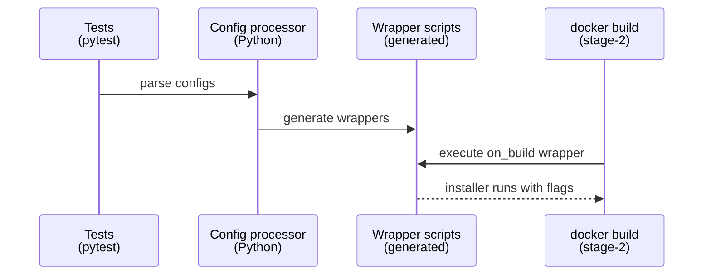
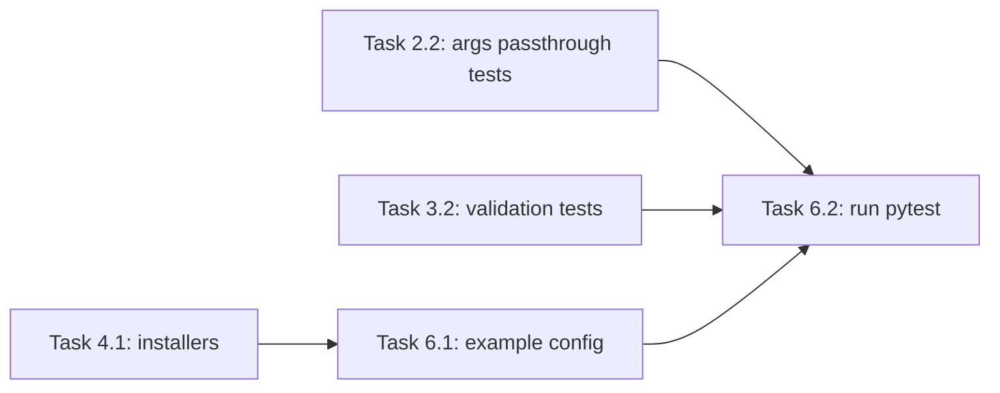

# Implementation Guide: Integration Verification

**Group**: 6 | **Change**: storage-agnostic-install-scripts | **Tasks**: [6.1]–[6.2]

## Goal

Prove the change works end-to-end:

- build-time scripts can run in `docker build` without `/soft/*`
- runtime scripts can still target `/soft/...`
- env var tokens in custom script arguments expand at execution time
- invalid build-time `/soft/...` and `/hard/volume/...` paths are rejected early

## Public APIs

### Task 6.1: Add/update an example config demonstrating build-time vs runtime paths

The public interface is the example `user_config.yml` under `tests/configs/` (or `docs/examples/`) that shows:

- `stage_2.custom.on_build` using `/hard/image/...`
- `stage_2.custom.on_first_run` or `on_every_run` using `/soft/...`

### Task 6.2: Run pytest + existing integration flow

Primary verification commands:

```bash
pixi run pytest
```

For the existing “custom script params” integration flow, use the platform-appropriate runner under `tests/scripts/` (PowerShell on Windows).

**Usage Flow**:



---

## Group Integration



## Testing

### Test Input

- Example config (to add/update): `tests/configs/storage-agnostic-installers.yml` (suggested name)
  - build-time on_build scripts use `/hard/image/...`
  - runtime hooks use `/soft/...`
- Existing config: `tests/configs/custom-script-params-test.yml` (extend with `$VARS` if needed)

### Test Procedure

```bash
# Unit + validation coverage
pixi run pytest -q

# Optional: generate a project and build images (requires Docker)
# pixi run pei-docker-cli create -p <tmp-project>
# cp tests/configs/storage-agnostic-installers.yml <tmp-project>/user_config.yml
# pixi run pei-docker-cli configure -p <tmp-project>
# (then docker compose build stage-2)
```

### Test Output

- `pytest` reports success (no regressions)
- Invalid build-time paths fail during config parsing with clear errors
- Wrapper scripts include `$VARS` un-single-quoted where expansion is expected

## References

- Proposal: `openspec/changes/storage-agnostic-install-scripts/proposal.md`
- Design: `openspec/changes/storage-agnostic-install-scripts/design.md`
- Specs: `openspec/changes/storage-agnostic-install-scripts/specs/`

## Implementation Summary

TODO(after implementation): summarize the added example config(s) and how integration was validated locally/CI.

### What has been implemented

TODO(after implementation)

### How to verify

TODO(after implementation)

