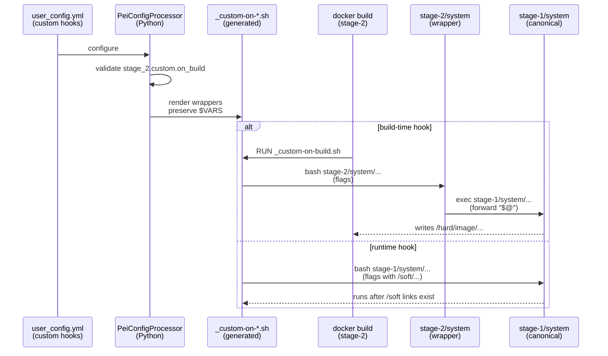
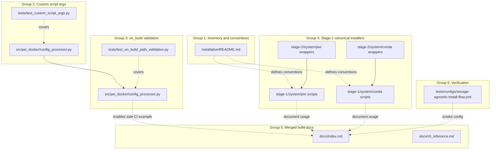
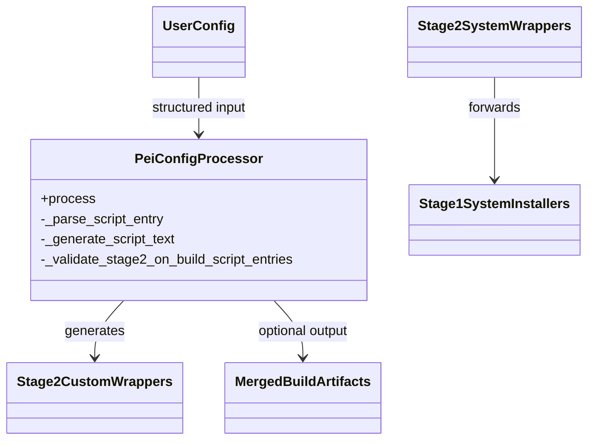
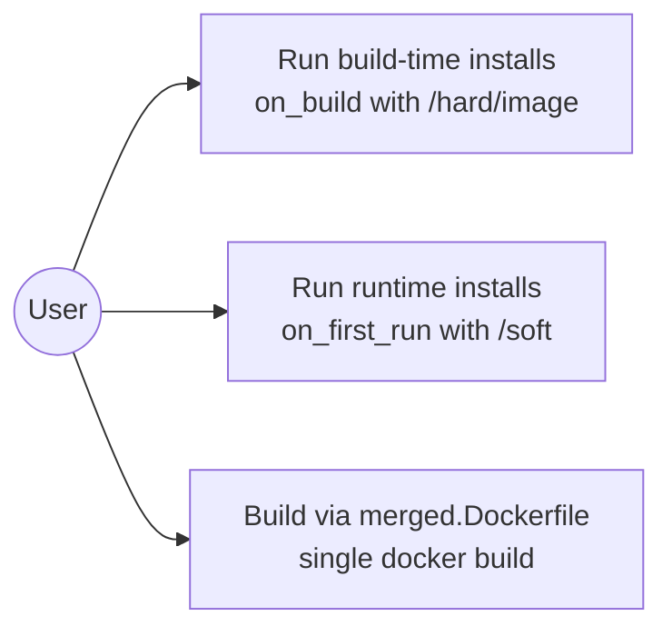
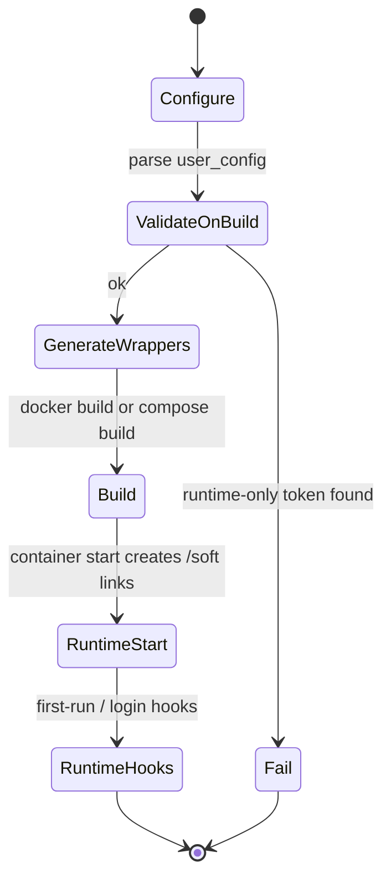

# Integration Guide: storage-agnostic-install-scripts

**Change**: `storage-agnostic-install-scripts` | **Groups**: 6

## Overview

This change makes “installer scripts” usable in both build-time and runtime contexts by:

- preserving custom script argument text (so `$VARS` expand at execution time), and
- enforcing a lifecycle rule: build-time (`stage_2.custom.on_build`) must not reference runtime-only storage paths (`/soft/...`, `/hard/volume/...`).

It also establishes the pattern “stage-1 is canonical, stage-2 forwards” for the first migrated installer batch (Pixi + Conda).

## Group Flow

**MUST HAVE: End-to-End Sequence Diagram**



## Artifact Flow Between Groups



## System Architecture



## Use Cases



## Activity Flow



## Inter-Group Dependencies

### Group 2 → Group 3

**Dependency**: Group 3 relies on Group 2’s “raw args text” handling so validation and wrapper rendering remain consistent and do not re-tokenize user strings.

**Code**:

```python
# src/pei_docker/config_processor.py
#
# - Group 2: _parse_script_entry() and wrapper rendering preserve args text
# - Group 3: _validate_stage2_on_build_script_entries() rejects runtime-only tokens
```

### Group 4 → Groups 5 and 6

**Artifacts**:
- `src/pei_docker/project_files/installation/stage-1/system/pixi/README.md` provides canonical usage guidance.
- `tests/configs/storage-agnostic-install-flow.yml` demonstrates referencing stage-1 canonical scripts from stage-2 hooks.

## Integration Testing

```bash
# Unit checks (fast)
pixi run pytest -q

# Optional Docker smoke (requires Docker)
pixi run pei-docker-cli create -p <tmp-project>
cp tests/configs/storage-agnostic-install-flow.yml <tmp-project>/user_config.yml
pixi run pei-docker-cli configure -p <tmp-project>
docker compose -f <tmp-project>/docker-compose.yml build stage-2
```

## Critical Integration Points

1. **Wrapper arg forwarding**: wrapper scripts must not rewrite `$VARS` into single quotes.
2. **Build-time path validation**: `stage_2.custom.on_build` must fail fast on `/soft/...`, `/hard/volume/...`, `$PEI_SOFT_*`, `$PEI_PATH_SOFT`.
3. **Stage forwarding**: stage-2 system paths remain callable but forward to stage-1 canonical via `$PEI_STAGE_DIR_1`.

## References

- Proposal: `openspec/changes/storage-agnostic-install-scripts/proposal.md`
- Design: `openspec/changes/storage-agnostic-install-scripts/design.md`
- Tasks: `openspec/changes/storage-agnostic-install-scripts/tasks.md`
- Specs: `openspec/changes/storage-agnostic-install-scripts/specs/`
- Group guides: `openspec/changes/storage-agnostic-install-scripts/impl-guides/grp*.md`

## Implementation Summary

The implementation centers on `PeiConfigProcessor` generating lifecycle wrapper
scripts that preserve custom args text while enforcing the build-time lifecycle
constraints. Pixi + Conda were migrated to stage-1 canonical implementations,
with stage-2 system paths converted into thin wrappers.

### What has been implemented

- Wrapper arg passthrough:
  - `src/pei_docker/config_processor.py` (`_parse_script_entry`, `_generate_script_text`)
  - `tests/test_custom_script_args.py`
- Build-time validation:
  - `src/pei_docker/config_processor.py` (`_validate_stage2_on_build_script_entries`)
  - `tests/test_on_build_path_validation.py`
- Stage-1 canonical installers + stage-2 forwarders:
  - Pixi: `src/pei_docker/project_files/installation/stage-1/system/pixi/*`
  - Conda: `src/pei_docker/project_files/installation/stage-1/system/conda/*`
  - Forwarders: `src/pei_docker/project_files/installation/stage-2/system/{pixi,conda}/*`
- Merged build docs:
  - `docs/index.md`, `docs/cli_reference.md`

### How to verify

- `pixi run pytest -q`
- Optional: run the Docker smoke flow in “Integration Testing” above.
