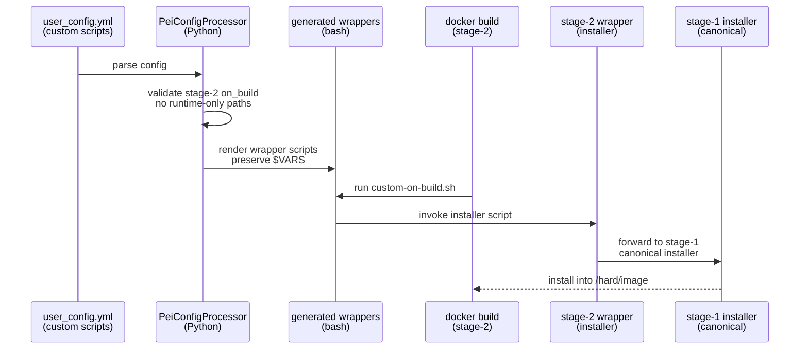
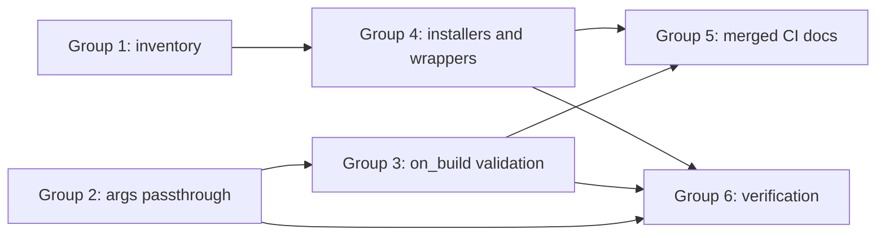

# Implementation Guide: Integrate All Groups

**Change**: storage-agnostic-install-scripts | **Scope**: Groups 1–6

## Goal

Deliver a storage-agnostic installer story that works in:

- stage-2 runtime workflows (where `/soft/...` symlinks exist)
- build-time hooks (`custom.on_build`) during `docker build` (where `/soft/app|data|workspace` do not exist)
- merged/single-Dockerfile CI builds

## End-to-End Flow (What “Done” Looks Like)

1) Users can run installers at build time by targeting `/hard/image/...` with tool-specific flags.
2) Users can run installers at runtime by targeting `/soft/...` with the same flags.
3) PeiDocker rejects `stage_2.custom.on_build` entries that reference `/soft/...`, `/hard/volume/...`, `$PEI_SOFT_*`, `$PEI_PATH_SOFT`.
4) Stage-2 “system installers” prefer stage-1 canonical scripts; stage-2 paths remain only as forwarders where needed.

## Public APIs

### User Config Surface

- `stage_2.custom.on_build`: build-time scripts (must not reference runtime-only paths)
- `stage_2.custom.on_first_run` / `on_every_run` / `on_user_login`: runtime scripts (may use `/soft/...`)
- Installer scripts accept explicit tool-specific path flags:
  - `--install-dir=...`
  - `--cache-dir=...`
  - `--tmp-dir=...`
  - `--user <name>` (when relevant)

### CLI Surface

- `pei-docker-cli configure --with-merged` generates `merged.Dockerfile`, `merged.env`, `build-merged.sh`

**Usage Flow**:



## Cross-Group Dependency Map



## Testing

### Test Input

- Unit tests for:
  - wrapper argument rendering (env var-safe)
  - stage-2 on_build runtime-only path validation
- Example configs demonstrating:
  - build-time `/hard/image/...`
  - runtime `/soft/...`

### Test Procedure

```bash
# Fast checks
pixi run pytest -q

# Optional (requires Docker installed):
# - generate a project
# - configure it
# - docker compose build stage-2
```

### Test Output

- `pytest` green
- Invalid configs fail early with clear errors
- Wrapper scripts preserve `$VARS` for runtime expansion
- Selected installers run in build-time context without requiring `/soft/*`

## References

- Proposal: `openspec/changes/storage-agnostic-install-scripts/proposal.md`
- Design: `openspec/changes/storage-agnostic-install-scripts/design.md`
- Specs: `openspec/changes/storage-agnostic-install-scripts/specs/`

## Implementation Summary

TODO(after implementation): summarize the end-to-end story, including which installers were migrated, how wrappers work, and the verification matrix (build vs runtime vs merged).

### What has been implemented

TODO(after implementation)

### How to verify

TODO(after implementation)

